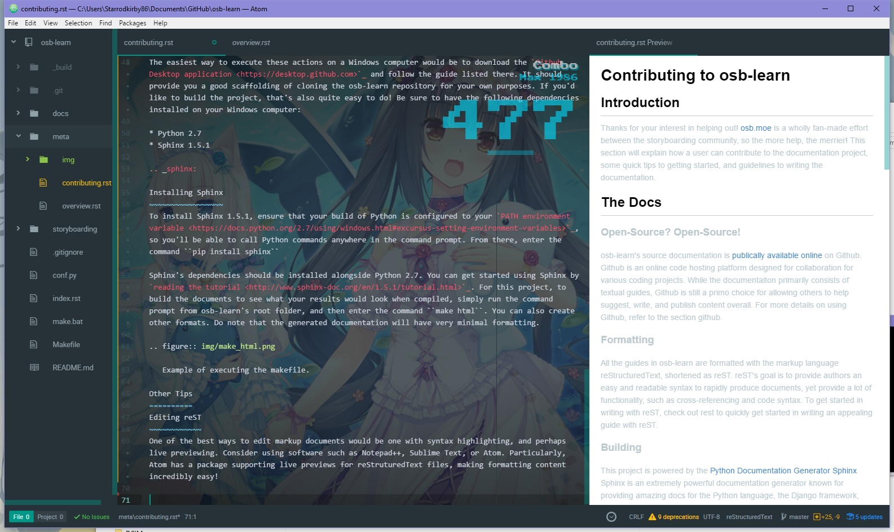

=========================
Contributing to osb-learn
=========================

Introduction
============
Thanks for your interest in helping out! `osb.moe <https://osb.moe>`_ is a wholly fan-made effort between the storyboarding community, so the more help, the merrier! This section will explain how a user can contribute to the documentation project, some quick tips to getting started, and guidelines to writing the documentation.

The Docs
========

Open-Source? Open-Source!
-------------------------
osb-learn's source documentation is `publically available online <https://github.com/osb-group/osb-learn>`_ on Github. Github is an online code hosting platform designed for collaboration for various coding projects. While the documentaiton primarily consists of textual guides, Github is still a primo choice for allowing others to help suggest, write, and publish content overall. For more details on using Github, refer to the section :ref:`github`.

Formatting
----------
All the guides in osb-learn are formatted with the markup language reStructuredText, shortened as reST. reST's goal is to provide authors an easy and readable syntax to rapidly produce documents, yet provide a lot of functionality, such as cross-referencing and code syntax. To get started in writing with reST, check out :doc:`rest` to quickly get started in writing an appealing guide with reST.

Building
--------
This project is powered by the `Python Documentation Generator Sphinx <http://www.sphinx-doc.org>`_. Sphinx is an extremely powerful documentation generator known for providing amazing docs for the Python language, the Django framework, and everything on Read the Docs. By providing markup files, Sphinx generates a set of static pages that osb.moe can serve. For more details, refer to the section :ref:`sphinx`.

.. _github:

How to Contribute using Github
==============================

Introduction
------------
Github at its core is powered by the *Git* version control system (VCS). Naturally, in software development, version control is very important. Great VCS allow multiple developers to work concurrently on a project with up-to-date code, and to rollback to a previous version should something go wrong. It's very similar to collborating on Google Docs. While there are many guides to using Git, Github and the like, this section will summarize the basic system and terminology to help get you up-to-speed on everything.

The Circle of Life
~~~~~~~~~~~~~~~~~~
An overall code project is known as a **repository**. A developer receives a copy of the repository through a process called **cloning**, which is basically like downloading the project into your computer. Git, and therein Github, can be used to help keep track of any additions, changes, and deletions made inside your repository. However, these changes are only on a local level. If Aoba were to work on something in the cloned repository, Hifumi, who also has a copy of the repository, will not receive any of the changes yet.

In order for other developers to see what changes have been made, the developer creates a **commit**. A commit records all the tracked additions, changes, and deletions made since the last update. Once the commit has been made, assuming no conflicts, it's uploaded online, updating the repository. This upload is known as a **push**.

So Aoba just updated the code, committed, and pushed it into the repo. Now Hifumi wants to update her working directory with Aoba's new code. As we saw with push, Hifumi executes what's called a **pull**, which will update her local repository with the contents online. Sometimes it's not perfect, and conflicts can occur. It's up to the developer on what changes to make from there.

Now we're almost done here! Say that Aoba and Hifumi have been working on an open-source project on Github, and a random kind stranger online wanted to help out. The anonymous developer improves a bit of the code, but they do not have permission to directly push into the Aoba and Hifumi's repository. What the developer should do is **fork** the repository, which is effectively making their own copy of the repo, with changes that they can make and upload. This essentially **branches** the repository. If the developer wants this forked contribution in the original repository, they propose what's called a **pull request**. Then it's up to the original owners, Aoba and Hifumi, to look at the suggested code, see if the proposed change improves their project, and then approve it. As it's approved, the repository branches **merge**, and the code is updated as a whole.

How does this play with contributions? You, as the contributor, will be the one that will fork, write, then make a pull request to improve the guide overall!

Now It's Your Turn!
-------------------
The easiest way to execute these actions on a Windows computer would be to download the `Github Desktop application <https://desktop.github.com>`_ and follow the guide listed there. It should provide you a good scaffolding of cloning the osb-learn repository for your own purposes. If you'd like to build the project, that's also quite easy to do! Be sure to have the following dependencies installed on your Windows computer:

* Python 2.7
* Sphinx 1.5.1

.. _sphinx:

Installing Sphinx
~~~~~~~~~~~~~~~~~
To install Sphinx 1.5.1, ensure that your build of Python is configured to your `PATH environment variable <https://docs.python.org/2.7/using/windows.html#excursus-setting-environment-variables>`_, so you'll be able to call Python commands anywhere in the command prompt. From there, enter the command ``pip install sphinx``

Sphinx's dependencies should be installed alongside Python 2.7. You can get started using Sphinx by `reading the tutorial <http://www.sphinx-doc.org/en/1.5.1/tutorial.html>`_. For this project, to build the documents to see what your results would look when compiled, simply run the command prompt from osb-learn's root folder, and then enter the command ``make html``. You can also create other formats. Do note that the generated documentation will have very minimal formatting.

.. figure:: img/make_html.png
  :scale: 80%

  Example of executing the makefile.

Other Tips
==========

Editing reST
------------
One of the best ways to edit markup documents would be one with syntax highlighting, and perhaps live previewing. Consider using software such as Notepad++, Sublime Text, or Atom. Particularly, `Atom <https://atom.io/>`_ has a package supporting live previews for reStruturedText files, making formatting content incredibly easy!

  Starrodkirby86's Atom setup, complete with live previewing!
