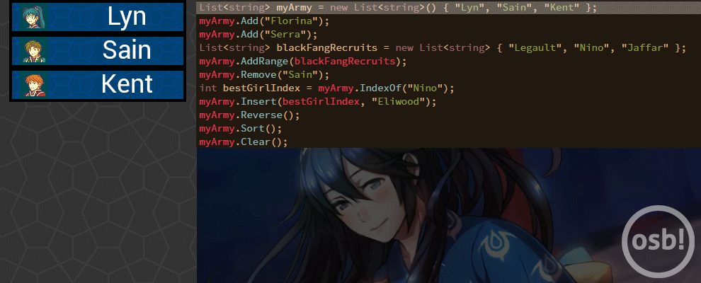

================
Arrays and Lists
================

Sneak Peek
==========
By the end of this lesson, you should be able to...

- Utilize arrays and lists to store similar and contiguous amounts of data.
- Understand the differences between arrays and lists and know how to process them.
- Work with multidimensional arrays and lists.
- Understand the possible pitfalls and mistakes behind arrays and lists.

Particle Hell
=============
While it is possible to generate particles through the utilization of for loops, if the sprite's creation is within the loop, then once a new iteration begins, all access to that sprite is lost. There are some situations where it feels you'd actually want that sprite data preserved, perhaps to do another effect later, or some other kind of management.

Our inclination then thinks we should declare something like ``particle00``, ``particle01``, ``particle02``, and so forth, but often, when generating particles, it's in the tens, or even hundreds. You'd certainly enter bullet hell, and not the good kind, but one where you're drowning in all these inefficiently named variables.

   Now *this* is the good kind of bullet hell. Shmup me up, bruh!

Consider the previous chapter's example on :ref:`while loops <programming_loops_while_loop>`. It'd certainly be nicer to express our party more than just a value of how many party members you have. Initially thinking, we can write this innocent piece of code:

.. code-block:: csharp
  :linenos:

  string pokemon1 = "Talonflame",
         pokemon2 = "Quagsire",
         pokemon3 = "Gardevoir",
         pokemon4 = "Buzzswole",
         pokemon5 = "Lilligant",
         pokemon6 = "Chansey";
  int pokemonParty = 6;

It's innocuous enough, but the point is that *we can do better*. This is especially true as variable naming like this can be incredibly artbirary, requires tons of manual changes, and is rather inconvenient. Fortunately, C# offers us a great way to store similar data like this by using **arrays** and **lists**.

Arrays
======
An **array** is a data object that stores a fixed-size collection of elements of same type. Internally, arrays store their data in contiguous memory locations, so accessing between each item in the collection is efficient and fast. A perfect example of an array would be elevating our Pokémon example to store our party in an array.

.. code-block:: csharp
  :linenos:
  :emphasize-lines: 1

  string[] pokemonParty = { "Talonflame", "Quagsire", "Gardevoir", "Buzzswole", "Lilligant", "Chansey" };
  Log("My favorite Pokémon is " + pokemonParty[0]);

Wow! Talk about the savings. We initialized a new array containing only values of the ``string`` type, and because we initialized with 6 ``string`` values (In this case, Pokémon's names), the array ``pokemonParty`` has a fixed-size of ``6`` elements. The next line does a little cute example of accessing these values in an array. Arrays count from ``0``, so when calling ``pokemonParty[0]``, we get our lead party member, Talonflame! Pretty cool, right?

Because arrays make the effort to specifically size out the memory locations for their elements, **the size of the array cannot be changed**. That means we can't add anymore Pokémon to make a party of 7, or if we happen to store a Pokémon in the PC, we'd still have 6 total elements, just some of them may be empty strings instead. This is an extremely important concept with arrays and is one of the defining factors when using them.

In the following sections, we'll cover the detailed parts when dealing with arrays, such as creating them, accessing its contents, and processing and taking advantage of this special data object.

.. _programming_arrays_and_lists_intiializing_arrays:

Initializing Arrays
-------------------
There are numerous ways to declare and initialize an array. The simplest initialization would be to declare the array and specify a size like this:

.. code-block:: csharp
  :linenos:

  int[] funNumbers = new int[8];

This initializes a blank array of 8 integers named ``funNumbers``. The ``new`` keyword is needed because it helps create the array and initialize the data for ``funNumbers`` to have default values, which for an integer is ``0``.

Initializing an array with existing data is also just as easy. We can provide a collection of the data separated by commas and surrounded by curly braces, as shown:

.. code-block:: csharp
  :linenos:

  int[] funNumbers = new int[] { 0, 1, 1, 2, 3, 5, 8, 13 };

The size of the array is figured out implicitly by the number of elements given in the initialized list. The ``new int[]`` is also optional, as the shorthand already provides some of that groundwork in creating a new variable. However, if the array is being assigned to an array variable without initialization, then the keywords are required:

.. code-block:: csharp
  :linenos:

  string[] myGroceries = new string[] { "Cucumber", "Latex Rubber", "Johnson's Extra Fine Lubricant" }; // OK
  string[] funnyForiegnWords = { "Biblioteca", "Wasabi", "Barack Obama" }; // OK

  string[] eagleJumpEmployees;
  eagleJumpEmployees = new string[] { "Aoba", "Hifumi", "Yun" }; // OK
  // eagleJumpEmployees = { "Aoba", "Hifumi", "Yun" }; // NOT OK

It is also possible to create implicitly-typed arrays, that is, arrays declared :ref:`using the keyword <programming_variables_and_types_implicit_typing>` ``var``, with the program inferring the type by the elements in the initialization, as shown:

.. code-block:: csharp
  :linenos:

  var kawakamiGirls = new[] { "Momoyo", "Wanko", "Miyako", "Chris", "Yukie" }; // string[]

Notice that no square brackets are needed on the lefthand side of the statement. Pretty neat!

.. tip:: What if you want to initialize some data, but also want to leave some bits of data blank, like having a party of 4 Pokémon instead of 6? For the ``string`` type, we can utilize ``null`` or ``""`` to denote a blank string. While ``null`` doesn't directly work integers, zeroing out the extra elements isn't too much of a big deal either. If your collection of objects tend to be of dynamic length, you may want to keep reading and look at :ref:`lists <programming_arrays_and_lists_lists>`.

Accessing
---------
Elements in an array can be accessed by using the access operator, ``[]``. When an array is created, its elements are **indexed**, allowing them to be accessible in conveniently numbered slots. The index values of an array, unlike our normal counting system, **begin from 0**. The vast majority of programming languages all follow the habit of **zero-indexing**, so it's probably a good idea that you follow that too. That essentially means that, say, when ``pokemonParty`` is created, the elements we stuck inside that variables can be accessed through calling ``pokemonParty[0]`` through ``pokemonParty[5]``. You should then take notice that when declaring an array ``arr`` of size ``n``, the elements are accessible through ``arr[0]`` to ``arr[n-1]``.

.. rst-class:: table table-sm table-hover table-striped
.. csv-table:: ``pokemonParty`` Elements
   :header: "Index", "Element"
   :widths: auto

   "0","Talonflame"
   "1","Quagsire"
   "2","Gardevoir"
   "3","Buzzswole"
   "4","Lilligant"
   "5","Chansey"

What happens if we decide to try accessing an element in the array that's outside this range, such as ``arr[n]`` or ``arr[-1]``? An error known as an **out-of-range exception** occurs, where compilation will end up failing, as no data exists there to begin with. The out-of-bound exception is one of the most common mistakes a programmer may encounter when :ref:`processing arrays <programming_arrays_and_lists_processing_arrays>`. Always be strict and count from 0.

.. _programming_arrays_and_lists_processing_arrays:

Processing Arrays
-----------------
One of the best ways in managing and calculating the data in arrays would be to utilize the loops we've learned in the previous chapter. Often we want to access every element of the array, using that data for some sort of profound effect. Such is the case with arrays, especially the :ref:`for loop <programming_loops_for_loop>`. Recall that the for loop has the initialization, condition, and step all in one line. With that temporary variable used for looping, we can access every element in the array with something like this storybrew-centric piece of code:

.. code-block:: csharp
  :linenos:
  :emphasize-lines: 4,6

  public override void Generate()
  {
      var dkCrew = new[] { "Donkey Kong", "Diddy Kong", "Lanky Kong", "Tiny Kong", "Chunky Kong" };
      for(int i = 0; i < 5; i++)
      {
          Log(dkCrew[i] + " expands their dong!");
      }
  }

We can see that the access operator can actually accept ``int`` variables, to which, taking advantage of the changing nature of ``i``, we'll be able to access all the members of ``dkCrew``, that is ``dkCrew[0]``, ``dkCrew[1]``, ``dkCrew[2]``, ``dkCrew[3]``, and ``dkCrew[4]``. The :ref:`off-by-one error <programming_loops_off_by_one>` becomes especially important in this case, as having a condition such as ``i <= 5`` will also include accessing ``dkCrew[5]``, which doesn't exist.

   No one loves you, Kiddy Kong.

.. tip:: You can actually save the trouble of having to think of how many elements your array can store by calling the ``Length`` component of an array. This way, we can add or remove members of ``dkCrew`` without having to manually change the value in the condition statement. A rewritten snippet of the code would look like the following instead.

    .. code-block:: csharp
      :linenos:

      for(int i = 0; i < dkCrew.Length; i++)
      {
          Log(dkCrew[i] + " expands their dong!");
      }

Foreach Statement
~~~~~~~~~~~~~~~~~
A special kind of loop exists for arrays and lists known as the **foreach statement**. Followed by the keyword ``in``, ``foreach`` is exactly what it says on the tin: *for each* element *in* the array, do the following section of code. Using the same example as before (just because it's great to have the grand presence of the DK Crew), we can rewrite the for loop using the foreach statement:

.. code-block:: csharp
  :linenos:
  :emphasize-lines: 4,6

  public override void Generate()
  {
      var dkCrew = new[] { "Donkey Kong", "Diddy Kong", "Lanky Kong", "Tiny Kong", "Chunky Kong" };
      foreach(var kong in dkCrew)
      {
          Log(kong + " expands their dong!");
      }
  }

The best convenience is the fact that the array ``dkCrew`` can have more or less elements without needing to manually change the condition value or needing to call ``dkCrew.Length``. In addition, due to the use of :ref:`implicitly typed variables <programming_variables_and_types_implicit_typing>`, we can even change the array into some other data type, like an array of integers! Though you'll need to change Line ``6`` to accomodate for that as well.

   Even if we can add more Kongs, we are still not adding you.

When should you use ``foreach`` instead of the for loop? In general, nearly every instance, as it's incredibly intuitive and readable as code. The only situation where you'd opt for using a for loop *(Ha! That pun!)* is when **you need the indices within your code**. Notice that we made a trade-off in ``foreach`` where we no longer use the index value. While it's possible to get the index value by declaring a variable outside the ``foreach`` statement and then incrementing it like a counter, but that largely ends up as pretty unnecessary and gives less cleanliness to code.

One less common thought of needing indices would be when managing multiple arrays or lists of equal length. Because ``foreach`` only iterates upon one array or list, managing or accounting for multiple arrays or lists would likely be better with using a for loop. If you find that they are heavily intertwined with each other, consider reading about `tuples <https://msdn.microsoft.com/en-us/library/dd268536%28v=vs.110%29.aspx?f=255&MSPPError=-2147217396>`_.

   Any mention of the DK Crew without he-has-no-style-he-has-no-grace-but-is-one-badass-homie Lanky Kong is total blasphemy.

.. _programming_arrays_and_lists_lists:

Lists
=====
A **list** is also a collection of objects, but allows the additional functionality of being dynamic – that is, we can safely add or remove additional elements in the list without having to worry about fixed-size strictness like arrays do. In nearly all situations, you'd rather use Lists over arrays. Like, virtually all the situations. It's just really good to first learn about arrays as they're a universal programming construct.

Lists are fundamentally similar to arrays in that they keep an ordered collection of objects together. As such, the following sections are more dedicated to creating your own lists, managing them, processing them, and further explanation of why you'd want to use lists instead of arrays.

Creating Lists
---------------
Creating lists are almost identical to creating arrays. To save the trouble, we'll introduce you all the cool ways of creating new lists without all the extra jargon.

.. code-block:: csharp
  :linenos:

  List<int> myEmptyList = new List<int>();
  List<string> problems = new List<int>(99); // list with capacity of 99 problems, but... ;)
  List<string> myHangoutSpots = new List<string>() { "Mcdonalds", "KFC", "Burger King", "My Heart Surgeon's Office" };
  List<int> squarefreeSemiprimes = new List<int>() { 6, 10, 14, 15, 21, 22, 26, 33, 34 };
  var myEmptyImplicitLifeIMeanList = new List<int>(); // same type as myEmptyList
  var greatestHits = new List<string>() { "Drop It Like It's Hot", "Vato", "Young, Wild & Free" };
  var usingAnotherList = new List<string>(greatestHits); // Initializes with the contents inside greatestHits

  // The new expression is required, unlike array initializers
  // List<string> myHangoutSpots = { "Mcdonalds", "KFC", "Burger King", "My Heart Surgeon's Office" }; NOT OK

You may have noticed that all declarations of lists require ``<>``. Similar to an array's square breackets, these specify what type the List uses, often written as List<T>. Of course, these are only necessary for initialization. Also remember that because lists are dynamic, a size is not needed to be specified. We can have a list that's size 0 and still add elements liberally.

Managing Lists
--------------
The biggest advantage with lists are the fact that we can add and remove elements. Of course, there are many more opportunities available with lists. We're going to be sharing various list methods that can be used to help manage the list, along with a comment explaining what it does to change the list. If you're working this inside a storybrew ``Generate`` method, feel free to add ``foreach`` loops with ``Log`` methods to keep track of the chaos for yourself. Think of this like having an appetizer sampler and trying various different things to see what you like. For a full list of methods a list can use, `check out MSDN's official documentation <https://msdn.microsoft.com/en-us/library/6sh2ey19(v=vs.110).aspx>`_.

   This is the epitome of American dining.

.. code-block:: csharp
  :linenos:

  List<string> myArmy = new List<string>() { "Lyn", "Sain", "Kent" };

  myArmy.Add("Florina"); // Florina added to the back, 4 elements
  myArmy.Add("Serra"); // Serra added to the back, 5 elements

  List<string> blackFangRecruits = new List<string> { "Legault", "Nino", "Jaffar" };
  myArmy.AddRange(blackFangRecruits); // myArmy + blackFangRecruits -> 8 elements

  myArmy.Remove("Sain"); // Removes the first instance of Sain, 7 elements

  int bestGirlIndex = myArmy.IndexOf("Nino"); // I'll do my best!
  myArmy.Insert(bestGirlIndex, "Eliwood"); // Inserts Eliwood at the specified index, pushing the others

  myArmy.Reverse(); // Everyone is reversed!
  myArmy.Sort();    // Now everyone is sorted!
  myArmy.Clear();   // Alright guys, we had a good show, get back to work.

The following figure illustrates each step in this sampling of list methods.

    A step-by-step breakdown of what's going on.

   Thanks! Now go off and play Fire Emblem Heroes!

Accessing elements in the list operates exactly like arrays. It should be similar enough to the point we can rewrite the ``dkCrew`` example into that of a list.

.. code-block:: csharp
  :linenos:
  :emphasize-lines: 3

  public override void Generate()
  {
      var dkCrew = new List<string>() { "Donkey Kong", "Diddy Kong", "Lanky Kong", "Tiny Kong", "Chunky Kong" };
      foreach(var kong in dkCrew)
      {
          Log(kong + " expands their dong!");
      }
  }

And that is the beauty of having clean, flexible code.

In summary, **always use lists** over arrays. The implementation of lists allow for more flexibility and to play with more of C#'s features, especially as one of C#'s hugest strengths is its easy retrieval, manipulation, and management with lists. The performance difference is negligible for our purposes, so arrays only really need to be used for really specific, obscure scenarios. However, there is a variant of arrays that prove more useful than a list. Intrigued? Read on.

Inception
=========
Déjà vu? You have every right to be. In the previous chapter, we pondered :ref:`whether it's possible to have loops within loops <programming_loops_nested_for_loops>`. We should then ask ourselves the same question: Is it possible to store arrays within arrays, or lists within lists? And indeed, it *is* possible. We'll cover each of these sections one by one then.

.. figure:: img/loops/inception.jpg
   :scale: 100%
   :alt: Joseph Gordon-Levitt.

   Joseph Gordon-Levitt is quite the... *looper*, wouldn't you say!? I swear if you don't laugh a second time, you're going to be in for a world of pain.

Multidimensional Arrays
-----------------------
Up to this point, the arrays we dealt with were only fixed in one direction – going forward and backward through the array. These arrays we've worked with are known as **single-dimensional arrays**. However, arrays can actually support having more than one dimension.

Initilaizing these arrays are pretty simple, as shown:

.. code-block:: csharp
  :linenos:

  // Makes a 2D array with 3 rows and 4 columns.
  int [,] rectangle = new int[3, 4];

  // Makes a 3D array with size of 4, 2, and 3.
  int [, ,] funkyArray = new int[4, 2, 3];

  // Initialize with data, specifying dimension sizes:
  string [,] partyPairs = new string[4, 2] { {"BetaStar", "Exile-"}, {"Naxess", "Starrodkirby86"},
                                             {"Minami Kotori", "Kousaka Honoka"}, {"Hillary Clinton", "E-mails"} };

  // Initialize with data, no dimensions specified.
  char [,] ticTacToe =  new char [,] {
                                        {'o', 'x', 'o'},
                                        {'o', 'o', 'x'},
                                        {'o', 'x', 'x'}
                                    };

  // Initialize with data, no specifier needed
  int[,] funnyNumberPairs = { {6, 9}, {4, 20}, {42, 0}, {27, 19} };

Accessing each element in a multidimensional array can be done using nested for loops. For two-dimensional arrays, the format for the indexing is by row then by column. As such, the outer loop often represents the row, and the inner loop represents the column.

.. code-block:: csharp
 :linenos:

 public override void Generate()
 {
     // Initialize with data, specifying dimension sizes:
     string [,] partyPairs = new string[4, 2] { {"BetaStar", "Exile-"}, {"Naxess", "Starrodkirby86"},
                                                {"Minami Kotori", "Kousaka Honoka"}, {"Hillary Clinton", "E-mails"} };
     for(int i = 0; i < 4; i++)
     {
         for(int j = 0; j < 2; j++)
         {
             Log(partyPairs[i,j] + " is ready to do the worm!");
         }
     }
 }

A primary usage for a two-dimensional array would be to manage an image, which are essentially two-dimensional arrays containing color information for each pixel.

.. note:: While the foreach statement can be used to iterate through a multidimensional array, often multidimensional arrays are accessed with their index and location in the overall array playing an important part in its usage. Because nested for loops offer more flexibility, they generally are more preferable.

Jagged Arrays
-------------
Jagged arrays are a special kind of beast. Whereas with a multidimensional array such as a 2D array have an even count of rows and columns (i.e. every row has ``n`` columns), a **jagged array** is more like an array whose elements are arrays. That means each element in the initial jagged array contains an array of their own that can have their own unique fixed-size. Consider this example:

.. code-block:: csharp
  :linenos:

  string[][] enemyGroups = new string[3][];
  enemyGroups[0] = new string[] {"Slime", "Slime"};
  enemyGroups[1] = new string[] {"Slime", "Wolf", "Slime"};
  enemyGroups[2] = new string[] {"Mage", "Swamp Monster", "Big Belly Pork Beast", "Slime... Nope, It's Chuck Testa"};

If we want to access, for instance, the wolf in the second enemyGroup, we can call ``enemyGroups[1][1]``. If we want to access the swamp monster, we can call ``enemyGroups[2][1]``. Jagged arrays can be similarly traversed with a nested for loop, but as the arrays within the array can vary in size, it's imperative to use ``Array.Length`` to manage the contents inside, or else we'll range out-of-bounds exceptions.

.. code-block:: csharp
  :linenos:
  :emphasize-lines: 6, 8

  string[][] enemyGroups = new string[3][];
  enemyGroups[0] = new string[] {"Slime", "Slime"};
  enemyGroups[1] = new string[] {"Slime", "Wolf", "Slime"};
  enemyGroups[2] = new string[] {"Mage", "Swamp Monster", "Big Belly Pork Beast", "Slime... Nope, It's Chuck Testa"};

  for(int i = 0; i < enemyGroups.Length; i++)
  {
      for(int j = 0; j < enemyGroups[i].Length; j++)
      {
          Log(enemyGroups[i,j] + " is scary!");
      }
  }

The same can also be done with nested ``foreach`` statements.

.. code-block:: csharp
  :linenos:

  string[][] enemyGroups = new string[3][];
  enemyGroups[0] = new string[] {"Slime", "Slime"};
  enemyGroups[1] = new string[] {"Slime", "Wolf", "Slime"};
  enemyGroups[2] = new string[] {"Mage", "Swamp Monster", "Big Belly Pork Beast", "Slime... Nope, It's Chuck Testa"};

  foreach(var group in enemyGroups)
  {
      foreach(var enemy in group)
      {
          Log(enemy + " is scary!");
      }
  }

List of Lists
-------------
A List of lists are exactly like jagged arrays, only with different syntax. In other words, a **list of lists** stores a collection of lists. Just like what we mentioned previously regarding the benefits between using arrays or lists, a lists of lists would be better in virtually every instance, as the resizable nature of a list applies just as well. We can also add and remove lists as well (and even then add and remove the elements within those lists!). Observe the earlier code retooled as a list of lists with some data manipulation:

.. code-block:: csharp
  :linenos:

  List<List<string>> enemyGroups = new List<List<string>>();
  enemyGroups.Add( new List<string>() {"Slime", "Slime"} );
  enemyGroups.Add( new List<string>() {"Slime", "Wolf", "Slime"} );
  enemyGroups.Add( new List<string>() {"Mage", "Swamp Monster", "Big Belly Pork Beast", "Slime... Nope, It's Chuck Testa"} );

  enemyGroups[1].Remove("Slime"); // Removes the first instance of slime, now {"Wolf", "Slime"}.
  enemyGroups[0].Add("Gelato"); // Now {"Slime", "Slime", "Gelato"}

  // Accessing the contents in the list of lists is exactly the same as a jagged array:
  foreach(var group in enemyGroups)
  {
      foreach(var enemy in group)
      {
          Log(enemy + " is scary!");
      }
  }

To summarize, remember this key point regarding the usage of arrays and lists:

- **In general, always use lists over arrays**.

