================================
Case Study 01: Variables & Types
================================

Tutorial Mode
=============
We've introduced you to the basics of variables and types in programming, so with that, let's begin making our first storyboard! Let's make something cool. To start off, we have a test map prepared for you, but if you can successfully create the effects made in that, there's no question that you can incorporate the same concepts into your own maps or storyboards that you make.

Before we even begin coding, we need to approach this in an organized matter, basically, having a game plan. **More often than not, you'd look at a blank canvas and think, "I don't know how to start".** But the key to getting things done lickety-split versus ramming your head against the wall is being laser-focused, clean, and know exactly in how to solve the problem and express that in coding.

That may sound overwhelming, but don't think it that way! It takes a lot of practice to get to that point. Fortunately, following this guide should only help you get there.

The Map
-------
As with any guide, you'd need to have the reference map to learn from. We'll be using the `Helblinde <https://new.ppy.sh/beatmaps/artists/5>`_ song **Memoria Reborn**.

**Download the reference map by** `clicking this link <https://drive.google.com/file/d/0Bz8tmyefLbRTY0dYVWhDVWd0blk/view?usp=sharing>`_.

If everything imported successfully, you should be greeted with an empty beatmap created by *osb.moe*. There is a nice and cute Miku background, alongside an SB folder with the following contents:

- miku_cut.png
- miku_glow.png
- sideglow.png
- white.jpg

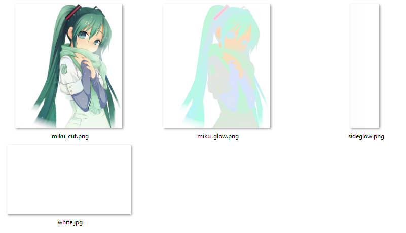

   A sample of the images seen.

These will be the assets that we'll play with for our sample storyboard. Once you have that set up on osu!'s end, let's devise a game plan in how we want to use these assets.

Our Goals
---------
We want to accomplish the following:

- Have pulses during adrenaline-pumping moments to heighten maximum fun.
- Have the background fade in or out and change colors depending on the mood of the song.

Since this guide aims to walk through the process of creating a storyboard using storybrew, it's split up into sections that act as good checkpoints to see your overall work come into fruition. Take it step-by-step, and the work within this guide should be as refreshing as a spring breeze.

The sections are split up as:

- **Getting Started**. We'll walk you through setting up your project in storybrew. Knowing the interface is half the battle.
- **Layers and Sprites**. After that, we'll get started adding code inside our script, declaring all the necessary sprites we plan to use for the tutorial.
- **Commandeering**. Our work finally gets visualized as we begin adding commands to our sprites, so that way they will appear on our storyboard.
- **Phase 2.** Now that we have a basic understanding of how things work, we'll put it all together to make some more bombastic effects.

Getting Started
===============

.. attention:: Be sure to check if storybrew is running fine and you have things set up as shown in :ref:`storybrew's Getting Started page. <storyboarding_storybrew_getting_started_installation>`. This guide assumes that everything is ready to go, including having VS Code.

The first matter at hand would be **creating the new project**. Give your new project any name you'd like, and set the mapset path to that of the map you just downloaded earlier.

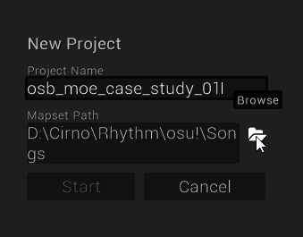

   You know, in case you get lost. ;)

Wonderful! Now you're greeted with a blank editor. **We'll need to create a new script that will be our main effect for this guide.** So let's click on the Effects button, then select New script. Give your script a name like ``Main``. VS Code should automatically open, but if not, click on the Edit script icon to open up your new effect. You should have a screen resembling the following figure:

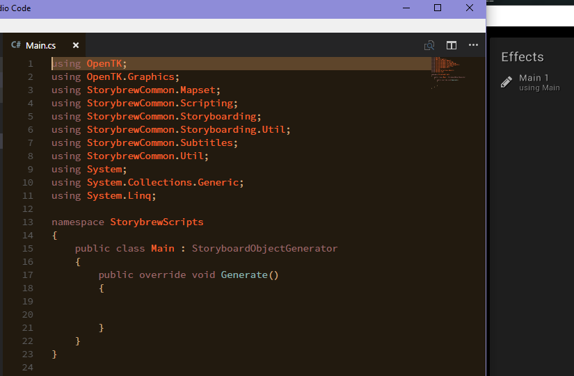

   If you get lost. (;

The Blank Canvas
----------------
The first thing you see inside the script for ``Main.cs`` is all the housekeeping necessary to set up an effect for storybrew to execute. **In this guide, all of our code will belong inside the Generate method**. This is the place where storybrew starts its little journey, so we want to make sure that we give it a good show of visual splendor to display!

Layers and Sprites
==================

The Layer!
----------
We first need to create a :term:`layer` to contain all of our sprites we plan to make. **Remember that this layer is for storybrew's own internal organization!** The layer object you create in scripts will be visible to redefine in :ref:`storybrew's layers menu <storyboarding_storybrew_interface_layers>`. This menu is useful for things like pushing certain effects to osu!'s Foreground layer, or making an effect difficulty exclusive.

**To do this, we add the following line inside our** ``Generate`` **block.**

.. code-block:: csharp
  :linenos:
  :lineno-start: 19

  var layer = GetLayer("MainBackground");

.. hint:: Keep an eye out for our code blocks' line numbers! They're here to suggest the general area where your code should be at. They may not always line up exactly (depends on if you add your own things), but they're here as a hint marker to know where you should place your code.

That line tells storybrew to create a new layer for storybrew to organize named ``MainBackground``. This object is also its own data type, the ``StoryboardLayer``, but it's a bit awkward, so for convenience, we leave it :ref:`implicitly typed <programming_variables_and_types_implicit_typing>` with ``var``.

The Sprites!
------------
Now that we've created the layer, we can now add sprites onto the layer and at least let the world know that they exist. *They exist!*

Before we do that though, we should consider *what* sprites we even want to add, and whether their order should matter. Remember our goals are to enhance the beatmap by changing the background at pivotal moments while also adding pulses and rave effects for adrenaline-pumping excitement.

In storybrew, sprites that share the same layer will get declared later have a higher :term:`z-order`, so the order of what we declare does matter. For some of these objects it can go either way, but for others it's really important. So let's think of what we have and organize them:

- The background, **miku.jpg**, should be declared first, so that way, all the other sprites will be seen on top of it.
- We'll be using **sideglow.png** twice (for both sides of the screen), but they don't particularly obscure anything. It needs to be at least after the background's declaration though.
- **miku_glow.png** should be *before* **miku_cut.png** as we'll use that to create a cool pulsing effect on Miku.
- We'll be using **white.jpg** for flashes or white fade-ins, so this needs to be declared last.

**To create a new sprite, we use the layer object that we've declared earlier and then call the** ``CreateSprite`` **method.** This method requires us to input **source image path**. We then can add the **origin of the sprite** if we want to. If we *do* decide to add an origin, we can also give our sprite a starting location, but if we don't give the ``CreateSprite`` one, it'll place it at the origin at ``320, 240``. For now, we'll just worry about the source paths and origins.

Let's get started with actually coding. We'll do this all in one go, so take it nice and easy, then GO! Leave a line break after your layer declaration for organization, then, from Line ``21``...

.. code-block:: csharp
  :linenos:
  :lineno-start: 21

  var bg = layer.CreateSprite("miku.jpg", OsbOrigin.Centre);
  var sideGlow = layer.CreateSprite("sb/sideglow.png", OsbOrigin.CentreLeft);
  var sideGlow2 = layer.CreateSprite("sb/sideglow.png", OsbOrigin.CentreRight);
  var mikuGlow = layer.CreateSprite("sb/miku_glow.png", OsbOrigin.Centre);
  var miku = layer.CreateSprite("sb/miku_cut.png", OsbOrigin.Centre);
  var flash = layer.CreateSprite("sb/white.jpg", OsbOrigin.Centre);

For most of the sprites, we're just going to stick with an :term:`origin`: right at the center. However, for ``sideGlow`` and ``sideGlow2``, we want them to be at the edges of the screen. Therefore, we need to anchor their origins to their respective screen sides (``sideGlow2`` will later be flipped using the FlipH command).

Now we need to declare a few number types that we're calculating a lot, but want to put it inside a variable to keep our code cleaner.

**The first thing that'll be incredibly useful would be to know how much time a quarter beat (1/1) will take.** storybrew offers a really cool way of finding this value regardless of what beatmap you have open or whether your timing will change. The beatmap we have open is actually a callable object named ``Beatmap``. From there, we can grab a timing point based on a time we give it, then get the time per quarter beat, called ``BeatDuration``. Since this song only has one timing point, we'll just put a value of ``0`` ms.

**We also need to get the background and Miku sprite resized accordingly to the 854x480 playfield.** That's simply a calculation of ``480.0 / 1080``. This is because the background image we are using is 1080px tall. Remember that the decimal point at ``480.0``, or else the compiler will assume integer division and ignore the decimals!

Giving an extra line break to help let our code to breathe, we add the following two lines:

.. code-block:: csharp
  :linenos:
  :lineno-start: 28

  var beatDuration = Beatmap.GetTimingPointAt(0).BeatDuration;
  var screenScale = 480.0 / 1080;

You should have something more or less resembling this:

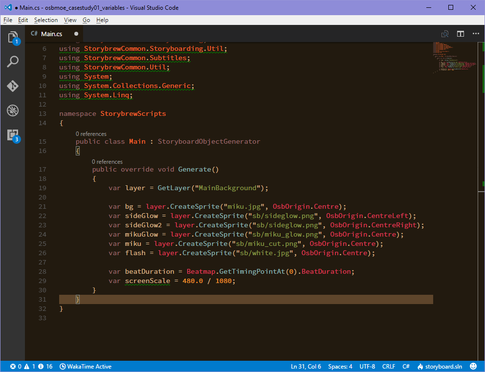

   I know we can just use a code block, but sometimes with a screenshot it's just... more direct, y'know? Plus you get to see my cute little interface!

Commandeering
=============
If you've reached to this point so far, congratulations! Sadly, there isn't anything showing up yet. If we were to save our work, as long as there aren't any dreaded syntax errors, the coast is clear for now. **But it's finally time to tell our sprites what to do and get the ball rolling.**

Loading the Background
----------------------
**Let's start with getting the background to fade in and display.** We can probably do a slow fade-in until the song begins picking up, but 9000ms into the song the music drops a teensy bit. So let's accentuate that part too. We also shouldn't forget to :term:`scale` the background to fit with the storyboard's area, so we can use the value we calculated earlier.

With that, we can begin inserting our first commands:

.. code-block:: csharp
  :linenos:
  :lineno-start: 31

  bg.Scale(0, screenScale);
  bg.Fade(0, 9000, 0, 0.7);

The first command tells storybrew to resize the background to the size of ``screenScale`` so that it'd fit the screen. The second command then tells storybrew that from ``0`` ms to ``9000`` ms, change the opacity from ``0`` to ``0.7``. When you see four values like this, break it down and think that the command is asking for your *start time* (``0``), the *end time* (``9000``), the start opacity (``0``), and the end opacity ``0.7``.

If you save your work now, you'll be able to see Miku fade-in, but right after 9000ms, everything turns dark. This is because the latest end time is 9000ms, to which after that point, the sprite despawns to save memory. Let's not worry about that for now; it only means we need to add more commands!

At 9000ms, there's a slight gap in the music before it fully picks up, so we can take advantage of that moment with our fading to create some minor theatrics. **Let's make the background fade to near black really quickly, then become fully opaque when the music builds up.**

Let's see the new code we'll be planning to add, then explain more about it.

.. code-block:: csharp
  :linenos:
  :lineno-start: 33
  :emphasize-lines: 1

  bg.Fade(OsbEasing.OutCubic, 9000, 9600, bg.OpacityAt(9000), 0.1);
  bg.Fade(9600, 9900, bg.OpacityAt(9600), 1);

We're going to be introducing two new things here, so let's break it down. In addition to the four values that a command can accept, **we can also incorporate** :ref:`an easing <storyboarding_scripting_easing>` **to spicen up the tweening our command does.** Just like in direct scripting, the easing value would be passed before all the other values, if we'd like to use it. In this case, we're using OutCubic, which will be relatively fast. We then have it go from ``9000`` ms to ``9600`` ms.

The next thing to mention is ``bg.OpacityAt(9000)``. This method call is known as **querying a sprite's state**. We can get `various properties of a sprite at a specified time value <https://github.com/Damnae/storybrew/wiki/Sprite-Methods#querying-sprite-state>`_. In this case, we're getting the opacity of the sprite at the time ``9000`` ms. This way, if we find that ``0.7`` may not be a satisfying value, we actually don't need to edit every instance of ``0.7``. The flexibility in querying a sprite's state allows you to be less redundant in your code.

Finally, let's keep the background on full blast up for now. It's pretty annoying to deal with it immediately despawning. The end of the song is at ``249627`` ms, so let's just add this line so that way the last command is at the very end of the song.

.. code-block:: csharp
  :lineno-start: 35
  :linenos:

  bg.Fade(249627, 0);

So far so good! Let's end this section with a bang! What better way than to have our flash sprite come and make a flash? **Let's add a line with the flash fading out for a full measure from** ``9600`` **ms.** Starting with a line break to give our code more breathing space...

.. code-block:: csharp
  :lineno-start: 37
  :linenos:

  flash.Fade(9600, 9600 + beatDuration * 4, 0.8, 0);

Assuming no errors, your storyboard should resemble this:

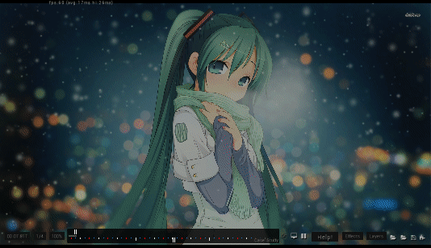

   *It's alive!*

Applying Miku
-------------
Let's have Miku join the party now. The first matter of concern is needing to calculate Miku's location on the background *with* the scale resize in mind *and* the fact that the x-range for the playfield is from -107 to 747. This needs to be done for both the x and y position, because Miku herself is not 1080px tall.

Miku's center position is located at (847.5, 551) in relation to the original background's size. These values can then be taken as ratios by dividing against the max width and height of the background. Then we multiply it against the dimensions of the playfield size, and for the width, offset it by -107. If we want to use the ``Vector2`` type that :ref:`OpenTK offers <programming_variables_and_types_openTK>`, we'll need to make all decimal numbers have the ``f`` suffix to denote the value as a ``float`` and not a ``double``.

In the end, the calculations should look like this:

.. code-block:: csharp
    :lineno-start: 39
    :linenos:

    // Calculating Miku's position based on the original image's dimensions.
    var initialMikuLocation = new Vector2(847.5f, 551);

    var xRatio = initialMikuLocation.X / 1920;
    var yRatio = initialMikuLocation.Y / 1080;

    var mikuX = (854 * xRatio) + -107;
    var mikuY = 480 * yRatio;

**We can now place our Miku sprite and see what it'll look like in our storyboard.** When the background starts getting darker at ``9000`` ms, let's retain the original background opacity onto the Miku sprite, *along with* actually making it even more opaque. We gotta bring Miku to the spotlight after all!

So we need to first put the commands for moving Miku appropriately, resizing her, then query the background sprite's opacity at ``9000`` ms as well. For our testing purposes, let's also throw the Miku sprite a bone and have it despawn at the end of the map.

.. code-block:: csharp
    :lineno-start: 48
    :linenos:

    miku.Move(9000, mikuX, mikuY);
    miku.Scale(9000, screenScale);
    miku.Fade(9000, 9600, bg.OpacityAt(9000), 1);
    miku.Fade(249627, 0);

It's easy to get lost in trying to follow these kinds of tutorials, so here's a screenshot where the action happens so that way you have an idea of what's happening. Does your storyboard resemble this?

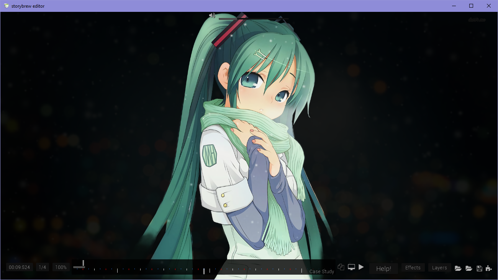

   Just one on one with an angel. (≧◇≦)

Side Glows
----------
As the music picks up, it's now high time to add some cool auxiliary effects to get the adrenaline pumping while playing the map. Let's begin incorporating the side glows into the storyboard, then. **We're going to have the side glows alternate in pulsing every 1/1 beat repeatedly.** Those cues certainly call for using a storyboard loop. Let's first begin by setting up the sprites though.

**We first need to resize the side glow images so that they'll fit the playfield's 480px maximum**. The side glow's image height is 640px, so we can utilize the same math as we did earlier with ``screenScale``. We also want to kind of customize the width of our glow's scale, so let's also add a variable to keep track of that, and instead of using the Scale command, we can use ScaleVec to be able to resize both width and height. We then need to move the glows to their appropriate locations, which would be anchored to the sides of the screen.

**For timing, we need to consider that the second side glow should be alternating with the first one.** If the first sideGlow were to begin at ``9900`` ms and a pulse lasts two 1/1 beats, then ``sideGlow2`` should begin at ``9900 + beatDuration * 2`` ms.

**Since these glow images are a plain white, let's make them more exciting by adding some color.** We can use the standard colors offered in :ref:`OpenTK's Color4 data type <programming_variables_and_types_openTK>` to make coloring our sprites a cinch! Let's use a nice SeaGreen.

And as a final but very important footnote, **the second side glow uses the same source image, but needs to be flipped because it's intended to be mirrored on the right side of the screen.** We'll need a command for that as well. Simply including a single instance of the FlipH command will keep the image flipped throughout its lifespan, so we can just have it instaniate upon its start time immediately.

With a line break to give our code more breathing space, let's begin adding some spice with our glows with the following code:

.. code-block:: csharp
    :lineno-start: 53
    :linenos:

    var sideGlowWidthScale = 0.6;
    var sideGlowHeightScale = 480.0 / 640;
    var sideGlowStartTime = 9900;
    var sideGlow2StartTime = sideGlowStartTime + beatDuration * 2;

    sideGlow.ScaleVec(sideGlowStartTime, sideGlowWidthScale, sideGlowHeightScale);
    sideGlow2.ScaleVec(sideGlow2StartTime, sideGlowWidthScale, sideGlowHeightScale);
    sideGlow.Move(sideGlowStartTime, -107, 240);
    sideGlow2.Move(sideGlow2StartTime, 747, 240);
    sideGlow.Color(sideGlowStartTime, Color4.SeaGreen);
    sideGlow2.Color(sideGlow2StartTime, Color4.SeaGreen);

.. tip:: You may have noticed the inclusion of more and more variables as we're developing this case study. **Variables are a good thing!** They help make the code far easier to read at a glance, and if you have to change the value of a variable, all the corresponding items will update as well.

    A good rule of thumb is that if you're repeating the same expression of values many times throughout your code, you may want to put it inside a variable. A great guideline coders follow is known as the DRY principle – **Don't Repeat Yourself**. Once we learn more programming constructs, you'll find that following this principle gets far easier and more exciting to partake!

    Just remember that there is a limit to how much you want to be using variables. It's incredibly trivial to store a variable for one little value in a Fade command. Just use your intution in how you feel would greatly increase the readability and organization of your code.

While this code so far just inserts the side glows, the pulsing still needs to be done. **We'll need to have the sprites execute their own storyboard loops using a Fade command to execute the pulse effect.**  Since we already put everything in variables, we can just take advantage of them and have remarkably simple and clean code. Remember that a loop's duration is based on the end time of the latest command in the loop, so we need to add a filler fade command at ``beatDuration * 4`` so that the loop's duration is 4 1/1 beats long. The first side glow will have 8 iterations, and the second side glow, starting a little late, will only need to pulse 7 times. We decided on these times because at the very end of this point, at ``18900`` ms, the music drops again and a new section begins.

And with a line break... More code!

.. code-block:: csharp
    :lineno-start: 66
    :linenos:

    sideGlow.StartLoopGroup(sideGlowStartTime, 8);
        sideGlow.Fade(0, beatDuration * 2, 0.7, 0);
        sideGlow.Fade(beatDuration * 4, 0);
    sideGlow.EndGroup();

    sideGlow2.StartLoopGroup(sideGlow2StartTime, 7);
        sideGlow2.Fade(0, beatDuration * 2, 0.7, 0);
        sideGlow2.Fade(beatDuration * 4, 0);
    sideGlow2.EndGroup();

With the side glows added, your storyboard should now resemble the following. Getting excited? I sure am, and I'm just text on a screen!

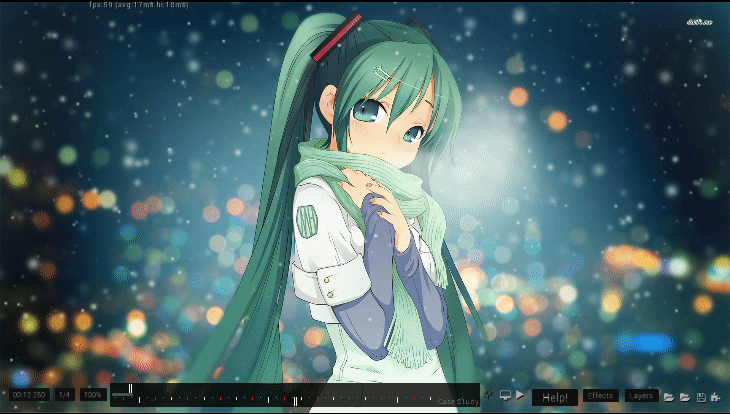

   In a nice and fresh sea green. Actually, why is it sea green anyway? Wouldn't it be a concern if the sea was colored this green? Like, if there's been so much algae that the algae are going to assemble together and start a competing algae civilization? I, for one, welcome our algae overlords.

Glow, Miku, Glow!
-----------------
We have almost every sprite used in some capacity. Hooray! **Let's finish the section off by applying a glow pulsing effect on the Miku sprite.** By this point, you should be somewhat familiar with our workflow process – that is, we'll begin by setting up our sprite with the necessary housekeeping, then apply the necessary commands afterwards.

In setting up, we can simply reuse the coordinates calculated earlier, as the image is of the same dimensions as the Miku sprite. We don't need to rescale it though, as we plan to use the scale in the pulse effect's storyboard loop. If we were to have both of these commands, it may cause a same-time conflict, potentially causing commands to inconsistently not run in the first place. We can't have that.

Let's also add a light recolor to... LightSeaGreen. Just to spice things up.

The pulse effect itself is straightforwawrd otherwise and resembles that of the side glows. To add a little spice, we can add a simple Out easing effect as well. We'll make the loop last every 2 quarter beats, and thus, we'll need to up the iteration count to 15.

With a line break for some personal space, let's code!

.. code-block:: csharp
    :lineno-start: 76
    :linenos:

    mikuGlow.Move(sideGlowStartTime, mikuX, mikuY);
    mikuGlow.Color(sideGlowStartTime, Color4.LightSeaGreen);

    mikuGlow.StartLoopGroup(sideGlowStartTime, 15);
        mikuGlow.Scale(OsbEasing.Out, 0, beatDuration * 2, screenScale, screenScale * 1.04);
        mikuGlow.Fade(OsbEasing.Out, 0, beatDuration * 2, 0.7, 0);
    mikuGlow.EndGroup();

Miku should now be pulsing alongside the side glows. Exciting, right? Here's an image preview to help verify if you're on track with this guide.

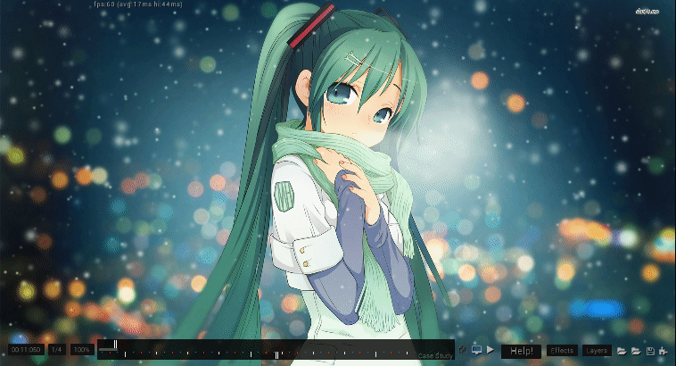

   Miku was like, an idol girl before idol girls were cool. ( ｀ー´)ノ

Summary
-------
If you've been following each section here to a T, your ``Generate`` method for this effect should resemble something like this:

.. code-block:: csharp
    :lineno-start: 17
    :linenos:

    public override void Generate()
    {
        var layer = GetLayer("MainBackground");

        var bg = layer.CreateSprite("miku.jpg", OsbOrigin.Centre);
        var sideGlow = layer.CreateSprite("sb/sideglow.png", OsbOrigin.CentreLeft);
        var sideGlow2 = layer.CreateSprite("sb/sideglow.png", OsbOrigin.CentreRight);
        var mikuGlow = layer.CreateSprite("sb/miku_glow.png", OsbOrigin.Centre);
        var miku = layer.CreateSprite("sb/miku_cut.png", OsbOrigin.Centre);
        var flash = layer.CreateSprite("sb/white.jpg", OsbOrigin.Centre);

        var beatDuration = Beatmap.GetTimingPointAt(0).BeatDuration;
        var screenScale = 480.0 / 1080;

        bg.Scale(0, screenScale);
        bg.Fade(0, 9000, 0, 0.7);
        bg.Fade(OsbEasing.OutCubic, 9000, 9600, bg.OpacityAt(9000), 0.1);
        bg.Fade(9600, 9900, bg.OpacityAt(9600), 1);
        bg.Fade(249627, 0);

        flash.Fade(9600, 9600 + beatDuration * 4, 0.8, 0);

        // Calculating Miku's position based on the original image's dimensions.
        var initialMikuLocation = new Vector2(847.5f, 551);

        var xRatio = initialMikuLocation.X / 1920;
        var yRatio = initialMikuLocation.Y / 1080;

        var mikuX = (854 * xRatio) + -107;
        var mikuY = 480 * yRatio;

        miku.Move(9000, mikuX, mikuY);
        miku.Scale(9000, screenScale);
        miku.Fade(9000, 9600, bg.OpacityAt(9000), 1);
        miku.Fade(249627, 0);

        var sideGlowWidthScale = 0.6;
        var sideGlowHeightScale = 480.0 / 640;
        var sideGlowStartTime = 9900;
        var sideGlow2StartTime = sideGlowStartTime + beatDuration * 2;

        sideGlow.ScaleVec(sideGlowStartTime, sideGlowWidthScale, sideGlowHeightScale);
        sideGlow2.ScaleVec(sideGlow2StartTime, sideGlowWidthScale, sideGlowHeightScale);
        sideGlow.Move(sideGlowStartTime, -107, 240);
        sideGlow2.Move(sideGlow2StartTime, 747, 240);
        sideGlow.Color(sideGlowStartTime, Color4.SeaGreen);
        sideGlow2.Color(sideGlow2StartTime, Color4.SeaGreen);
        sideGlow2.FlipH(sideGlow2StartTime, sideGlow2StartTime);

        sideGlow.StartLoopGroup(sideGlowStartTime, 8);
            sideGlow.Fade(0, beatDuration * 2, 0.7, 0);
            sideGlow.Fade(beatDuration * 4, 0);
        sideGlow.EndGroup();

        sideGlow2.StartLoopGroup(sideGlow2StartTime, 7);
            sideGlow2.Fade(0, beatDuration * 2, 0.7, 0);
            sideGlow2.Fade(beatDuration * 4, 0);
        sideGlow2.EndGroup();

        mikuGlow.Move(sideGlowStartTime, mikuX, mikuY);
        mikuGlow.Color(sideGlowStartTime, Color4.LightSeaGreen);

        mikuGlow.StartLoopGroup(sideGlowStartTime, 15);
            mikuGlow.Scale(OsbEasing.Out, 0, beatDuration * 2, screenScale, screenScale * 1.04);
            mikuGlow.Fade(OsbEasing.Out, 0, beatDuration * 2, 0.7, 0);
        mikuGlow.EndGroup();
    }

If you've gotten to this point, then **congratulations**! You've successfully cleared the main meat of this tutorial. We hope that this gives you a good idea about how to utilize sprites, using different variables and types, and then putting them all together to create something awesome.

We've prepared one more section that will push these commands further to demonstrate other cool effects that can be done. Treat this as extra credit and a good way to see how this work can scale into a full-fledged and fun storyboard of its own.

Phase 2
=======
At this point, we see that the effects all end at ``18900`` ms, denoting a drop in the music and a new section beginning. **We're going to build off from this point by having the background fade out a small bit, adding a flash, and then more aggressive pulsing in this upcoming section.**

The Background
--------------
Let's first begin with the background transitioning into something more sinister. **We'll first do a really quick fade-out of the background in complementing the music, and then have it change color upon the new section. We'll also use the flash sprite to make this transition seamless.** A good easing to use for this kind of fast effect would be something like OutCirc, so let's try that out.

.. code-block:: csharp
    :lineno-start: 84
    :linenos:

    bg.Fade(OsbEasing.OutCirc, 18900, 19200, 1, 0.1);
    bg.Fade(19200, 1);
    bg.Color(19200, 19500, bg.ColorAt(19200), Color4.Crimson);
    flash.Fade(OsbEasing.Out, 19200, 19500, 1, 0);

We need to have a Fade command immediately at ``19200`` ms or else the background would always remain completely dark. The flash at the end will help make this effect look less sudden. As for the color change, we query the state of the background's color at ``19200`` in case we ever want to change the color prior to this moment (The default color for an image is ``Color4.White``, which causes no hue changes to the sprite), and then transition the background to a sinister Crimson.

Just these few lines should create the following result, screenshotted here:

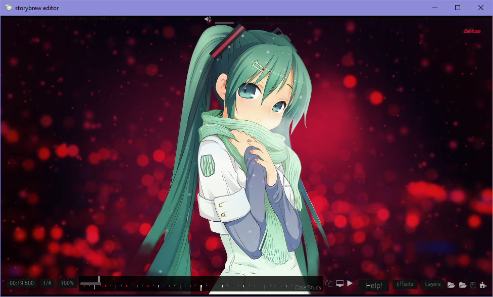

   This is yandere Miku.

The Pulsing
-----------
Let's now add some aggressive pulses. **The pulsing will be similar to the previous loops made, only that they'll be faster, a different color, and a stronger opacity.**

We'll need to change the colors of the side glow sprites and the Miku glow befitting the evil atmosphere we've created with the background. Otherwise, the loops should resemble their previous entities, only with stronger opacity and faster timing. Let's also throw an easing like OutBack to make a more sudden effect too.

.. code-block:: csharp
    :lineno-start: 89
    :linenos:

    sideGlow.Color(19200, Color4.Crimson);
    sideGlow.StartLoopGroup(19200, 32);
        sideGlow.Fade(OsbEasing.OutBack, 0, beatDuration, 1, 0);
        sideGlow.Fade(beatDuration * 2, 0);
    sideGlow.EndGroup();

    sideGlow2.Color(19200, Color4.Crimson);
    sideGlow2.StartLoopGroup(19200, 32);
        sideGlow2.Fade(OsbEasing.OutBack, 0, beatDuration, 1, 0);
        sideGlow2.Fade(beatDuration * 2, 0);
    sideGlow2.EndGroup();

    mikuGlow.Color(19200, Color4.Red);
    mikuGlow.StartLoopGroup(19200, 32);
        mikuGlow.Scale(OsbEasing.OutCirc, 0, beatDuration * 2, screenScale, screenScale * 1.1);
        mikuGlow.Fade(OsbEasing.OutCirc, 0, beatDuration * 2, 1, 0);
    mikuGlow.EndGroup();

Does your storyboard match the following?

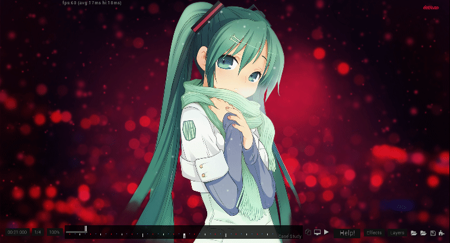

   This is yandere Miku ready to proclaim her love to you in the most maniacally gory way possible.

Extra Credit
------------
**Let's end this storyboard on a somber note by also storyboarding the section starting at** ``38400`` **ms**. We'll just have the background commit a slow transition away from the vile crimson color and into something melancholic and moody like Navy. We'll also have the background fade out too, let's say around ``48000`` ms. Throw in some easings as well – the basic ones work very well over an extended period of time.

.. code-block:: csharp
    :lineno-start: 107
    :linenos:

    bg.Color(OsbEasing.In, 38400, 39600, bg.ColorAt(38400), Color4.Navy);
    bg.Fade(OsbEasing.Out, 39600, 48000, 1, 0.3);

Upon reaching ``48000`` ms, we should be greeted with a nice faded background like:

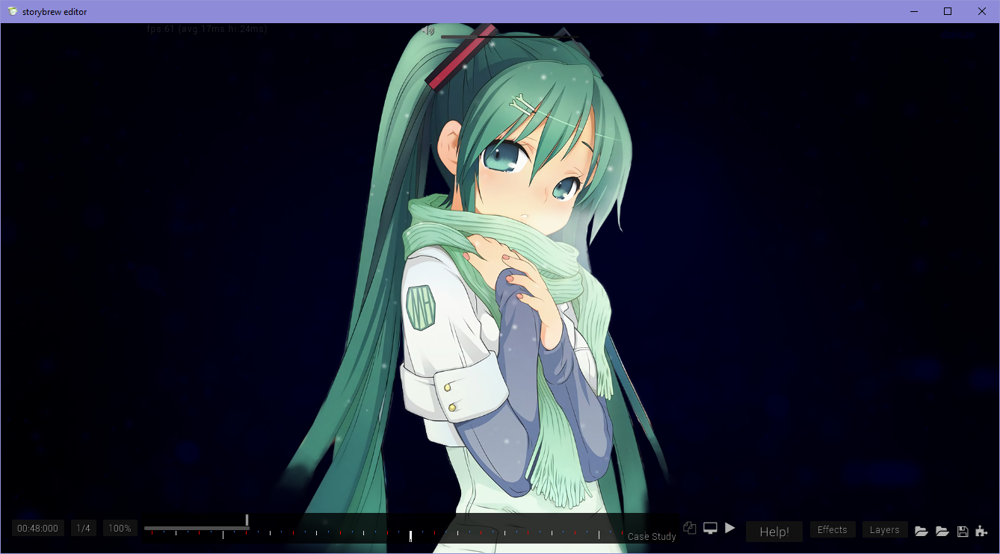

   On another note, I wouldn't be surprised if people were to confuse the word somber with Overwatch's Sombra. Oh baby!

The Complete Code
=================
To compare your work, here's the entirety of the code we've developed within this guide.

.. code-block:: csharp
    :lineno-start: 17
    :linenos:

    public override void Generate()
    {
        var layer = GetLayer("MainBackground");

        var bg = layer.CreateSprite("miku.jpg", OsbOrigin.Centre);
        var sideGlow = layer.CreateSprite("sb/sideglow.png", OsbOrigin.CentreLeft);
        var sideGlow2 = layer.CreateSprite("sb/sideglow.png", OsbOrigin.CentreRight);
        var mikuGlow = layer.CreateSprite("sb/miku_glow.png", OsbOrigin.Centre);
        var miku = layer.CreateSprite("sb/miku_cut.png", OsbOrigin.Centre);
        var flash = layer.CreateSprite("sb/white.jpg", OsbOrigin.Centre);

        var beatDuration = Beatmap.GetTimingPointAt(0).BeatDuration;
        var screenScale = 480.0 / 1080;

        bg.Scale(0, screenScale);
        bg.Fade(0, 9000, 0, 0.7);
        bg.Fade(OsbEasing.OutCubic, 9000, 9600, bg.OpacityAt(9000), 0.1);
        bg.Fade(9600, 9900, bg.OpacityAt(9600), 1);
        bg.Fade(249627, 0);

        flash.Fade(9600, 9600 + beatDuration * 4, 0.8, 0);

        // Calculating Miku's position based on the original image's dimensions.
        var initialMikuLocation = new Vector2(847.5f, 551);

        var xRatio = initialMikuLocation.X / 1920;
        var yRatio = initialMikuLocation.Y / 1080;

        var mikuX = (854 * xRatio) + -107;
        var mikuY = 480 * yRatio;

        miku.Move(9000, mikuX, mikuY);
        miku.Scale(9000, screenScale);
        miku.Fade(9000, 9600, bg.OpacityAt(9000), 1);
        miku.Fade(249627, 0);

        var sideGlowWidthScale = 0.6;
        var sideGlowHeightScale = 480.0 / 640;
        var sideGlowStartTime = 9900;
        var sideGlow2StartTime = sideGlowStartTime + beatDuration * 2;

        sideGlow.ScaleVec(sideGlowStartTime, sideGlowWidthScale, sideGlowHeightScale);
        sideGlow2.ScaleVec(sideGlow2StartTime, sideGlowWidthScale, sideGlowHeightScale);
        sideGlow.Move(sideGlowStartTime, -107, 240);
        sideGlow2.Move(sideGlow2StartTime, 747, 240);
        sideGlow.Color(sideGlowStartTime, Color4.SeaGreen);
        sideGlow2.Color(sideGlow2StartTime, Color4.SeaGreen);
        sideGlow2.FlipH(sideGlow2StartTime, sideGlow2StartTime);

        sideGlow.StartLoopGroup(sideGlowStartTime, 8);
            sideGlow.Fade(0, beatDuration * 2, 0.7, 0);
            sideGlow.Fade(beatDuration * 4, 0);
        sideGlow.EndGroup();

        sideGlow2.StartLoopGroup(sideGlow2StartTime, 7);
            sideGlow2.Fade(0, beatDuration * 2, 0.7, 0);
            sideGlow2.Fade(beatDuration * 4, 0);
        sideGlow2.EndGroup();

        mikuGlow.Move(sideGlowStartTime, mikuX, mikuY);
        mikuGlow.Color(sideGlowStartTime, Color4.LightSeaGreen);

        mikuGlow.StartLoopGroup(sideGlowStartTime, 15);
            mikuGlow.Scale(OsbEasing.Out, 0, beatDuration * 2, screenScale, screenScale * 1.04);
            mikuGlow.Fade(OsbEasing.Out, 0, beatDuration * 2, 0.7, 0);
        mikuGlow.EndGroup();

        bg.Fade(OsbEasing.OutCirc, 18900, 19200, 1, 0.1);
        bg.Fade(19200, 1);
        bg.Color(19200, 19500, bg.ColorAt(19200), Color4.Crimson);
        flash.Fade(OsbEasing.Out, 19200, 19500, 1, 0);

        sideGlow.Color(19200, Color4.Crimson);
        sideGlow.StartLoopGroup(19200, 32);
            sideGlow.Fade(OsbEasing.OutBack, 0, beatDuration, 1, 0);
            sideGlow.Fade(beatDuration * 2, 0);
        sideGlow.EndGroup();

        sideGlow2.Color(19200, Color4.Crimson);
        sideGlow2.StartLoopGroup(19200, 32);
            sideGlow2.Fade(OsbEasing.OutBack, 0, beatDuration, 1, 0);
            sideGlow2.Fade(beatDuration * 2, 0);
        sideGlow2.EndGroup();

        mikuGlow.Color(19200, Color4.Red);
        mikuGlow.StartLoopGroup(19200, 32);
            mikuGlow.Scale(OsbEasing.OutCirc, 0, beatDuration * 2, screenScale, screenScale * 1.1);
            mikuGlow.Fade(OsbEasing.OutCirc, 0, beatDuration * 2, 1, 0);
        mikuGlow.EndGroup();

        bg.Color(OsbEasing.In, 38400, 39600, bg.ColorAt(38400), Color4.Navy);
        bg.Fade(OsbEasing.Out, 39600, 48000, 1, 0.3);
    }

Not bad for your first time, huh?

Tutorial Cleared!
=================
If you've reached *this* point, then **congratulations**! You've cleared everything this case study has to offer. You're free to continue experimenting out new things, or to try this out on a storyboard of your own. **But your journey isn't complete yet!** There's so much more that can be harnessed using programming and storybrew, that you'd only be depriving yourself if you felt content at this point.

Keep on reading through these chapters and trying them out for yourself in storybrew to see your effects. **The best way to learn is to try it out yourself and explore!** Fiddle around with values. Add in your own commands. Use different ones. The sky is yours!

.. figure:: img/case_study_01/botw.gif
   :scale: 100%
   :alt: Link flying out in the BOTW to explore.

   Alternatively, *this guy* is yours.
