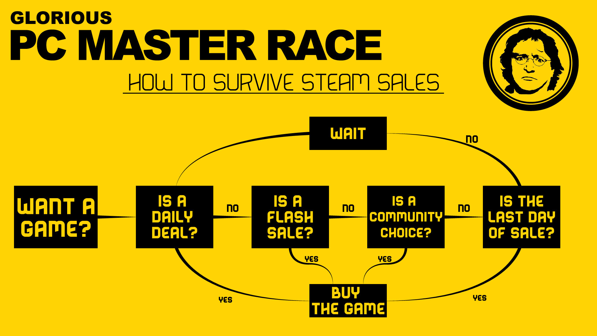
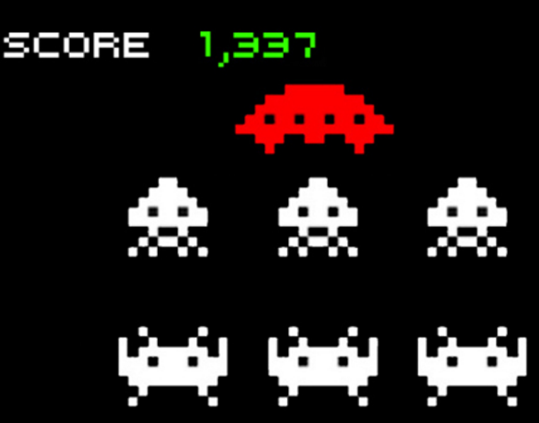
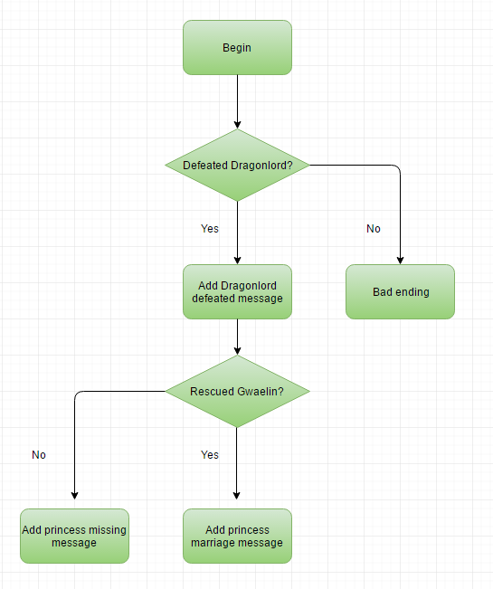

===============
Decision Making
===============

.. _programming_decision_making:

Sneak Peek
==========
By the end of this lesson, you should be able to...

- Use if statements to make the program pick different choices depending on whether a condition is true or false.
- Use switch statements to provide numerous outcomes depending on a variety of cases.
- Combine relational and logical operators to create more robust conditional blocks.

Controlling Flow
================
So we have ways to store different types of data, and also ways to calculate these points of data. While linear, start-to-finish programs are charming, they hardly stretch the limits of our programming. Like a visual novel with different choices and routes, our storyboard's effects can create different visuals depending on the choices made (or, rather, calculated). This makes developing an effect very exciting – you can reuse this effect in other parts of the storyboard, creating coherence, convenience, and more opportunities to unleash wizardry!

This section is entirely dedicated to the decision making process of coding, and how we can express different outcomes depending on certain conditions in our code. Particularly helpful would be to visualize your program as a flowchart. A flowchart is very procedural, and when a decision point is met (i.e. our condition), we go through different paths to reach our final conclusion.

    The old flowchart for Steam Sales should work well. Now it's simply just "buy the game". Or click circles.

If Statements
=============
The **if statement** is the most fundamental form of decision making in a program. All the statement asks is a question, or our condition. If it's met, we execute that certain section of code. So essentially, think of it as, "If *something is true*, then do the following". Because these kinds of questions can be answered with a "yes" or "no", our spidey senses tell us that it's equivalent to ``true`` or ``false``. As such, if statements take a ``bool`` type, and *only if* that ``bool`` value is true, we go through the corresponding section of code.

It's best to demonstrate this directly by example.

.. code-block:: csharp
    :linenos:
    :emphasize-lines: 4

    int badges = 1;
    int obedienceLevel = 20;
    bool beatMisty = true;
    if (beatMisty)
    {
        badges++;
        obedienceLevel = 30;
    }

If the player has defeated Misty (as expressed in our sample ``bool`` variable ``beatMisty``), then we'll increment the amount of badges we have, making that ``2``, and, as a perk for owning the Cascade Badge, be able to tame Pokémon up to Level 30. The code contents that are inside those brackets are the special section of code that execute when the condition is met. So remember, all those badge perks *only* occur if ``beatMisty`` is ``true``!

    GUYS WE NEED TO BEAT MISTY

Of course, directly sticking in the ``bool`` value isn't the only thing we can do. Remember how we talked about :ref:`relational operators earlier? <programming_operators_relational>` As those comparison operators return ``true`` or ``false`` upon evaluation, they act as the perfect conditional sentinel for our purposes. Take a look at this example:

.. code-block:: csharp
    :linenos:
    :emphasize-lines: 4

    Color4 magicalParticleColor = Color4.Red;
    Vector2 particleLocation = new Vector2(320,240);

    if (particleLocation.X > particleLocation.Y)
    {
        magicalParticleColor = Color4.Blue;
    }

Ooh, interesting! Imagine us having a particle of the color red. If the particle's ``X`` coordinate is larger than its ``Y`` coordinate, we'll recolor it blue. But *only if* ``X > Y``!

.. warning:: Up to this point, you've hopefully been rather strict on yourself by making sure, the easy way or the hard way, that all your statements end in semicolons. Does that mean the if statement should end in a semicolon as well? The answer is actually **no**! Ending the opening part of the if statement with a semicolon basically suffocates it – the bracketed contents will *not* be a part of the if statement, but rather become a separate entity that will always execute. Observe:

    .. code-block:: csharp
        :linenos:
        :emphasize-lines: 2

        float pokemonRating = 7.8f;
        if (false);
        {
            pokemonRating = 10.0f;
        }

    This snippet of code *should* not execute the bracketed contents of the if block. However, due to the semicolon placed after ``if (false)``, the whole if statement's execution is basically nothing, and the contents from Line ``3`` will execute anyway because, as a naive program it is, it's not attached to that if-condition.

    So save the trouble and don't put a semicolon there to begin with. Think of the if statement as having the condition *and* the bracketed good stuff.

Or Else!
--------
With the if statement, we can execute a certain block of code only if the condition for that if statement is met. However, what if we want an alternative path for our code to partake when the condition is *not* met? We can actually add an **else** block to our if statement, adding another possible path to our conditional statements – that is, the path if the condition is false.

.. code-block:: csharp
    :linenos:
    :emphasize-lines: 7

    int myScore = 5000;
    bool defeatedEvilSpaceship = false;
    if (defeatedEvilSpaceship)
    {
        myScore += 15000;
    }
    else
    {
        myScore += 1000;
    }

If we only defeated that evil spaceship! Now we'll only gain ``1000`` points instead of ``15000``, as ``defeatedEvilSpaceship`` is ``false``. Notice that the ``else`` block naturally slides in without any need to explicitly reference back to the if statement. We just attach an ``else`` with the brackets and call it a day.

    He evades us yet again! This game is *too* outdated and *too* hard. I'd rather play *Dark Souls*, or *osu!*.

Else If
-------

It's also possible to chain else blocks as well. This allows you to check for multiple possibilities, and when all of those possible conditions have not been met, resort to a default one (where none of the conditions have been met). Take the existing else block and add an ``if (condition)`` right after it. Only for the last case, where none of the previous conditions have been met, you can optionally end the chain with the else block we learned earlier. Consider the following example:

.. code-block:: csharp
    :linenos:
    :emphasize-lines: 7,11,15,19

    float myGrade = 87.9f;
    string letterGrade;
    if(myGrade >= 90)
    {
        letterGrade = "A";
    }
    else if(myGrade >= 80)
    {
        letterGrade = "B";
    }
    else if(myGrade >= 70)
    {
        letterGrade = "C";
    }
    else if(myGrade >= 60)
    {
        letterGrade = "D";
    }
    else
    {
        letterGrade = "F";
    }

What a respectable grade. You can see that as one condition isn't met, it'll go to the next ``else if`` to see if that condition is met, and so forth. If *none* of the conditions are met, then you as the student will get a very unfortunate letter grade of an F. That's depressing.

Because this effectively acts as a chain of if-else if-else... statements, you do need to be more considerate of the conditions from within. For instance, imagine it checking from the bottom up, where we check if ``myGrade >= 60`` first, then if ``myGrade >= 70``, and so forth. You may realize what happens instead is a *false positive*, as a grade value like ``87.9`` would *technically* validate ``myGrade >= 60``, leaving the other else conditions impossible to even meet. These sorts of errors where the program does successfully compile but still have errors are known as **logical errors**. They're more difficult to debug than syntax errors since the compiler doesn't tell you anything.

Nested If Statements
--------------------
It's also possible to implement additional if statements in if statements to allow even more elaborate conditions and situations. These are known as **nested if statements**. Be careful though. As you add additional if statements inside other conditional blocks, the amount of possible paths your program can theoretically take also increases, adding to the complexity of the program. As a storyboarder, it's important to consider the kinds of path your logic can take, and ensure that it exactly matches your intentions. The following block of code is an example using nested if statements. For convenience, assume that the variables have already been declared ahead of time.

.. code-block:: csharp
    :linenos:
    :emphasize-lines: 6,10

    string endingMessage = "Congratulations!\n";

    if(defeatedDragonlord)
    {
        endingMessage += "The Dragonlord is defeated!\n";
        if(rescuedGwaelin)
        {
            endingMessage += "Princess Gwaelin asks for your hand in marriage.";
        }
        else
        {
            endingMessage += "But the princess still remains missing.";
        }
    }
    else
    {
        endingMessage += "You cowered out, and Alefgard is in ruins!";
    }

If you're going to design something more algorithmic or complex, it's best to approach things with a flowchart to ensure that you're organized and the logic is going *exactly* as you intend. The following diagram is a flowchart visual of the chained if statement.

    Is my age showing by giving you guys a Dragon Quest reference? I sure hope not.

Switch Cases
============
A **switch statement** is a situational tool that can also be used for decision making, but has some specific constraints. It is a control statement that, inside its section of code, executes from a list of possible candidates matching the case switch. These "candidates" are known as cases, and are constant values of the same type as the case switch. When of the cases match the case switch (i.e. equality), then that case is executed. There can be an infinite number of cases, with the last case having the possibility to be ``default`` in order to account for every possibility. If no ``default`` case is included, the switch block will exit without any action being executed.

.. code-block:: csharp
    :linenos:
    :emphasize-lines: 4,21

    string muhCoffeeSize = "grande";
    int coffeeFlOz;

    switch(muhCoffeeSize)
    {
        case "short":
            coffeeFlOz = 8;
            break;
        case "tall":
            coffeeFlOz = 12;
            break;
        case "grande":
            coffeeFlOz = 16;
            break;
        case "venti":
            coffeeFlOz = 24;
            break;
        case "trenta":
            coffeeFlOz = 32;
            break;
        default:
            cofeeFlOz = 0;
            break;
    }

Each case label must be a constant value (i.e. a hard-value, not some variable or expression) and be unique. This means that it's not possible to dedicate a range, such as a case where a value is greater than some other value, for switch cases. You must use if statements instead.

It is also possible to have multiple case labels that lead to the same set of statements. These case labels will just get considered as one possible case altogether, as shown:

.. code-block:: csharp
    :linenos:
    :emphasize-lines: 6,7,8,9

    int myIdealHaremSize = 6;
    bool isIdealSize;

    switch(myIdealHaremSize)
    {
        case 4:
        case 5:
        case 6:
        case 7:
            isIdealSize = true;
            break;
        default:
            isIdealSize = false;
            break;
    }

Though at this point, you may consider opting for if statements and ranges instead. Consider reading about :ref:`logical operators <programming_decision_making_logical_operators>` for implementing conditions based on a range.

Execution of the switch case begins right after the case label and proceeds until it hits some sort of end-of-control point, which in this case, is a ``break``. This end-of-control is **required** for a switch case. In other programming languages, it is possible to not have this ending point and have the case "fall-through" to the next case, but C# strictly enforces this ending rule. Basically, consider that each case needs to have an ending, and that ``break`` usually satisfies "The End" for the case.

When should you use switches over if statements?

- Switch cases are often more readable than if statements when formatted properly.
- Compilation time for switch statements can be slightly faster than if-else-if ladders, as switches can be easier to optimize when compiling code into the computer's understanding. (Like most things in programming though, *it depends*.)
- If you have over 5 possible conditions that can be checked with equality, consider opting for switches instead of if statements.

Other Remarks
=============

.. _programming_decision_making_logical_operators:

Logical Operators
-----------------
In the previous chapter, we talked about :ref:`relational operators <programming_operators_relational>` and how we can use them in if statements for more robust situations. To further up the ante, there also exists special boolean binary operators that can be used to provide even further flexibility for our if statements. These are known as **logical operators**.

.. csv-table:: Logical Operators
   :header: "Expression", "Operation", "Description"
   :widths: auto

   "``!x``","Logical negation", "Flips the ``bool`` of ``x`` to its opposite"
   "``x && y``","Logical AND", "``x`` **AND** ``y`` must be ``true`` for the whole expression to be ``true``"
   "``x || y``","Logical OR", "``x`` **OR** ``y`` must be ``true`` for the whole expression to be ``true``"

If you've played with the redstone ore in Minecraft and tried out basic digital logic with AND, OR, and NOT gates, then these essentially act exactly the same. It's important to be more liberal in parentheses here to ensure that the whole expression is caught for any of your logical inquiries. The following example checks if a :term:`particle` is on-screen, and if so, to do a :term:`Fade` command. Assume variables are already declared.

.. code-block:: csharp
    :linenos:
    :emphasize-lines: 1

    if((mySpriteLocation.X > -107) && (mySpriteLocation.X < 747) && (mySpriteLocation.Y > 0) && (myspriteLocation.Y < 480))
    {
        mySprite.Fade(StartTime,EndTime,0,1);
    }

This chains four comparisons made, and if any one of these cases are ``false``, the whole expression is ``false``. Chaining logical operators together with relational ones allow you to create numerical ranges. In this case, the numerical range is from -107 to 747 for the X-axis and 0 to 480 for the Y-axis.

.. tip:: You can also make your code more readable by adding additional line breaks, indents, or spaces where you see fit. For example, you can line break for each part in a multi-variable logical expression so you can easily see what the cases are. The following example is a refactor of the on-screen particle code block shown earlier:

    .. code-block:: csharp
        :linenos:

        if((mySpriteLocation.X > -107) &&
           (mySpriteLocation.X < 747) &&
           (mySpriteLocation.Y > 0) &&
           (myspriteLocation.Y < 480))
        {
            mySprite.Fade(StartTime,EndTime,0,1);
        }

Logical negation can be used to invert a boolean. For an if condition, it can be used to check if the opposite occured without needing to resort to having an else block.

.. code-block:: csharp
    :linenos:
    :emphasize-lines: 4

    bool amIBanned = false;
    string welcomeMessage;

    if(!(amIBanned))
        welcomeMessage = "Welcome to osu!";
    else
        welcomeMessage = "Bancho is sad :(";

Due to logical negation, this *actually* checks if ``amIBanned`` is *false*. You can consider it actually asking, "Am I *not* banned?" instead. It is also possible to have this wrap with an expression using relational operators as well.

.. note:: Adding additional logical expressions in an if statement can dramatically increase the complexity of your condition, making it hard to evaluate and think that things are going exactly as planned. In electrical engineering, adding an additional variable that goes through a logical gate increases the number of possibilities via ``2^n``. Some cases are readily obvious, but when an unexpected logical error occurs, the if condition can very well be a place to possibly pinpoint as an error. Be aware of the trade-offs you make when adding additional expressions.

Ternary Operator
----------------

The :ref:`ternary operator <programming_operators_ternary_operator>` in the previous chapter has striking parallels with if statements. In fact, the two code-blocks are considered equivalent:

.. code-block:: csharp
    :linenos:

    bool superSizeMyMeal = true;
    int sodiumIntake = 1000;

    if(superSizeMyMeal)
    {
        sodiumIntake *= 2;
    }
    else
    {
        sodiumIntake *= 1;
    }

.. code-block:: csharp
    :linenos:

    bool superSizeMyMeal = true;
    int sodiumIntake = 1000;

    sodiumIntake *= (superSizeMyMeal) ? 2 : 1;

Imagine the amount of space you save!

It is also possible to chain ternary statements similar to if-else-if statements. Simply attach another ternary statement in one of the true or false branches and keep that combo going. As such, the following two code-blocks are considered equivalent:

.. code-block:: csharp
    :linenos:

    int favoriteBustSize = 86;
    string bestVocaloid;

    if(favoriteBustSize >= 90)
    {
        bestVocaloid = "Megurine Luka";
    }
    else if(favoriteBustSize >= 85)
    {
        bestVocaloid = "Meiko";
    }
    else if(favoriteBustSize >= 80)
    {
        bestVocaloid = "Hatsune Miku";
    }
    else
    {
        bestVocaloid = "Kagamine Rin";
    }

.. code-block:: csharp
    :linenos:

    int favoriteBustSize = 86;
    string bestVocaloid;

    // Following the tip earlier, we're going to line break each ternary case for readability.
    bestVocaloid = (favoriteBustSize >= 90) ? "Megurine Luka" :
                   (favoriteBustSize >= 85) ? "Meiko" :
                   (favoriteBustSize >= 80) ? "Hatsune Miku" : "Kagamine Rin";

As with nested if statements and logical operators, chaining ternary operators together can easily increase the complexity of your code and make it less readable overall. In the short-term this may not be a problem, as being the programmer, you know what your code is. However, in a week's time, or when you want to reuse the code in a future storyboard or project, that nightmare of spaghetti code can bite you in the back. The goal in programming is not necessarily be lazy, but be smart and efficient.  The two aren't mutually exclusive, and it's often hard to identify whether you're being lazy AND efficient, but it only takes practice to develop that intuition in what is the pursuit of clean code.

.. figure:: img/decision_making/fsm.jpg
    :scale: 60%
    :alt: Flying spaghetti monster.

    We get it! We know you worship the Flying Spaghetti Monster. But that doesn't mean it's a good idea to promote spaghetti in your code! Unless you're making pasta.
