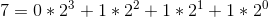
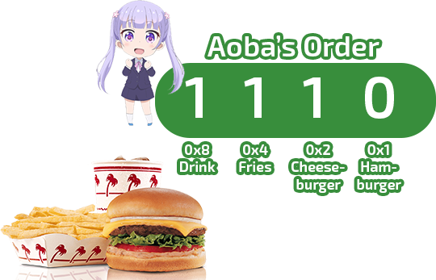

===========
Enumeration
===========

Sneak Peek
==========
By the end of this lesson, you should be able to...

- Learn how to create enumeration types and use them in your program.
- When to use enumerators over integers, strings, or other situations.

Enumerators
===========
The days of the week are a universal time system with one big constant – that there are only seven days of the week: nothing more and nothing less. Initially presented, if we wanted to present the days of the week as a string or an integer...

.. code-block:: csharp
  :linenos:

  string dayOfTheWeek = "Tuesday";
  int dayOfTheWeek = 2; // Tuesday

Maybe things seem fine and dandy. However, this is susceptible to unintended inputs. We could try to guarantee writing ``"Monday"``, but then there could be strings to not check for, like, ``"monday"``, ``"月曜日"``, or ``"My Super Sweet Quinceanera"``. Having to account for these other inputs when there are clearly only seven days of the week is a bit of an inconvenience.

   This must be Thursday. I never could get the hang of Thursdays.

Enter the enumeration type. An **enumerator** defines a set of named constants that a variable can be assigned with. An ``enum`` is declared outside of a class, and then can be utilized from within. Using storybrew and going with the days of the week example:

.. code-block:: csharp
  :linenos:
  :emphasize-lines: 3, 8, 9

  namespace StorybrewScripts
  {
        public enum Weekday { Sunday, Monday, Tuesday, Wednesday, Thursday, Friday, Saturday };
        public class SampleEffect : StoryboardObjectGenerator
        {
            public override void Generate()
            {
                Weekday thankGodIts = Weekday.Friday;
                if (thankGodIts == Weekday.Friday)
                {
                    Log("Party!");
                }
            }
        }
    }

Enumerators provide concise ways of expressing these constants while also forcing constraints yet being very readable at the same time. While a rose by any other name smells just as sweet, it's not very intuitive reading it as an integer of the value ``1``. Let the enumerators take care of that underlying value while on the surface you can cleanly classify it as a rose. If you know that a variable will only need to store a very limited set of values, consider creating an enumeration type to make management of that variable far, far easier when storyboarding.

.. hint:: Be sure to pay attention to the **scoping** of enumeration types as you work with this. Enumerators are custom variable types, and don't directly belong in things like the ``Generate`` method. More will be explained to you as you go through this section, but just keep especially in mind *where* you're placing your declaration of an enumerator.

Creating Enumerators
--------------------
Enumerators are customized data types of their own. Like how the primitive data types ``int`` and ``float`` are their own entities we can declare variables for, enumeration types are *our own* types that we can declare variables *of* that type. Just as we can have multiple ``int``, ``string``, and ``float`` variables, we can have multiple instances of our enumeration types. However, to properly declare a custom type, it must be done outside the scope of the storybrew script's class we're working with. This is because the contents in our effect, such as ``SampleEffect``, is its own object, and an object like that isn't able to create a custom enumeration type. Once the compiler enters ``SampleEffect`` territory, it's totally dedicated to making the components for that object, not for making new types or anything.

Otherwise, creating a new enumeration type is very similar to :ref:`creating a new array or list <programming_arrays_and_lists_intiializing_arrays>`. Tell the program that you plan to make an enumerator with ``enum``, give your type a name (as per :ref:`proper variable name rules <programming_variables_and_types_naming>`), then create your bracketed collection of constants that will be your enumeration type.

As such:

.. code-block:: csharp
  :linenos:
  :emphasize-lines: 4

  namespace StorybrewScripts
  {
      // A mon is a feudal Japanese emblem representing a proud family clan.
      public enum MonDesign { Kikkomon, Oda, Toyotomi, Tokugawa, Minamoto, Taira, Chiba, Date, Ryukyu, Itsukishima };

      public class MonDisplay : StoryboardObjectGenerator
      {
            public override void Generate()
            {
                // Code here
            }
      }
  }

By default, the underlying type for enumerators are ``int``, with each constant an incremented integral starting from ``0``. That means that the constant ``Kikkomon`` will begin at ``0``, with ``Oda`` being 1, all the way to ``Itsukishima`` being ``9``. It is possible to change the underlying type of each element, such as using a ``byte`` instead. Changing the underlying type can be done by adding a colon and then specifying your type after the enumeration type name, as shown:

.. code-block:: csharp
  :linenos:

  public enum MonDesign : byte { Kikkomon, Oda, Toyotomi, Tokugawa, Minamoto, Taira, Chiba, Date, Ryukyu, Itsukishima };

Only integral-based types like ``int``, ``byte``, ``short``, and ``long`` are acceptable, with the exception of ``char``. However, the difference in memory that each type creates is incredibly minimal, and for the purpose of storyboarding, it's negligible enough to not worry. Just treat it as trivia. Everyone loves trivia.

.. figure:: img/enumeration/soy-sauce.png
   :scale: 100%
   :alt: Kikkoman soy sauce.

   Not to be confused with Kikkoman soy sauce, which has its own proud, Japanese mon emblem at the center. Did you know that the Mitsubishi logo is also styled after the Japanese mon?

It is also possible to assign different values to each constant in the enumeration type. Computed values are also possible. Observe:

.. code-block:: csharp
  :linenos:

  public enum SpiritAnimal {
      Dragon = 14,
      Fox = 36,
      KimKardashian = 40,
      Hifumi = KimKardashian + 29
  }

.. note:: You may have noticed that this code example doesn't end in a semicolon, while the previous examples do. The semicolon is optional, but it helps in a general convention with one-liners to end in a semicolon as opposed to a multi-lined instance. So if you need to use multiple lines for your enumerator types, feel free to exclude the semicolon as well.

Using Enumerators
-----------------
Enumerators are really easy to utilize in your code. Calling any constant for whatever nefarious deeds you have in mind require you to write the enumeration type name, a ``.``, then the constant name. This allows you to do things like assigning enumeration constants into your variables or checking for equality, such as:

.. code-block:: csharp
  :linenos:

  var theMaster = MonDesign.Oda;
  var theSuccessor = MonDesign.Toyotomi;
  var theShogun = MonDesign.Tokugawa;

  if (theShogun == MonDesign.Tokugawa)
    Log("Constructing the Tokugawa shogunate.");

   I\'m here to chuck samurai and sip on green tea, and I\'m all out of green tea.

This is pretty much the basic extent that can be done with enumerators. The rest of this chapter will cover a few miscellaneous uses that enumerators are good for, and a few examples that demonstrate why enumerators are useful in the first place.

Casting
-------
Because enumeration types' underlying values are integral based, it is possible to convert between integers and back by :ref:`typecasting <programming_variables_and_types_casting>`. This allows for useful possibilities such as cleanly converting your enumeration type into a filename, or randomly selecting enumeration values.

.. code-block:: csharp
  :linenos:

  var monImage = GetMapsetBitmap(SourcePath + "/" + Convert.ToString( (int)myMonDesign ) + ".png");
  var randomMon = (MonDesign) Random(0, 10);

.. warning:: As seen in the previous example, it *is* possible to assign variables beyond the range of the amount of constants there are in an enumeration type, such as giving ``randomMon`` a value of ``42`` typecasted to ``MonDesign``. This is **not** encouraged though. While there will not be any syntax errors, the expectation of an enum is that it should hold the constant values given to it. Look at it a week later, and you'll forget that you're a cheeky bastard assigning the value of ``42`` into your variable. It's a recipe for disaster.

System.Enum Methods
-------------------
Because all enumeration types are derived from the ``enum`` type (``System.Enum`` to be more exact), we can take advantage of Enum methods for any enumerator we create. This allows us to take apart components of our ``enum`` into its names or the values they represent. As they return lists, it's easy to iterate through using something like ``foreach`` loop:

.. code-block:: csharp
  :linenos:
  :emphasize-lines: 17,23

  namespace StorybrewScripts
  {
      public enum Rupee
      {
          Green =  1,
          Blue = 5,
          Red = 20,
          Purple = 50,
          Silver = 100,
          Gold = 300
      }

      public class HollaHollaGetDolla : StoryboardObjectGenerator
      {
            public override void Generate()
            {
                foreach (int i in Enum.GetValues(typeof(Rupee)))
                {
                    if(i > 50)
                        Log("Get rich quick with a rupee valued at " + i.ToString());
                }

                foreach (string rupeeName in Enum.GetNames(typeof(Rupee)))
                {
                    Log("Get jiggy with the fine color of " + rupeeName);
                }
            }
      }
  }

You can also take advantage of the fact that ``Enum.GetValues(typeof(Rupee))`` is inherently a list, so you can get its length and work dynamically from there. The following example is a bit more advanced, but it basically generates a whole list containing every enumeration type in ``MonDesign``. It requires the ``System.Linq`` library to use as well.

.. code-block:: csharp
  :linenos:

  var monMax = Enum.GetNames(typeof(MonDesign)).Length;
  var mons = Enumerable.Range(0,monMax).Select(i => (MonDesign)i).ToList();

    Having united all of Japan under a new era of prosperity, Tokugawa now gets to drown in mad all-natural, forests of concubines.

Flags
-----
Enumeration types are also incredibly useful to store if whether attributes have been met or not. These are known as **flags**. You may be familiar hearing the term *flag* if you play any RPG or visual novel. For example, killing off the bandits in that cave over there could *raise* a flag with the nearby village, thereby you completing their silly side quest. Some choices you make could *raise* a flag that will force you into that girl's route, such as staying with a girl to listen to their back story more.

    Yes, yes, very good... Fall into the trance of the great blonde fake tsundere Michiru and take this route... Yes...

Enumerators work with flags in a slightly contrived way, as inherently it is still an enumeration type. It is easier to simply show an example and explain its components.

.. code-block:: csharp
  :linenos:
  :emphasize-lines: 3, 17, 18

  namespace StorybrewScripts
  {
      [Flags]
      public enum BurgerMenuOrder
      {
          None = 0x0,
          Hamburger = 0x1,
          Cheeseburger = 0x2,
          Fries = 0x4,
          SoftDrink = 0x8,
      }

      public class MyFastFoodExperience : StoryboardObjectGenerator
      {
            public override void Generate()
            {
                BurgerMenuOrder hifumiOrder = BurgerMenuOrder.Hamburger | BurgerMenuOrder.Fries;
                BurgerMenuOrder aobaOrder = BurgerMenuOrder.Cheeseburger | BurgerMenuOrder.Fries | BurgerMenuOrder.SoftDrink;

                Log("Hifumi ordered: " + hifumiOrder.ToString());
                Log("Aoba ordered: " + aobaOrder.ToString());
            }
      }
  }

Flags work with binary encoding to store their values. An enumeration type that uses flags is still inherently an enumerator, meaning that its underlying value is still some integral constant. However, by adding the ``[Flags]`` attribute, it lets the compiler and ourselves manage things better and lets us store multiple flags through binary values.

.. rst-class:: low
.. todo:: 0x0 is hex lol

Each value stored inside each constant in the enumeration type then must be a power of 2 (expressed in binary as ``0x[value]`` to further stress it uses binary). The only flag that should be stored for ``0x0`` is a None flag or an equivalent, a state in which none of the remaining flags have been raised at all. So in this case, None would be when no one makes a burger menu order.

Assigning multiple flags can be done by using the bitwise OR operator, ``|``, which functions a lot like the :ref:`logical operator of the same vein, <programming_decision_making_logical_operators>` ``||``. Binary values go to the very little bits, which is why we're using the *bitwise* OR operator. Because we've specified that this enumerator is storing flags, we can see that when exported as a string, it'll print out numerous flags instead of something wonky and unintended.

It is then possible to check if a variable holds a certain flag by using the ``HasFlag()`` method, as shown:

.. code-block:: csharp
  :linenos:

  if(hifumiOrder.HasFlag(BurgerMenuOrder.Hamburger))
  {
      Log("Watch your weight, Hifumi!");
  }

It is also possible to check using bitwise operators if you have an understanding of them, but it's less intuitive to read at a glance. You don't want to put extra work on yourself.

    You're at the burger joint and this girl slaps your girlfriend's ass. What do you do?

Why Binary Works
~~~~~~~~~~~~~~~~

.. note:: This section is purely optional to read! If you just need to get things done practically and fast, feel free to skip and proceed onwards. The goal of this section is to explain why the flags attribute has to use binary encoding and why we use bitwise operators.

Consider our number system. When we count from 0 to 9, we carry the next digit over, making 10. Because it takes us 10 numbers to get to the next digit, our primary numbering system that we use in our daily lives is the **base-10 numeral system**, or decimals. In that very same case, if it takes us only 8 numbers to get to the next digit (i.e. after counting 7, we go to 10) then that's a base-8 numeral system, or octal. The one we want to pay attention to is the **base-2 numeral system**, also known as **binary**. In binary, it only takes 2 numbers to get to the next digit, 0 and 1. As such, if we were to play a counting game, comparing the binary number system to the decimal one... (We'll pad the extra digits with 0s for convenience) :

.. csv-table:: Counting in Binary vs. Decimal
   :header: "Decimal", "Binary"
   :widths: auto

   "0","0000"
   "1","0001"
   "2","0010"
   "3","0011"
   "4","0100"
   "5","0101"
   "6","0110"
   "7","0111"
   "8","1000"

.. rst-class:: low
.. todo:: Consider different number (i.e. the same number for both base-10, base-2)

You may notice that for each new digit in the binary system, the corresponding number is a power of 2. This isn't a coincidence. A decimal number between each digit can be actually be composed as a summation of their values multiplied various bases' power values. Let's start with the familiar territory of base-10 with a value like 7962. If you wanted to break that into individual values per digit, we'd get ``7000``, ``900``, ``60``, and ``2``. Added together, we get ``7962``. Breaking down 7962 in an equation, we can see:

 .. figure:: img/enumeration/eq_0.gif
     :scale: 100%
     :alt: It would suck if you can only read this alt text and not see the equation.

Turns out, this is also a way to convert a number in its base into decimal. As we see that each digit in base-10 is a power of 10, each digit in binary is a power of 2. Consider breaking down the value of 7:

The decimal value it's tied isn't quite the important part we need to focus on with understanding the binary roots for flags. Rather, it's that every binary number has a corresponding decimal number, and since enumerators are integral-based, we can store integer values that under the hood are these binary values of 0s and 1s. What we're doing for each flag is saying that this individual digit is dedicated to being a certain flag, as there can only be two states for that digit: 0 or 1. This heavily mirrors the boolean type of ``false`` or ``true``.

Here is a binary representation of Aoba's burger menu order:

    This value would be 14 in base-10, so assigning ``aobaOrder`` as ``14`` would also be valid (but much less intuitive)!

The bitwise OR operator ``|`` allows us to chain multiple binary values together, like adding them together. That means a binary value of ``0100`` (or ``0x4``) and one of ``1000`` (or ``0x8``) OR'd together would be ``1100``. This is what allows us to store multiple flags.

You may want to look more into digital logic or playing with redstones and basic logic gates in Minecraft if this sort of thing fascinates you.

Examples of Enumeration Types
-----------------------------
What are some examples of enumerators in action? What better way to see it than to look inside storybrew itself!

Easing
~~~~~~
As you know, you can apply an :ref:`easing value <storyboarding_scripting_easing>` to your sprite's commands to allow more refined tweening animation within your sprite's commands. However, when using scripting, we have to type in the direct numbers, such as ``13`` for OutQuint. This is not very convenient for us when we want to quickly read and reference values. But we know that there's only 35 easing values available, and that won't change anytime soon. Our problem then demands a solution that can best store 35 constants, and also be more intuitive to reference and read in code. Enter enumeration types!

In fact, storybrew offers exactly that by creating a custom enumeration type named ``OsbEasing``:

.. code-block:: csharp
  :linenos:
  :caption: For a full source, refer to viewing ``storybrew/common/Storyboarding/OsbSprite.cs`` at the `official repo <https://github.com/Damnae/storybrew/>`_ .
  :lineno-start: 311

  public enum OsbEasing
  {
      None,
      Out,
      In,
      InQuad,
      OutQuad,
      InOutQuad,
      InCubic,
      OutCubic,
      InOutCubic,
      InQuart,
      OutQuart,
      InOutQuart,
      InQuint,
      OutQuint,
      InOutQuint,
      InSine,
      OutSine,
      InOutSine,
      InExpo,
      OutExpo,
      InOutExpo,
      InCirc,
      OutCirc,
      InOutCirc,
      InElastic,
      OutElastic,
      OutElasticHalf,
      OutElasticQuarter,
      InOutElastic,
      InBack,
      OutBack,
      InOutBack,
      InBounce,
      OutBounce,
      InOutBounce,
  }

Hitsounds
~~~~~~~~~
A hitobject in osu! can possess any combination of the following four hitsound additions: a normal hit, a whistle, a finish, or a clap. What would be a good solution to store all of these that is intuitive and without clutter? Enter enumeration types with the flag attribute. By storing these components with flags, we can easily account for any combination of these hitsounds while also cleanly having them in one cohesive variable.

.. code-block:: csharp
    :linenos:
    :caption: For a full source, refer to viewing ``storybrew/common/Mapset/OsuHitObject.cs`` at the `official repo, linked once more <https://github.com/Damnae/storybrew/>`_ .
    :lineno-start: 89

    [Flags]
    public enum HitSoundAddition
    {
        None = 0,
        Normal = 1,
        Whistle = 2,
        Finish = 4,
        Clap = 8,
    }

Some uses that you can use for yourself would be to help account for different behavior in a reusable effect, or if you need to store a tightly cohesive pack of constants together. Whatever it is, enumeration types are incredibly useful and can make your code a lot cleaner to read and more intuitive to boot.
