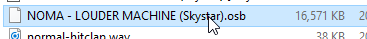
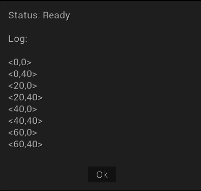

=====
Loops
=====

Sneak Peek
==========

The Repetitive Repetoire
========================
Programming is all about efficiency. When there's a tedious task that has to be done repeatedly, why wallow and resign yourself like that? There's a way to automate everything, and programming offers some ways to maximize on that. These constructs are generally known as **loops**. Exactly as they sound, these sections of code specialize in running over and over again. Combine these with the operators, expressions, and logic that you've learned so far, and you can definitely use loops to your advantage when storyboarding.

.. figure:: img/loops/automation.png
   :scale: 80%
   :alt: Clearly, we can do better.

   This is an unfortunate reality that happens though.

The Various Loops
=================

While Loop
----------
The while loop continually executes its code block *while* its condition is ``true``. Just like the if statement, we have the statement paired up against our bracketed section of code here:

.. code-block:: csharp
  :linenos:
  :emphasize-lines: 3

  int pokemonParty = 0, mysticNumber = 0;

  while (pokemonParty < 6)
  {
      mysticNumber += pokemonParty;
      pokemonParty++;
  }

In this situation, both ``pokemonParty`` and ``mysticNumber`` begin as ``0``. *While* the value ``pokemonParty`` is less than ``6``, we execute the section of code inside, which is adding the current value of ``pokemonParty`` to ``mysticNumber``, while also incrementing ``pokemonParty``. After the code finishes, the condition is checked again to see if it's true, and, if so, then we *loop* and run the inner section of code again. But remember! As we're working with variables that get their data overwritten, the values will keep changing. The following animation keeps track of each variable for every iteration. Remember that for ``mysticNumber``, the current value of ``pokemonParty`` will add into it, which basically makes it a summation of ``0+1+2+3+4+5``.

   Animated for your benefit. :)

An important consideration to make in this example is Line ``6``, where ``pokemonParty`` is incremented. Imagine if the value ``pokemonParty`` does not increment at all, or that it decrements instead. You can easily see that the condition within the while statement will remain unfulfilled. What happens is the often dreaded **infinite loop**. When you're working with while loops, it's **always** important to make sure the following happen:

- **Your condition in the while loop consists of changing values.** If a constant value is considered as true, then there's no way of changing it to false and to exit out of the loop.
- **The variable in the condition is working its way to make the condition false.** In this example's case, the variable slowly increments up until ``pokemonParty`` is ``6``.  You can also exit the loop using the ``break`` statement, similar to switch cases, but there must be a way that the program can somehow reach that endpoint, whether immediately or eventually.

For Loop
--------

The for loop is an incredibly versatile looping tool and is *like* the while loop, only that there's more housekeeping it accounts for. Instead of solely having the condition like the while loop does, there are two other parts that can be entered in: which we can call the initialization and the step. The general syntax of a loop looks like:

.. code-block:: csharp
  :linenos:
  :emphasize-lines: 1

  for(<initialization>; <condition>; <step>)
  {
      // Looped contents here!
  }

Let's incorporate the Pokémon example earlier into a while loop to see how it would look there.

.. code-block:: csharp
  :linenos:
  :emphasize-lines: 3

  int mysticNumber = 0;

  for(int pokemonParty = 0; pokemonParty < 6; pokemonParty++)
  {
      mysticNumber += pokemonParty;
  }

Quite concise! The initialization and steps simply moved inside the for loop's statement, leaving the inside of the loop dedicated to the contents that we want to have repeated. For loops are really good for repeating a segment of code for a controlled, set period, as everything is neatly laid for you within the construction of the for loop up top. No need to worry if you forgot to increment ``pokemonParty`` somewhere in the while loop, for instance.

You may notice that we declare the variable ``pokemonParty`` within the for loop's statement. This constrains ``pokemonParty``'s scope to only that of the for loop. A variable's **scope** is where exactly it in exists inside the code, and whether or not the previous layers of code knows of its existence. For instance, once the loop ends, ``pokemonParty`` is no longer a variable I can call, as that would be *outside* of its scope. The bracketed sections act as a piece of code's own exclusive spot, however variables and data at a higher level than that section are usable, such as ``mysticNumber``. Having these semi-isolated kinds of sections of code helps make the code more **modular**, which means that the piece of code is not badly intertwined with other pieces of data like a tangled wire and that it can be *reusable*.

.. tip:: Often when needing to whip up a for loop just to quickly repeat something, we declare a quick and easily readable variable to get our data from. Often, this variable is ``i``, then followed by ``x`` or ``n``. So when you're starting a new for loop, consider starting it with ``for(int i = 0; ..; ..)`` and the like! Just be sure that if that variable *is* being used for something more useful than a quick and dirty variable, that you give it a better name.

.. warning:: Don't forget that the syntactic sugar inside the for loop *demands* those semicolons. You also are constrained to the usual limits with *one line*, as the steps effectively act as one semicoloned line, or a statement. While it is possible to declare variables such as ``int x = 0, y = 10, z = 20`` and even have the step component do ``x++, y++, z++``, realize that it could come at a cost of readability, or adding another variable to make the for loop even more complex.

Do-While Loop
-------------

The do-while loop is an extremely situational loop that has its occasional uses. It's a subtle variant of the while loop, but syntactically it looks like some backwards bizarro version of it all. The most important part of a do-while loop is that the loop is guaranteed to execute at least once. This is because the loop *precedes* the while statement, so the first iteration of code runs, then it checks the condition to see whether or not it should continue in its loop-filled mayhem.

Imagine two slightly different bits of code:

.. code-block:: csharp
  :linenos:

  float originalSalePrice = 6.99f;

  do
  {
      originalSalePrice *= 0.75f;
  }
  while (originalSalePrice > 5f);

And for this one, let's change the original price listing to be less than ``5f``, so ``2.50f``.

.. code-block:: csharp
  :linenos:

  float originalSalePrice = 2.50f;

  do
  {
      originalSalePrice *= 0.75f;
  }
  while (originalSalePrice > 5f);

If you tried it out, you'd see that for our first product, the price went from ``6.99`` to ``5.2425`` to a sweet discount of ``3.931875``, as at that point ``originalSalePrice`` is NOT greater than ``5``. With the second code block, the discount still is applied to the ``2.50`` despite not being greater than ``5``. The discount is applied, and ``originalSalePrice`` becomes ``1.875`` before immediately ending. As such, you're always guaranteed the first loop. It's like some sort of measly consolation of a free toss at a rigged carnival game.

   That's really good, Pippi! Now realize that you actually won the lowest prize, but you can get a few more attempts to the BIGGER prize if you play some more!

Other Remarks
=============

Differences from Storyboarding Loops
------------------------------------
You probably recall that there exists a compound command in storyboard scripting known as the :ref:`loop command <storyboarding_scripting_compound_commands_loop>`. Does that act similarly to a loop in programming? The answer is yes and no, but mostly no. While it *is* true that they both operate by repeating a section of code, or, in this case, a section of commands, storyboarding loops do not offer any flexibility or differences in those commands, where programming loops do. As scripting has no actual logic or dynamic variables to change, loop commands just naively execute the same exact commands at the same exact parameters.

However, there are concerns when advocating to ditch storyboarded loops for the power of for loops and the like for your sprite commands. To make this dynamicism, the storyboard commands to generate these sprites have to be manually broken down piece by piece. That means a storyboarded loop containing 5 commands repeated for 16 times, when broken down as a for loop manually, can be as awful as **80 commands**! When playing with multipliers like this, things scale up fast, and things can get *worst* far more. Then this becomes a problem with **optimization**, or ensuring that your code runs, or in this case, your storyboard, performs at a playable state.

Otherwise, you may end up with a storyboard that contains unnecessarily huge space, affecting in-game load times and the like.

   Take that! Just kidding. We love you, Exile-.

Nested For Loops
----------------

Remember that code is as flexible and creative as you will it to be. Then in that case, as you explore, you may wonder and think, "Hey! Can't I put... a for loop in a for loop!?" And before you get dismissed for thinking that's a silly idea, it's actually not! This is known as a **nested for loop**. Just like nested if statements, nested for loops are just that. Since the inner for loop is part of this code that gets repeated, the inner for loop repeats as well, which means that *its* contents will repeat as such too. It's like a loopy version of Inception!

   Joseph Gordon-Levitt is quite the... *looper*, wouldn't you say!? HA HA HA HA HA PLEASE LAUGH AT MY PUNS THEY ARE FUNNY

Consider this example with nested for loops using storybrew's built-in log method. If you're working this from a manual C# program, you can simply replace ``Log()`` with ``Console.WriteLine()`` instead.

.. code-block:: csharp
  :linenos:
  :emphasize-lines: 3,5

  public override void Generate()
  {
      for(int i = 0; i < 4; i++)
      {
          for(int j = 0; j < 2; j++)
          {
              // {} are placeholders replaced by the params after the string
              // {0} is i*20
              // {1} is j*40
              Log(String.Format("<{0},{1}>",i*20,j*40));
          }
      }
   }

What should the output be? Consider that every time the inner for loop runs again, it begins entirely anew, as if we just pressed "New Game" when playing our RPG or eroge. Think about it for a moment before your eyes tempt you in looking at the solution below.

... Ready?

... You sure? Alright, here you go:

   Here's the solutions!

Do the solutions make sense? If not, try and think about how each loop is broken down, step-by-step, as if you're following the exact pathway of a dance.

Nested for loops are particularly useful for working with 2D coordinate spaces, and there are just some moments where you need to have more sophisticated resetting variable control like that.

.. warning:: How many total iterations did the nested for loop execute? In this simple example, we can see that there's a total of ``8`` iterations, but what if the conditions are far larger that manually tracing is too labor-intensive and time wasting? The simplest way to figure out the amount of iterations would be to multiply the amount of iterations in the outer loop and the amount of iterations in the inner loop. In this case, as ``i`` is ``4`` and ``j`` is ``2``, the total amount of iterations is ``8``.

    When scaling, you have to be extremely careful about the amount of iterations you go through. This not only increases complexity, but can be the quickest way to causing bloated storyboards, long loading times, and massive amounts of lag. It's never a good idea to create a loop that iterates through ms of time, or to create a loop that goes all the coordinates of the playscreen (That's 854*480, after all!). When working with loops, it is always important to keep optimization a priority.

When to Use Certain Loops
-------------------------
There's a variety of loops given here, so have a quick rundown of a few recommended usages of the loops seen above.

- **While loops** semantically have an indefinite number of iterations. Use this when you aren't sure how many iterations you really need to execute (such as reading until the end of a file). Ergo, use this only when you only really need the completion condition.
- **For loops** have the initialization and step parts of the loop altogether in one line for convenience. Use this when you definitely know how many iterations it needs to go, especially if it's just concrete hard-values. If you need to have the initialization and/or the step of your loop, the for loop should be your de facto choice.
- **Do while loops** should be the rarest kind of loop you'd need to make. Consider them if you're looking for a while loop, but you always want an iteration to execute at least once.

Common Mistakes
---------------
This section highlights some of the most common mistakes programmers deal with when working with loops.

Infinite Loop
~~~~~~~~~~~~~
Observe the following bad code:

.. code-block:: csharp
  :linenos:

  for(int bottleOfBeers = 99; bottleOfBeers < 100; bottleOfBeers--)
  {
      // Code here
  }

By the end of it all, we'd die of alcohol poisoning before enjoying the benefits of our bottled beer on the wall. This is because the completion condition of ``bottleOfBeers < 100`` is always true, as ``bottleOfBeers`` is only decrementing as we take one down and pass it around. Always remember, whether it be a for loop, a while loop, or your dog, to make sure that the step component of the loop is always building towards the completion condition in some way. If you find your program hanging in some way, it's most often an infinite loop error, or one astronmically giant loop (which is not recommended either).

Off-By-One
~~~~~~~~~~
Now observe this bad code:

.. code-block:: csharp
  :linenos:

  int bottleOfBeers;
  for(bottleOfBeers = 99; bottleOfBeers >= 0; bottleOfBeers--)
  {
      // Code here
  }

What should the final value of ``bottleOfBeers`` be based on this for loop? (Keep note that for the sake of this example, we elevated ``bottleOfBeers``'s scope so its value lingers past the loop). Our intuition and knowledge of the folk song should make us think it'd end at ``0``, but due to the completion condition, we'd actually enter the treacherous minus world and end up with ``-1``. This is because the completion condition looks for ``bottleOfBeers`` being greater than OR equal to ``0``. This means that when ``bottleOfBeers`` does subtract down to ``0``, it'd make *another* iteration. Not quite desirable.

You espeically want to pay attention to this. It's a common beginner mistake to be nice and write this operator, but find out this goes against their intentions entirely.

Enclosed Brackets
~~~~~~~~~~~~~~~~~
Just like if statements, the brackets after the loop's initial statement are optional. However, just like if statements, the lack of brackets make them follow the same exact policy. Observe this faulty code:

.. code-block:: csharp
  :linenos:

  int bottleOfBeers = 99, redBalloons = 0;

  while(bottleOfBeers > 0)
    redBalloons++;
    bottleOfBeers--;

Just dapper. Now we're going to sing 99 Red Balloons. Except, in reality, we'll be singing that for quite a long time – an infinitely long time for that matter! That's because the loop only accepts the next line as the content to repeat, leaving the intended step component of our loop out on the wayside and ignored. With this, ``bottleOfBeers`` will always remain at ``99``, and it'd be impossible for it to decrease down to ``0``.
