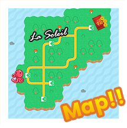
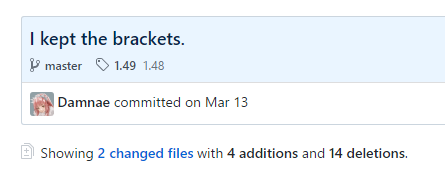

=======
Methods
=======

Sneak Peek
==========
By the end of this lesson, you should be able to...

- Understand the concept of methods, their practicality in programming, and the different nature and flow methods create in a program.
- Learn how to utilize parameters inside methods, and understand returning a value.
- Learn about method shorthands and special parameter keywords to better customize your method making skills and flourish!

The Premise
===========
Dance choreography is a beautiful art full of intricate steps, twirls, movements, and timing. When trying to memorize a dance routine, it can be thought up of various steps done in sequence. *Left step, left step, then right step, right step, and jump.* And repeat. If we pretend this to be like our own pseudocode, it can look a little like this:

.. code-block:: csharp
  :linenos:

  StepUp();
  StepUp();
  StepDown();
  StepDown();
  StepLeft();
  StepRight();
  StepLeft();
  StepRight();
  Boogie();
  Acrobatics();
  StartAgain();

Don't worry about the parentheses for now, as it's just there to help differentiate between saying that we're *doing* something than it being a variable. Think a verb versus a noun.

Continuing on, this code block is a bit contrived for a dance routine – *especially* when we think about every little dance step. As the dancer, these steps eventually become muscle memory, and the whole sequence becomes rather memorable to execute. Let's give these steps a catchy name, like the *Konami dance*. But that's obviously not the entire choreography, else we just freestyle and embarrass ourselves. There are other sequences of steps and motions to memorize, and those too have their own individual steps.

   Unlike this. This is just a looped .gif. A butt-shaking, mesmerizing, looped .gif. What does your head say when it reads "gif" out loud? Like gift? Like jiffy? How spiffy, the thought of it so.

Say that the main segment of the routine starts off with doing the Konami dance twice, then the chicken dance, then the Konami dance again. After mastering the Konami dance enough times, does it *really* become the individual steps to singly memorize, or is it now a cohesive set of steps *grouped* together, to be executed whenever on cue? We look at the code-block again, and if we *didn't* fully master or realize the sequence that is the Konami dance, our routine may have to end up looking like this:

.. code-block:: csharp
  :linenos:

  StepUp();
  StepUp();
  StepDown();
  StepDown();
  StepLeft();
  StepRight();
  StepLeft();
  StepRight();
  Boogie();
  Acrobatics();
  StartAgain();

  StepUp();
  StepUp();
  StepDown();
  StepDown();
  StepLeft();
  StepRight();
  StepLeft();
  StepRight();
  Boogie();
  Acrobatics();
  StartAgain();

  ChickenDance();

  StepUp();
  StepUp();
  StepDown();
  StepDown();
  StepLeft();
  StepRight();
  StepLeft();
  StepRight();
  Boogie();
  Acrobatics();
  StartAgain();

If the previous code-block was convoluted with steps, this one is far worse. The real kicker is the fact that it's the *same* steps again and again, but it's being done as if they're individual dance bouts that aren't realized or grouped as the Konami dance. What's better for all of our sanity is something like this:

.. code-block:: csharp
  :linenos:

  KonamiDance();
  KonamiDance();
  ChickenDance();
  KonamiDance();

With the sequence ``KonamiDance()`` to be the motion that we've practiced and memorized earlier, any instance we're to do such a dance, we know what to do on the spot, without any need to focus on the individual steps. All because it's muscle memory to us.

   The real reason why I'm starting off with a dance lesson is so I can post images like this and call it educational.

Back to the Programming World
-----------------------------
In actuality, this little happy episode about dancing and choreography is a lot like the concept of methods. A **method** is a procedure an object can execute, and in that procedure, a sequence of commands can undergo a variety of different behaviors – whether it'd be doing the Konami dance, finding the maximum value in an array, or creating a sprite into a storyboard. Whenever we *call* a method, such as storybrew calling the *Generate* method, we tell the object to carry out a task, which in this case, is generating the effect.

We have, in fact, been using methods to carry out a plethora of tasks in our code already! If you've used the ``Log`` method in trying to debug or verify values in your code, then you've used a method, with the task being to send this message we give to ``Log`` and display it in storybrew's interface. Under the hood, there's a few complex things going on to make that happen, but in the end, the program ends with displaying it all in a pristine logged message for us to see. Just like the Konami dance is that behind-the-scenes set of dance steps we execute, ``Log`` is no different.

.. figure:: img/methods/logs.png
   :scale: 100%
   :alt: A bundle of logs.

   Us programmers are so insecure and unsure about our work that we have to ask this bundle of logs if everything is OK.

Methods don't need to be limited to some set of procedures that don't directly communicate back to us. There are methods where we can give a method some data, and we expect to get data in return. For instance, a popular method in OpenTK's MathHelper library is the method ``DegreesToRadians``. As the name implies, if we pass some degrees value, it'll give us back that same value, expect in radians. This is perfect if we needed to use the Rotate storyboard command, as that handles all its angles in radians.

We'll first talk about how methods are created and used, and also provide practical examples to apply our newfound knowledge.

Creating and Using Methods
==========================

A method must be declared inside the scope of a class. When we consider the philosophy of object-oriented programming, the **class** is essentially a custom object that we add data and behavior into. Often this object then gets called elsewhere in a program, using the data members and methods that we've defined into it. The same applies for storyboarding – each script creates a unique class (or object) that we define data (such as configurables) and behavior (like the ``Generate`` method).

Method Signatures
-----------------

The first component of a method is its signature. The **method signature** is the basic definition of a method. Similar to declaring the variable, we're simply declaring a method into existence. That pretty much means we're declaring the name of the method, the method type, and whether we want this method to accept inputs (like how ``DegreesToRadians`` does). Because it's a component of the class, it's also important for us to provide the **access level** of the method, which is basically whether or not this method is for internal use only or if other objects can use it freely. Let's provide an example of a method signature by providing a rather quick and dirty method here:

.. code-block:: csharp
  :linenos:

  public void LogFriendlyMessage()
  {
      Log("Hello! This is your daily friendly reminder to actually go outside for once.");
      Log("The sun is very concerned about your activity indoors and would like to see your beautiful face.")
      Log("... Just kidding. The sun just wants to burn that pasty skin to a pulp.");
  }

Breaking down the method signature we first begin with the **access level** keyword. The most important ones to consider are whether a method is **public** or **private**. A **public** method is accessible by any object, even different ones that are not of the same class. A **private** method is the opposite – the method would only be accessible to itself, and only itself. For most of your needs in storybrew, it's best to just use the ``public`` keyword and call it a day, as the problems access levels try to solve are not ones seen in beginning programming nor creating effects in storyboarding.

.. note:: Not including the access level for a method signature would automatically make the method **private**. This is the same case when specifying access levels for data members of an object too. This would be a rather harrowing problem if another object wants to use that method. For instance, if the ``Generate`` method had no ``public`` access level, storybrew would be unable to actually render the effect, as it's a foreign object trying to access the ``Generate`` method.

After the access level, we have the **return type** of a method. Some methods, like ``DegreesToRadians``, give information back to us. The data type of that information would belong here. If we aren't planning to return any information to the caller, then we say that the method is **void**, or lacking a return type.

Now we finally reach the method name itself, and if we want to pass any information into the method. This information passing through into the method are known as **method parameters**. Enclosed in the parentheses following the method name, the parameters are defined essentially as variable declarations separated by commas. For ``LogFriendlyMessage``, we don't use any parameters, so we'll only need to have a set of empty parentheses.

The access level, return type, method name, and parameters all compose together as the unique **signature** for a method. That means it's entirely possible to have a method of the same name, but with different return types or parameters. This allows for a method to have more flexibility in different situations, a concept known as **method overloading**.

After the method signature comes the actual content of the method itself. As you can see, it's not unlike the bracketed bits we see in chapters like :ref:`Decision Making <programming_decision_making>` or :ref:`Loops <programming_loops_while_loop>`. We'll discuss the scope and inner contents of these methods as we move into method parameters.

Parameters
----------
While some methods are purely procedural, others act like the cooking system in a modern RPG. You go ahead and pick ingredients, the game checks to see if your recipe is legit, and out comes your successful (?) work of art!

   If only cooking can be this bouncy and fun! (And just tossing a bunch of ingredients together creates some magical recovery item...)

These ingredients are essentially the inputs for your method, known as the method's **parameters**. These inputs are defined similarly to variable declarations, with a type and variable name to be used and calculated inside the method. Multiple parameters can be used by simply separating each one with a comma. Within the scope of the method, they become bona-fide variables that you can use for whatever calculation you need.

Remember that the method's definition is outside the scope of something like the ``Generate`` method, meaning that variables declared within ``Generate`` absolutely do not exist inside the method definition. If you want to *pass* these values into the method, you'd have to send the values off into the parameters, as if your variables are the ingredients for your cooking show.

Finally, methods can return back to us information that's calculated or concluded based upon the inputs we shove into it. If we shoved a ton of Hylian Mushrooms and Hearty Durians into our cooking pot, we should expect to get a delicious fruits and mushroom platter back. This is the **return value** of the method. We first must declare the return type in the method signature, and from that point, create a ``return`` statement that contains data of the same type. This data will be the item that's getting returned. Any method that has a non-void return type *must* have some way of returning a value.

To get a better picture of using methods, let's take a look at a real-life example of a method with OpenTK's ``DegreesToRadians`` method in the MathHelper library.

Example 1: Degrees to Radians
=============================
Degrees and radians are the most prominent units of measurement for angles. While degrees are generally more intuitive to calculate and estimate with, the storyboard engine's Rotate command only accepts angle measurements in radians. This calls for converting the units. The conversion of degrees to radians is not a particularly tricky one, as it involves multiplying the degree value by ``π  / 180.0`` degrees. This allows the liberty of using degrees, and then converting into radians, in something like:

.. code-block:: csharp
  :caption: Rotates a sprite from 0 to 45 degrees from 0ms to 10000ms.
  :linenos:

  // Assuming a sprite has already been declared prior
  int girlYoureAcute = 45;
  sprite.Rotate(0, 10000, 0, girlYoureAcute * (Math.PI / 180.0));

While this solution *does* work, its readability can be dramatically improved. When it comes to stellar programming, a major goal is to strive for ease of reading. This is where we'll introduce OpenTK's ``DegreesToRadians`` method.

.. code-block:: csharp
  :linenos:
  :caption: For a full source, refer to viewing ``opentk/blob/master/Source/OpenTK/Math/MathHelper.cs`` at the `official repo <https://github.com/mono/opentk/blob/master/Source/OpenTK/Math/MathHelper.cs#L244>`_ .
  :lineno-start: 244

  public static double DegreesToRadians(double degrees)
  {
      const double degToRad = System.Math.PI / 180.0;
      return degrees * degToRad;
  }

Let's first break this down by the method signature.
- Because of the ``public`` keyword, ``DegreesToRadians`` has a public access level, allowing any object to use this method.
- Because of the ``static`` keyword, an instance of ``MathHelper`` does not need to be created in order to use ``DegreesToRadians``. For a library with utility methods, this is obviously a necessity.
- Because of the ``double`` keyword, the return type for ``DegreesToRadians`` is the type ``double``. This also means that there **needs** to be a return value whose value is also a ``double``.
- ``DegreesToRadians`` is the name of the method. Oh snap!
- The method takes in one parameter, a type ``double`` named ``degrees``.

From then, the ``degToRad`` ratio is calculated (set as ``const`` because this value will *never* change), and then, the final value ``degrees * degToRad``, gets returned back to where the method was called. This means that our code-block earlier ends up looking like this when ``DegreesToRadians`` is used instead:

.. code-block:: csharp
  :caption: Rotates a sprite from 0 to 45 degrees from 0ms to 10000ms.
  :linenos:

  // Assuming a sprite has already been declared prior
  int girlYoureAcute = 45;
  sprite.Rotate(0, 10000, 0, MathHelper.DegreesToRadians(girlYoureAcute));

While the character length between the two are identical, the advantage this change of code makes is that the method name, ``DegreesToRadians`` literally tells the reader what's going on. It then means that we should trust the method to give us back the radians equivalent of ``girlYoureAcute`` to be rotated.

That value, ``girlYoureAcute``  gets assigned into the parameter value of ``degrees``. The variables that are passed into the parameters of a method are known as **arguments**. This is how a method can somewhat *communicate* with your main part of code. By specifying the right set of parameters, and then using your variables as arguments, methods can be a quick shortcut into performing elaborate behavior for your objects while also helping make your code more readable and easier to work with.

Methods are incredibly important with coding, so let's work with another example.

Example 2: The Distance Formula
===============================

   Your mission: To feed these hungry cats some delicious grub. You may think they're satisfied with that little cake, but *no*, they have the appetite of lions!

When La Soleil is bustling and popular, Kashou gets absolutely swamped with work making delicious cakes. This leaves Chocola and Vanilla very hungry. They want to order food, and they're craving either some yummy takoyaki or some indulgent Chinese food. But they want to get the closer one, because they are *hungry*, and they want it *now*. Given the locations of the eateries and La Soleil, which one is the closest? It's up to us to figure that out using the power of programming!

   Choices must be made.

Our first approach in this problem would be to think – in order to find out the closest location, you'd need to know the **distance** first. In that case, we need to take out the classic Distance Formula. The distance between two points can be calculated by taking the squared differences of the x and y coordinates, adding them, then finding their square root, as such:

Since there are only two locations to calculate, we can probably write some complicated math expression and stuff it into a variable like ``laSoleilToChinese`` or ``laSoleilToTakoyaki``. However, think about these drawbacks:

- What if Chocola and Vanilla grabbed out a phone book and wanted to compare against a list of locations, and not just two?
- The code is not easily reusable. It's not generalized in the sense that we put variable values in this formula that's clearly meant to be reusable and ambivalent of what's going in.
- How understandable is the code at a glance? While it may be obvious when the code is first created, looking at it again after a few days or a week, and it only acts as an impediment trying to decipher what formula is what, or even if the formula is correct.

To promote better programming practices (and for the sake of the current lesson), it's best to create a method serving the following purpose: **Given two different points, return their distance apart**. This information gives us all that we need:

- Our method needs two points, so in other words, two ``Vector2`` types. You bet they're going to be parameters.
- Our method will need to return the distance apart. We can use a ``double`` as the return type, as distance often are decimal values.

Now it's only a matter of writing the method.

.. code-block:: csharp
  :caption: Method calculating the distance between two points ``a`` and ``b``.
  :linenos:

  public double Distance(Vector2 a, Vector2 b)
  {
      var x = Math.Pow(b.X - a.X, 2);
      var y = Math.Pow(b.Y - a.Y, 2);
      return Math.Sqrt(x + y);
  }

For readability, we split the squared components into their own individual variables, then we return the square root of the variables summed up. If we were to call this method inside something like our ``Generate`` method, then we can expect some ``double`` value to spit back out. Thus, if we were to apply this method into our scenario...

.. code-block:: csharp
  :caption: Using the method outlined earlier, is La Soleil closer to the takoyaki stand or the Chinese restaurant?
  :linenos:

  public override void Generate()
  {
      var laSoleil = new Vector2(7, 6);
      var takoyakiStand = new Vector2(4, 10);
      var chineseRestaurant = new Vector2(12, 4);

      var laSoleilToTakoyaki = Distance(laSoleil, takoyakiStand);
      var laSoleilToChinese = Distance(laSoleil, chineseRestaurant);

      if (laSoleilToTakoyaki < laSoleilToChinese)
          Log("We're having Takoyaki for lunch!");
      else
          Log("Let's get Chinese food!");
  }

Let's walk through the distance calculations in the variables ``laSoleilToTakoyaki`` and ``laSoleilToChinese`` to make sure we understand it.

The first instance, ``Distance(laSoleil, takoyakiStand)`` takes the values ``laSoleil`` and ``takoyakiStand`` and passes them onto the variables ``a`` and ``b``. These concrete instances of values that are passed into the parameters are known as **arguments**. They're what makes methods so flexible.

After we have the arguments assigned into the parameter values ``a`` and ``b``, the code begins. This makes the calculation for ``x`` the result of ``Math.Pow(4 - 7, 2)``, or ``9``. The calculation for ``y`` is the result of ``Math.Pow(10 - 6, 2)``, or ``16``. Take the sum and square root, the final value then is ``5``. This value gets *returned* into the instance it was called at, making ``laSoleilToTakoyaki`` the value of ``5``.

We do a similar calculation for ``Distance(laSoleil, laSoleilToChinese)``, only that the arguments passed into ``a`` and ``b`` are going to be ``laSoleil`` and ``chineseRestaurant`` instead. So we do the same calculations, only instead of ``(4, 10)`` it's ``(12, 4)``. Go ahead with the calculations, and verify if the value returned is roughly ``5.385``.

In that case, it sounds like we'll have takoyaki for lunch! Hooray!

By moving the formula into its own method, not only is the code far more intuitive and readable, the ``Distance`` method is also reusable for other projects or cases too! Pretty cool, right?

   Milk thanks you for buying some delicious takoyaki from her stand.

Other Remarks
=============

Named and Optional Arguments
----------------------------
When a method signature contains parameters, the method call must match that with the appropriate arguments. These kinds of inputs are known as **required parameters**, since there must be an argument passed through the call in order to execute that method. However, it is also possible to provide a default value of the parameter if there is no argument being passed to it. These are called **optional arguments**. Optional arguments can be created by assigning a value in the parameter declaration as if we're initializing a new variable. It is then possible to call the method without needing to pass any value for that parameter. Due to this nature, these default parameters can *only* follow required parameters – in other words, they must only be declared at the end of the method signature.

The following section of code illustrates a method that accepts optional arguments.

.. code-block:: csharp
  :caption: Makes a sprite from ``startTime`` to ``endTime`` change its scale to ``scale`` and rotate by ``angle`` degrees from its current rotation.
  :linenos:

  public void ScaleAndRotate(OsbSprite sprite, int startTime, int endTime, float scale = 1, float angle = 90, OsbEasing easing = OsbEasing.None)
  {
    sprite.Scale(easing, startTime, endTime, sprite.ScaleAt(startTime).X, scale);
    sprite.Rotate(easing, startTime, endTime, sprite.RotationAt(startTime), sprite.RotationAt(startTime) + MathHelper.DegreesToRadians(angle));
  }

Let's consider the simplest method call where we don't provide any arguments for the non-required parameters.

.. code-block:: csharp
  :linenos:

  ScaleAndRotate(mySprite, 32000, 36000);

Because only three arguments are being passed into ``ScaleAndRotate``, the remaining parameters ``scale``, ``angle``, and ``easing`` all take their default parameters of ``1``, ``90``, and ``OsbEasing.None`` respectively, hence fulfilling their *optional* nature. We can also *partially* fill out the arguments too. Calling the ``ScaleAndRotate`` method like this...

.. code-block:: csharp
  :linenos:

  ScaleAndRotate(mySprite, 32000, 36000, 2);

...Only passes the value ``2`` into ``scale``, while ``angle`` and ``easing`` encompass their default values.

There can be situations where there may be a lot of arguments to manage, or you only want to pass the argument for something that isn't quite in order (e.g. only pass in ``easing``). An argument can specify what parameter to pass towards, a term known as a **named argument**. Named arguments are written by writing the parameter's name, followed by a ``:``, then followed by the value you're assigning towards. Like declaring optional arguments, only other named arguments or the end of the method call can follow a named argument. The following example demonstrates a legal call versus one that's not allowed.

.. code-block:: csharp
  :linenos:

  ScaleAndRotate(mySprite, 32000, 36000, easing: OsbEasing.OutBack);
  // ScaleAndRotate(mySprite, 32000, 36000, angle: 180, 3); !! not allowed
  // ScaleAndRotate(mySprite, 32000, 36000, scale: 4, 180, OsbEasing.Out); !! not allowed

For the arguments that do not have any value assigned to them, they will expectedly take their default values. Named arguments are great when there are a high amount of parameters to manage, especially when the inputs are similar data types.

All of these method calls go to the same ``ScaleAndRotate`` method, but the inputs are very different. Study the different method calls and use them to your advantage.

.. code-block:: csharp
  :linenos:

  ScaleAndRotate(mySprite, 16000, 18000); // mySprite | 16000 | 18000 | 1 | 90 | None
  ScaleAndRotate(mySprite, 16000, 18000, 4, 270); // mySprite | 16000 | 18000 | 4 | 270 | None
  ScaleAndRotate(mySprite, 16000, 18000, 1.5f, 30, OsbEasing.OutQuint); // mySprite | 16000 | 18000 | 1.5 | 30 | OutQuint
  ScaleAndRotate(mySprite, 16000, 18000, angle: 13); // mySprite | 16000 | 18000 | 1 | 13 | None
  ScaleAndRotate(sprite: mySprite, startTime: 14000, endTime: 23000, scale: 3f, easing: OsbEasing.OutSine); // mySprite | 14000 | 23000 | 3 | 90 | OutSine

.. note:: Not every parameter can have a default value assigned to them. Classes that require ``new`` instantiations cannot be used as optional arguments. This means that a parameter that uses the type ``Vector2`` cannot be assigned a default value, even if it's a constant such as ``Vector2.Zero``. If you still want the equivalent kind of functionality that an optional argument provides, you'll need to do method overloading. Thus you can create a separate method signature that omits the offending parameters, and use that to solely call the main method with concrete values as those arguments instead.

Expression Body Functions
-------------------------
.. attention:: Expression body function definitions were introduced in C#6.0, requiring the Roslyn compiler to be used within storybrew. This compiler is disabled by default, but if you want to enable it, open ``settings.cfg`` and set ``UseRoslyn`` as ``true``.

When we create a method, everything inside the curly brackets are known as the *body* of the method. However, many methods to implement are very simple in nature, yet all those additional brackets actually hurt readability. It's possible to simplify a method into a single expression instead, thereby skipping the use of brackets and having your method being declared in only one line. This is known as an **expression body function**. Consider the distance formula again. While it's great for our learning to break it down into three lines, it's actually possible to simplify it into a single expression.

.. code-block:: csharp
  :caption: Method calculating the distance between two points ``a`` and ``b``.
  :linenos:

  public double Distance(Vector2 a, Vector2 b) => Math.Sqrt(Math.Pow(b.X - a.X, 2) + Math.Pow(b.Y - a.Y, 2));

The ``=>`` operator is known as the **lambda operator**, which separates the inputs on its left (``a`` and ``b``), with the expression body on the right. The resulting calculation from the expression will be returned from the instance the method was called.

Keep in mind that expression body functions are specifically expressions and essentially must be completed within one line. If a method requires a bit more logic or flow, then it can't be helped – opt for the traditional way of creating methods instead. However, :ref:`ternary operators <programming_operators_ternary_operator>` can help streamline and allow some conditional logic within a single expression.

Finally, the notion of simplifying code to its most empirical form is incredibly tempting. This kind of practice, often known as code golfing, while fun to test programming skills and gain bragging rights, are often counterproductive as a whole. There's a major trade-off in readability by collapsing all your code into one line. Even though the context of storyboarding doesn't demand much requirements in maintenance, a rogue debugging error in one long strand of spaghetti code can be an utter nightmare. Develop an intuition whether writing an expression body function is appropriate or not.

   Darky1's shining contributions to storybrew are through his finely handcrafted curly brackets. But sometimes you should deprive him of those pesky brackets with expression body functions.

Special Parameter Keywords
--------------------------
Additionally, we can augment some of the parameter values to inhibit special behavior that can be incredibly useful for our methodical needs. This section will highlight three keywords that can be used with a parameter: ``ref``, ``out``, and ``params``. The first two are related to each other, so let's start with that first.

Passing by Reference
~~~~~~~~~~~~~~~~~~~~
By default, when a value type is passed to a method, the value is actually copied instead of the original object. Any changes that happen inside this copied object will not affect the original argument passed from the method call. This is known as **passing by value**. If we'd like to actually change the variable that's being passed through the parameter, we'll need to pass a *reference* to the original variable, and *not* a copy. This is known as **passing by reference**.

In C#, adding the ``ref`` or ``out`` keyword in both the parameter and argument instances of the method will allow that value to be changed within the method.

Let's start with the ``ref`` keyword. The ``ref`` keyword allows **explicitly defined variables** to be changed within the method. Simply add the keyword to both the method definition and calling method, as shown in this sample code:

.. code-block:: csharp
  :caption: Switches the Y coordinates between two ``Vector2`` objects.
  :linenos:

  public void SwapYValues(ref Vector2 a, ref Vector2 b)
  {
      float temp = a.Y;
      a.Y = b.Y;
      b.Y = temp;
  }

Then calling ``SwapYValues`` requires the usage of ``ref`` in the variables as well, as shown:

.. code-block:: csharp
  :linenos:

  var takoyakiStand = new Vector2(4, 10);
  var chineseRestaurant = new Vector2(12, 4);
  SwapYValues(ref takoyakiStand, ref chineseRestaurant);

If executed correctly, ``takoyakiStand`` would be relocated over to ``(4, 4)``, while our favorite ``chineseRestaurant`` will be now at ``(12, 10)``.

The ``out`` keyword is basically identical to ``ref``, but allows **uninitialized variables to be passed into the code**. Using the ``out`` keyword can be useful to return multiple values, as the ``return`` type can only return a single data object. However, because ``out`` variables have uncertainty of actually being initialized, they should only be considered as output, and never actually used inside the method without any prior assignment. The following is an example of using the ``out`` keyword in a method:

.. code-block:: csharp
  :caption: Counts the uppercase letters, lowercase letters, and digits within a ``string`` type.
  :linenos:

  public void NerdyStats(string passage, out int upper, out int lower, out int digits)
  {
      upper = 0;
      lower = 0;
      digits = 0;
      foreach (var c in passage)
      {
          if (Char.IsUpper(c)) upper++;
          else if (Char.IsLower(c)) lower++;
          else if (Char.IsNumber(c)) digits++;
      }
  }

And, as per the last example, calling it requires the ``out`` keyword:

.. code-block:: csharp
  :linenos:

  int u, l, d;
  var passage = "Your Name. (君の名は。) is a 2016 Japanese anime film by Makoto Shinkai. It is the highest-grossing anime film worldwide, grossing over US$328 million.";
  NerdyStats(passage, out u, out l, out d);

After calling ``NerdyStats``, the variables ``u``, ``l``, and ``d`` will then contain the values ``8``, ``96``, and ``7`` respectively.

When considering method overloading, the ``ref`` and ``out`` keywords are non-unique for the method signature. Additionally, properties of an object, such as ``takoyakiStand.Y`` are not actually standalone variables, and cannot be passed in a ``ref`` and ``out`` argument.

.. note:: While it may be useful to change or work with multiple values through a ``ref`` or ``out``-based method, keep in mind that this can increase the complexity of your code. Sending an object into a ``ref`` method will most likely change the original value, and could make debugging more tricky if a mistake were to occur. Be diligent and ``Log`` any change in values, so you truly know what's going on within your code.

Params
~~~~~~
The ``params`` keyword allows a **variable number of arguments** given for a parameter. These arguments can be passed as a comma-separated list, as long as they match the parameter type for the ``params`` object. All of the arguments will be collapsed inside an array of the given parameter name. It's also possible to send no arguments, to which the length of the list will be ``0``.

Because it allows a variable number of arguments, no additional parameters are allowed after the variable with the ``params`` keyword. In that sense, only the last parameter can have the ``params`` keyword to begin with.

The following example demonstrates a simple addition game involving a variable number of values to add or subtract.

.. code-block:: csharp
  :caption: Adds up when even and subtracts when odd.
  :linenos:

  public int OddEvenGame(params int[] list)
  {
      int sum = 0;
      foreach(var i in list)
          sum += (i % 2 == 0) ? i : -i;
      return sum;
  }

Because of the ``param`` keyword, we have the freedom of declaring any number of ``int`` values within the arguments of ``OddEvenGame``, such as:

.. code-block:: csharp
    :linenos:

    OddEvenGame(1, 3, 5, 2, 9);
    OddEvenGame(4, 6);
    OddEvenGame();
    OddEvenGame(new int[] {4, 7, 5, 2});

The results are, respectively, ``-16``, ``10``, ``0``, and ``-6``. Notice that because the parameter is inherently an array of integers, it is also possible to simply pass such an array within as an argument. While the ``params`` keyword can be especially useful as you can flexibly add any number of inputs without the method signature bloat, be mindful of the amount of arguments to pass in overall. A plethora of arguments could rather enjoy only taking in an array or a list of inputs.
