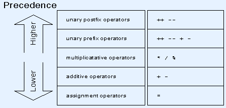

=========
Operators
=========

Sneak Peek
==========
By the end of this lesson, you should be able to...

- Know the different kinds of operators that exist for variables.
- Understand the order of operations for these operators.

Operators
=========
So we first learned about the various basic kinds of data we can store inside variables for storybrew. While we know a few things like basic arithmetic operations, knowing how you can manipulate variables is incredibly important. **Operators** help perform actions its receiving variables, known as *operands*. You're already familiar with these in any math class; they don't call it the *order of operations* for nothing. In an expression like ``16+9``, the operator is the ``+`` symbol, with the operands being ``16`` and ``9``.

Certain operators ask for different amounts of operands. Operators that take only one operand are known as **unary operators**. Two operands, such as our addition expression above, are known as **binary operators**. Only one operator exists that takes *three* operands, known as the **ternary operator**. We'll talk about those first, cover some specialized operators, and then some of the logic behind them.

    Obviously had enough of this crap being pulled.

Unary Operators
---------------
**Unary operators** only ask for one operand. This table covers some of the more practical unary operators.

.. csv-table:: Unary Operators
   :header: "Expression", "Operation"
   :widths: auto

   "``-``","Negation"
   "``++x``","Pre-increment"
   "``--x``","Pre-decrement"
   "``x++``","Post-increment"
   "``x--``","Post-decrement"
   "``!x``","Logical negation"
   "(T)x","Typecasting ``x`` to ``T``"

And some example usage:

.. code-block:: csharp
  :linenos:

  int startingNumber = 11;
  int negativeNumber = -startingNumber; // -11
  startingNumber++;                    // startingNumber + 1 -> 12
  startingNumber--;                    // startingNumber - 1 -> 10 again

You may be wondering what the differences are between the pre and post versions of incrementing and decrementing. Could they be similar to the communitive property of algebra, where it doesn't make a difference which side it is? While you may be inclined to think that, there *is* a slight difference, which is when the incrementing/decrementing occurs. Take a look at this example:

.. code-block:: csharp
  :linenos:

  int Aoba = 4;            // We start off with Aoba at a tender value of 4. (She's actually over 18, thank you.)
  int Hifumi = ++Aoba;     // Increment Aoba to 5 first, then assign that to Hifumi. Hifumi = 5, Aoba = 5
  int Yun = Aoba++;        // Assign Aoba to Yun first, then increment Aoba by 1. Yun = 5, Aoba = 6

As the example demonstrates, the primary difference is at what point is the righthand value upon evaluation. Writing the prefixed manner would apply the increment/decrement *first*, then assign, while the postfixed manner lets the value get assigned first, *then* get increment or decrement.

The following code-blocks break down prefixed and postfixed differences even further by providing their longer equivalents.

.. code-block:: csharp
    :linenos:

    int Aoba = 4;

    Aoba = Aoba + 1;
    int Hifumi = Aoba;  // Increment Aoba to 5 first, then assign that to Hifumi. Hifumi = 5, Aoba = 5

    int Yun = Aoba;
    Aoba = Aoba + 1;    // Assign Aoba to Yun first, then increment Aoba by 1. Yun = 5, Aoba = 6

.. note:: Post-increment and post-decrement are what's known as *primary operators*. They have the highest precedence when compared to other unary operators. This isn't really a big deal, but know that these two operators are a *bit* more special than the other unary operators.

Arithmetic Operators
--------------------
Binary operators ask for two operands. These are the most common operators you'll encounter, as basically all the arithmetic, mathematical junk fall under this tree. Because of this, this section is pretty much titled as the **arithmetic operators**, as they'll be the most important binary operators to encounter.

.. csv-table:: Arithmetic Operators
   :header: "Expression", "Operation"
   :widths: auto

   "``+``","Addition"
   "``-``","Subtraction "
   "``*``","Multiplication"
   "``/``","Division"
   "``%``","Modulus (Remainder)"

.. note:: Remember that integer division completely ignores the decimals when dividing. That is to say, ``3/2`` outputs ``1`` and *not* ``1.5``. If you need the decimal, at least one of the numbers needs to have floating-point precision. Simply adding ``.0`` to one of the values, like ``3.0/2`` will suffice.

The only operator of special note here is the modulus operator, as often the newbie programmer gets a bit tripped up with its functionality. Simply remember that it's just like integer division, only that it gives the remainder instead of the result. As such:

.. code-block:: csharp
    :linenos:

    int pizzaSlices = 8;
    int extraSlices;
    extraSlices = 8 % 3;        // remainder 2
    extraSlices = 8 % 2;        // remainder 0
    extraSlices = 8 % 7;        // remainder 1

Some special phenomena are possible when usiling modular arithmetic (as what this is called), but that's a can of worms for another day.

Ternary Operator
----------------
The **ternary operator** accepts *three* operands and is often an underrated but incredibly useful operator to make. It's easier to explain by explaining its syntax, then demonstrating it in an example.

.. code-block:: csharp
    :linenos:

    <condition-to-evaluate> ? <result-if-true> : <result-if-false>;

The contents within ``<condition-to-evaluate>`` can be any sort of logical evaluation that results in a ``true`` or ``false``. This is known as the ``bool`` type that we talked about in the previous section. It's possible to get these ``true`` or ``false`` values with mathematical expressions, as shown:

.. code-block:: csharp
    :linenos:

    // If the particle is on the bottom-half of the screen, put it towards the right side of the screen.
    // Otherwise, put it on the left side.
    Vector2 particleLocation = new Vector2(0,180);
    particleLocation.X = (particleLocation.Y > 240) ? 600 : 40; // X will be 40.

    // If I'm hungry, I'll get a hamburger. Otherwise, get a salad.
    bool amIHungry = true;
    string myLunch = (amIHungry) ? "Hamburger" : "Salad"; // BURGER TIME!

These expressions use :ref:`relational operators <programming_operators_relational>`, which are virtually identical to the concept of inequality in our math classes.

Observe that the contents in ``<result-if-true>`` and ``<result-if-false>`` may be both possibilities for the variable to assign, meaning that they should share the same type as that variable.

The ternary operator will be discussed more heavily in the next section, so don't sweat it if you feel it's a bit confusing. For now, we're just introducing the different kinds of operators we have available, so treat it as a sampler. It'll grow on you, like that bratty cute mascot in any shonen anime.

Assignment Operators
--------------------
All the arithmetic operators have a shorthand with the assignment operator ``=`` that allows for more convenient evaluation. It basically fuses both assignment and the respective arithmetic operator.

.. csv-table:: Assignment Operators
   :header: "Expression", "Operation"
   :widths: auto

   "``+=``","Addition"
   "``-=``","Subtraction "
   "``*=``","Multiplication"
   "``/=``","Division"
   "``%=``","Modulus (Remainder)"

The lefthand variable's current value will be one operand with the arithmetic operator, and the righthand value is the other. Whatever is the result will get assigned into the lefthand variable. As such, the following segments of code are equivalent:

.. code-block:: csharp
    :linenos:

    float myWallet = 0.50f;
    myWallet += 10.43f;     // I have $10.93 in my wallet. :(

    .. code-block:: csharp
        :linenos:

        float myWallet = 0.50f;
        myWallet = myWallet + 10.43f;  // I still have $10.93 in my wallet. :(

.. _programming_operators_relational:

Relational Operators
--------------------
As mentioned earlier, it's possible to compare different values together and reach a conclusion of ``true`` or ``false``. These sorts of evaluations use **relational operators**, binary operators that make a comparison and return a ``bool`` type.

.. csv-table:: Relational Operators
   :header: "Expression", "Comparison", "Description"
   :widths: auto

   "``==``","Equality","Checks if the two operands are equal. If they are, return ``true``."
   "``!=``","Inequality","Checks if the two operands are *not* equal. If they are *not*, return ``true`` ."
   "``>``","Greater Than","Checks if the left operand is greater than the right operand. If so, return ``true``."
   "``<``","Less Than","Checks if the left operand is less than the right operand. If so, return ``true``."
   "``>=``","Greaten Than Equal","Checks if the left operand is greater than or equal to the right operand. If so, return ``true``."
   "``<=``","Less Than Equal","Checks if the left operand is less than or equal to the right operand. If so, return ``true``."

You know the drill. Example time!

.. code-block:: csharp
    :linenos:

    bool kreygasm;
    kreygasm = (14 > 8);                        // true
    kreygasm = (19.4f == 19f);                  // false
    kreygasm = ("Hello world!" != "WutFace");   // true
    kreygasm = (67 <= 67);                      // true

We'll harness the power of these relational operators when we let our programs make different decisions depending on whether something is true or false. Before that though, we just need to discuss a little with how the program evaluates these operators.

Precedence
==========
Just like in math class, certain operators have a higher priority than others when it comes to evaluation. The popular concept of PEMDAS taught in math classes generally applies the same way here with programming. For instance, the ``*`` and ``/`` operators will precede any ``+`` and ``-`` operators, and so forth.

    Thanks `Glenn Stevenson <http://glennstevenson.com/>`_ for this ultra-convenient table I shamelessly took!

Remember that you can elevate the precedence of an operator by wrapping the expression up in parentheses. The contents in the parentheses will be evaluated first, just like PEMDAS.

Associativity
=============
When operators have the same precedence, they are then evaluated based on associativity. Most general operators, such as the arithmetic and relational operators, are **left-associative**, which means they are evaluated in order from left to right. This means that an expression like ``x * y / z`` is read as ``(x * y)  / z``. The scant few operators that don't do this are **right-associative**, which means that they are evaluated in order from right to left.

The only right-associative operators to consider are all the assignment operators and the unary operators. This just means that when you have an expression such as ``a = b = c``, ``c`` will get assigned to ``b``, then ``b`` will get assigned to ``a``. Consider another example that uses some more non-trivial assignment operators, and its equivalent piece of code. What are the results of ``loveNest``, ``yazawaNico``, and ``makiChan``?

.. code-block:: csharp
    :linenos:

    int yazawaNico = 25252, makiChan = 100;
    int loveNest = 69;
    loveNest += yazawaNico -= makiChan;

.. hint:: Think of the right-associativity! Start from the right, and don't forget to slowly overwrite the values as you go. Take it one step at a time.

.. code-block:: csharp
    :linenos:

    int yazawaNico = 25252, makiChan = 100;
    int loveNest = 69;
    yazawaNico -= makiChan;
    loveNest += yazawaNico;

The final values should be ``loveNest: 25221``, ``yazawaNico: 25152``, and ``makiChan: 100``.

If you find this confusing, just think of it like this:

- Arithmetic and relational operators at the same level of precendence read from **left-to-right**.
- Assignment operators at the same level of precedence read from **right-to-left**.

When in doubt though, you can always be liberal with parentheses. Just be sure to realize that there is a slight trade-off in readability.
