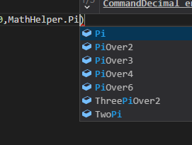

===================
Variables and Types
===================

Sneak Peek
==========
By the end of this lesson, you should be able to...

- Understand what a program is and what coding does.
- Assign different kinds of data into variables.

Structure of a Program
======================
A computer is able to perform a variety of tasks. We type in a web address, it gives us a web page, we click some circles, it registers them as misses because you suck... Routine stuff. All of these things are **programs**, and they're created from statements upon statements of commands we call **source code**. Programmers communicate to the computer using these commands, expressed in these abstract, English-like languages. They basically tell the computer what to do. It's like the computer is your own maid, only that this maid is not only very obidient, but very *dumb*. You need to specify the assumptions, frame the premise, and *give* the computer the logic to do these things *exactly* to your desires.

.. figure:: img/variables_and_types/sachi.jpg
   :scale: 50%
   :alt: Komine Sachi, at your service.

   Sachi is the perfect example of your computer maid.

When we look at programming from a storybrew perspective, the same principles apply, the only things we find different are:

    - Our computer maid only understands this language called **C#**.
    - Our computer maid additionally understands some storyboard-specific commands and perks.
    - Our computer maid looks at things in a more specific scope.

For instance, when you first create a new script in storybrew, the following block of code is generated for you:

.. code-block:: csharp
  :linenos:
  :caption: A blank script generated in storybrew.
  :lineno-start: 15
  :emphasize-lines: 3

  public class MyNewSampleScript : StoryboardObjectGenerator
  {
      public override void Generate()
      {

      }
  }

storybrew pays attention to the ``Generate`` :term:`method` inside this program. For now, think of the other pieces of code as some housekeeping for storybrew to realize that this is a new script we're dealing with here. Think of the place inside ``Generate`` as the first square in a board game: this is where the program first begins, and storybrew will naively execute each and every command we tell it to do. We want to think of an idea (such as creating a certain effect), plan stuff out (how to approach this), start developing, fine-tuning, and bam!

So in that case, let's start with an important concept in programming: variables!

   Let's go!

Variables
=========

A :term:`variable` is the cornerstone of creating a program. We need to tell the computer to create storage space for some data that'll be useful later, such as a calculated number, a filepath, or even a storyboard sprite. Creating this storage space can be written like:

.. code-block:: csharp
  :linenos:

  <type-name> <variable-name>;

.. hint:: You may have noticed that **semicolon character** at the end of the ``<variable-name>`` spot. That's C#'s way of saying, "This is the end of my sentence!".

    If you're a newbie programmer, most of your mistakes may occur because you forgot to end your statement with a semicolon. So always keep watch of this! (Fun fact: Python doesn't require ending your statements with semicolons. It helps with its aesthetics.)

This is known as declaring our variable. This makes the program realize that this variable, named ``<variable-name>`` is going to exist, and that it should use a bit of its memory to store data for it. We can also initialize a variable with values, giving data to these variables straight away. Here are some examples:

.. code-block:: csharp
  :linenos:

  int fluffyPancakes = 16;              // Making 16 fluffy pancakes.
  float g = 9.80665f;                   // Gravity acceleration constant
  string spritePath = "SB/credits.png"; // You can store messages inside strings like this.
  int remFans = 69, ramFans = 16;       // Both remFans and ramFans are initialized as ints.

.. hint:: OK, real funny. What do those ``//`` characters mean!?

    That's a :term:`comment`! When writing those characters, the remaining contents of the line are "commented out" and ignored by the program. They're only there for our own self-referential purposes. Comments especially help when you're writing a more elaborate program or effect, and you need to make sure you aren't lost or anything.

When a variable already exists, we can then assign different values into them. Variables don't need to be set in stone. Here's an example of changing the value of a variable:

.. code-block:: csharp
  :linenos:

  int fluffyPancakes = 16;          // Making 16 fluffy pancakes.
  int specialBonus = 24;
  fluffyPancakes = specialBonus;    // Now fluffyPancakes is 24.
  fluffyPancakes = 0;               // No more fluffy pancakes!

The ``=`` sign is known as the **assignment operator**. It's very similar to the concept of equality in math (2+2=4), but there's a really important difference. The stuff in the *righthand side* of the expression gets *assigned* to the variable in the lefthand side. If we look at Line ``3``, the contents inside ``specialBonus`` get assigned into ``fluffyPancakes``. Because ``fluffyPancakes`` and ``specialBonus`` have already been declared and initialized as variables, we don't need to call their type again. In that case, this statement then changes the ``fluffyPancakes`` the tender value of ``24``. Then we re-assign it with ``0``. No more fluffy pancakes.

.. note:: Remember that variable names are **case sensitive**. That means that ``fluffyPancakes`` and ``FluffyPancakes`` are **different** variables! If you have an error in your code where the compiler tells you that a certain variable is undeclared, check its spelling and casing.

It's also possible to do mathematical expressions, such as calculating a formula. We can call the very variable that we want to get re-assigned as well.

.. code-block:: csharp
  :linenos:

  int fluffyPancakes = 16;                            // Making 16 fluffy pancakes.
  int specialBonus = 24;
  fluffyPancakes = fluffyPancakes + specialBonus;     // 16+24 -> 40
  fluffyPancakes = 3 * (specialBonus - 14);           // 3*(24-14) -> 30

Now that we got a good grasp of how to use variables, let's learn about the different types that are possible in the C# language, and how it can help us storyboard.

Types
=====
C# is what's known as a **strongly typed** language, which generally means, as a programming language, it cares about the types of its variables, and tries to ensure that, when assigning data into variables, the passing data is compatible with the receiving type. This is known as **type safety**. It's very important we know what the basic types we can use in a program:

Built-in Types
--------------

.. csv-table:: Built-in Types
   :header: "Category", "Types"
   :widths: auto

   "Numeric, integral (integer-based)", "int, long, sbyte, short, uint, ulong, ushort, byte, char"
   "Numeric, floating-point", "float, double"
   "Numeric, decimal", "decimal"
   "Boolean", "bool"

This table gives a bit more information than needed, but is still useful for the overall context of things. Integral values are whole numbers, with the different types having different ranges of values. Some types take up less memory, such as a ``short`` vs. a ``long``. In the scope of storybrew, this is negligible, and we can safely use ``int`` for every calculation. The only other thing to remark is the ``char`` value, which is intended to store single characters, such as ``'a'``. These characters have numerical values behind them (think of a large table full of different letters), which is why a ``char`` type is also integral-based.

Floating-point and decimal values support having decimal values, with different degrees of precision. ``float`` has the least precision, but is the most convenient to juggle with and is primarily used in storybrew, so we'll stick with that. If you're handling calculations past 10^-7, use ``double`` instead. It may sound intuitive to use ``decimal`` for decimal numbers, but that's only reserved for *really* exact calculations, as it offers extremely fine precision. We'll talk about booleans in another chapter, but for now think of it as a flag that can say either, ``true`` or ``false``.

In summary, the only things you need to worry about within these built-in types are:

- Use ``int`` for whole values (integers).
- Use ``float`` for numbers with decimals.

.. warning:: Many of storybrew's commands rely on ``float`` types and not ``double`` type variables. When initially writing a decimal number, such as ``3.14159``, it'll automatically be interpreted as a ``double``, which will trigger a **type error** when sent into a storybrew command. You'll need to suffix that value with an ``f`` to tell the program to make it a ``float``, so ``3.14159f`` is fine instead.

Other Useful Types
------------------
The other useful type we'd like to share is known as the ``string`` type. A string is a collection of ``char`` values together to compose a message, such as the filepath example mentioned earlier. Strings are incredibly useful to not only store filenames of your sprites, but other things such as generating our own text (like lyrics). Strings can be assigned with a pair of double-quotes, just like the dialogue in a story.

OpenTK
------
storybrew generates its graphics thanks to a library known as OpenTK. We can also use OpenTK in storybrew, opening us (ha!) to some more convenient types and helpers.

Most importantly, the ``Vector2`` type stores two ``float`` values known as ``X`` and ``Y``. This is incredibly useful for storing coordinates and is smoothly compatible with things like storybrew's Move command. There also exists a ``Vector3`` type with a ``Z`` value as well, should you need to store 3 values this way. The following code-block is an example calling the Vector2 type:

.. code-block:: csharp
  :linenos:

  Vector2 treasureLocation = new Vector2(320,240); // Vector2 is a more elaborate type, so it requires the new keyword
  treasureLocation.X = 160;
  treasureLocation.Y = treasureLocation.Y - treasureLocation.X;

What should the value of ``treasureLocation`` be after the calculations? We'll leave that for you to find out. (Spoilers: It should be ``(160,80)``).

Another important type is the ``Color4`` type, representing a colorset in the form of RGBA. Like how ``Vector2`` contains ``X`` and ``Y``, Color4 contains ``byte`` values of ``R``, ``G``, ``B``, and ``A``. It's easier to demonstrate this through an example, so keep reading to see ``Color4`` in action.

Another useful perk with OpenTK is the ``MathHelper`` library, containing various constants and methods that can make calculation far easier. For example, you can declare the various points of Pi, which is very useful for rotation calculation. You can also convert between degrees and radians as well.

   Convenient!

There are other data types and contents inside the OpenTK library that are useful, which will be introduced in later sections.

Other Remarks
=============

Implicit Typing
---------------
Up to this point, we've been declaring variables using their specific type name. However, C# does offer a convenience feature where the typing is implicitly figured out from the righthand side of the assignment. This is known as **implicit typing**. Instead of specifying our type name when declaring our variable, we give it the ``var`` keyword instead. As the type is figured out from the righthand side, a variable declared with the ``var`` keyword **MUST** have something initialized to it.

.. code-block:: csharp
  :linenos:

  var fluffyPancakes = 16;                  // int
  var g = 9.80665f;                         // float (due to the f suffix)
  var spritePath = "SB/credits.png";        // string

The main advantage with implicit typing is just the convenience it takes, allowing for some flexibility in editing some of the values. If you also need to change the type of values for some reason, you don't need to laboriously change the explicit type naming and such too. It's just something we like to call "syntactic sugar".

Casting
-------
Some decimal calculations automatically output the value as a ``double`` type. However, there exists no implicit conversion between a ``double`` type to a ``float``, so the program will cry out that there's an error if you try to stick a ``double`` into a ``float`` due to type safety. You'll need to explicitly convert this ``double`` value into a ``float``, a concept known as **typecasting**. Casting is incredibly simple: wrap your expression in parentheses, then prefix that with a pair of parentheses containing the type you want to convert it to. Observe:

.. code-block:: csharp
  :linenos:

  float myCastvalue = 16 + (float)(Math.Pi * 8);

.. warning:: You may think that if you were to cast a floating-point number into an integer, it'd follow the conventions of rounding up after 0.5. However, this is absolutely untrue! The decimal value in a floating-point number will actually get completely ignored. This is the equivalent of calling ``Math.Floor`` to a value. To properly round a value, use ``Math.Round``. ``Math.Ceiling`` also exists if you want to round the number up as long as *some* decimal value exists.

    .. code-block:: csharp
      :linenos:

      int ignoredDecimal = (int)(6.79f);            // 6
      int notRounded = (int)(Math.Round(3.14f));    // 3
      int isRounded = (int)(Math.Round(3.87f));     // 4
      int onTheFloor = (int)(Math.Floor(9.99f));    // 9
      int raiseTheRoof = (int)(Math.Ceiling(10.1f));  // 11

Naming
------
While freedom of speech is a beautiful thing, there are a few rules when it comes to variable naming:

- The first character of a variable name must either be a letter, an underscore character (_), or the @ symbol.
- Characters after that can only be letters, underscore characters, or numbers.
- The variable name must not conflict with a reserved keyword.

Thus, these variable names are legal:

.. code-block:: csharp

  string matsushimaMichiru;
  int SUOU_AMANE;
  bool _irisuMAKINA;

And the following are illegal:

.. code-block:: csharp

  string 96neko;
  int namespace;
