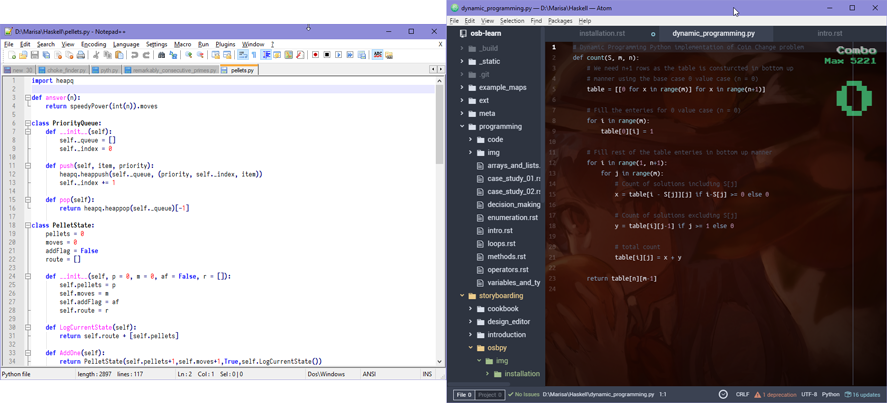
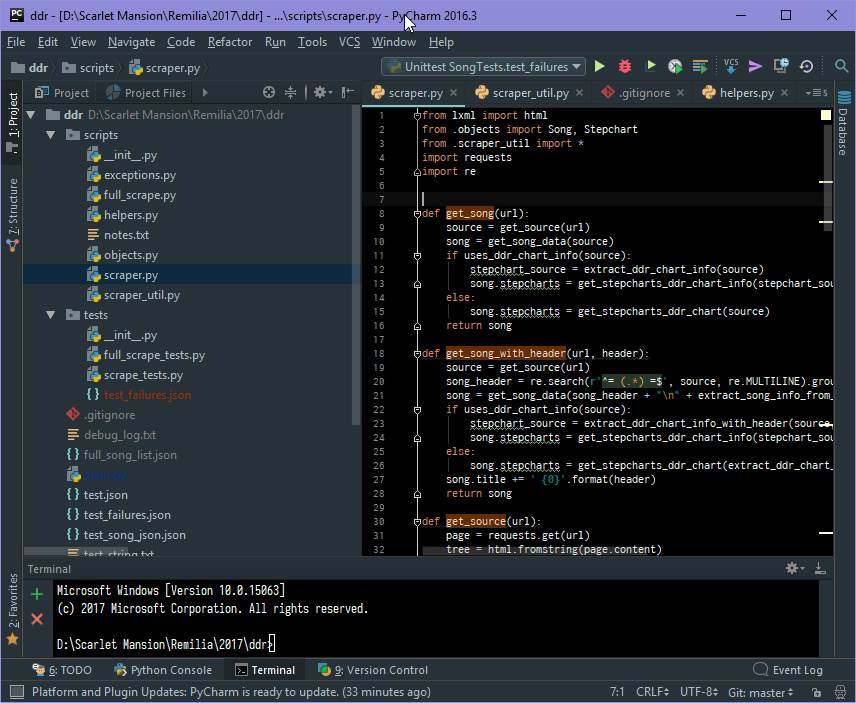

============
Installation
============

Introduction
============
Installing :term:`osbpy` into your existing Python environment is a cinch! However, there are additional packages known as dependencies that osbpy relies on. This chapter will act as a guide to help install these dependencies and ensure that your setup for Python is also spotless and ready for development.

.. attention:: If you have no clue what you're doing and this is your first foray into Python and programming, then it's likely better to *first* learn how to use Python and the general work flow process for developing and running a script. For learning the language, a site like `codeacademy <https://www.codecademy.com/learn/python>`_ can be incredibly useful as it's highly interactive, while take a read `here <https://wiki.python.org/moin/BeginnersGuide/Download>`_ to get started installing it on your own computer.

Installing Python
=================
Whether you have Python already installed on your computer or you're looking into downloading Python, you may be wondering what version will work best with osbpy, as the official Python website offers downloads for both Python 2 and Python 3. While Python 3 *is* the way of the eventual future, certain libraries may only be supported on Python 2, or vice-versa. Due to this, the answer *depends*, but generally, it doesn't matter which version of Python you use, as the requirements for osbpy and osbpy itself are compatible with both versions. For most general purposes, working with Python 3 is likely the better bet, unless a library you need is only in Python 2 (a probably rare situation).

   FIGHTING IS BAD. SO IS FIGHTING TO PICK A BETTER VERSION.

What's more important after installation is ensuring you have all the proper development tools with Python on your computer. The Hitchhiker's Guide to Python, *the* essential primer for writing awesome Python, `details a very useful guide here <http://python-guide-pt-br.readthedocs.io/en/latest/starting/installation/>`_ that contains three *incredibly* important enhnacements to do after installation. They are:

- Adding Python to the System Environment Variable PATH on a Windows machine
- Ensuring that setuptools and pip are installed
- Installing virtual environments

The Hitchhiker's Guide should help ensure that you have all of these setup, so it's best to read the guide for whichever OS and version is relevant for you:

`Python 3 on MacOS <http://python-guide-pt-br.readthedocs.io/en/latest/starting/install3/osx/#install3-osx>`_.

`Python 3 on Windows <http://python-guide-pt-br.readthedocs.io/en/latest/starting/install3/win/#install3-windows>`_.

`Python 3 on Linux <http://python-guide-pt-br.readthedocs.io/en/latest/starting/install3/linux/#install3-linux>`_.

`Python 2 on MacOS <http://python-guide-pt-br.readthedocs.io/en/latest/starting/install/osx/#install-osx>`_.

`Python 2 on Microsoft Windows <http://python-guide-pt-br.readthedocs.io/en/latest/starting/install/win/#install-windows>`_.

`Python 2 on Ubuntu Linux <http://python-guide-pt-br.readthedocs.io/en/latest/starting/install/linux/#install-linux>`_.

Installing osbpy's Dependencies
===============================
The next step will be to install all of osbpy's dependencies.

At this point, you can install these dependencies on either your main build of Python, or to install them in a virtual environment to separate installed modules from potentially messing with each other. Since the requirements for osbpy are generally broad, it's not only easier to just install it in the main build of Python, it suffices for the general user. However, if you'd like to install it in a virtual environment, then follow `virtualenv's guide in setting up a virtual environment <https://virtualenv.pypa.io/en/stable/userguide/>`_, and activate it. If it works, your console should have the name of the virtual environment to the left of the input token.

.. note:: For Windows PowerShell users of virtualenv, activation of the virtual environment is, by default, blocked due to system permissions. You can follow the workaround given in `virtualenv's guide here <https://virtualenv.pypa.io/en/stable/userguide/#activate-script>`_, or simply use the command prompt instead, which doesn't have these permission problems. Remember that for Windows machines, activating a virtual environment is done through ``scripts\activate.bat``, and not ``bin/activate``.

.. warning:: Keep in mind that when using a virtual environment, compilation of the script **must** occur within the virtual environment, as only that environment contains the necessary packages. If you find yourself often having to work on and off your project and needing to enter the virtual environment continuously, consider :ref:`using an IDE like PyCharm <storyboarding_osbpy_installation_ides>` instead.

Whether installing from the main Python build or through a virtual environment, the next step would be to simply install all the packages through pip. pip is the package management system for Python that hosts a wealth of extensions and libraries to enhance your Python development. If installed and set up correctly (i.e. for Windows machines, the Scripts folder is also in the PATH variable), then you can see if pip works by typing a quick version check, such as:

.. code-block:: shell
    :linenos:

    (env) D:\Eirin\test>pip -V
    pip 9.0.1 from d:\eirin\test\env\lib\site-packages (python 2.7)

Confident that pip is installed, you can then install the necessary packages for osbpy. They are:

- numpy 1.10.4 + MKL or higher
- matplotlib 1.5.1 or higher
- scipy 0.17.0 or higher

Fortunately, pip allows multiple installations in one line. For OSX and Linux machines, typing the following command should work just fine:

.. code-block:: shell

    pip install numpy-mkl matplotlib scipy

For Windows machines, the packages may not be as cleanly installable from PyPI, the package index that pip relies on. In this case, downloading the .whl files (the compiled packages ready for pip installation) from a webpage such as `Christoph Gohlke's <http://www.lfd.uci.edu/~gohlke/pythonlibs/>`_, will be the better bet. Simply select the version you want, the version of Python you're using (as denoted in the ``cp-##`` section), and finally, whether your computer runs on 32 or 64-bit. For example, an installation of the three packages may look like the following for a 64-bit computer using Python 2.7:

.. code-block:: shell

    pip install "numpy-1.12.1+mkl-cp27-cp27m-win_amd64.whl" "matplotlib-2.0.2-cp27-cp27m-win_amd64.whl" "scipy-0.19.0-cp27-cp27m-win_amd64.whl"

The links to each of the required wheels are:

- `numpy+mkl <http://www.lfd.uci.edu/~gohlke/pythonlibs/#numpy>`_.
- `matplotlib <http://www.lfd.uci.edu/~gohlke/pythonlibs/#matplotlib>`_.
- `scipy <http://www.lfd.uci.edu/~gohlke/pythonlibs/#scipy>`_.

You can verify a successful installation by typing the command ``pip freeze``, which displays all installed libraries within the environment. The only thing left is simply integrating osbpy!

Adding osbpy to your Projects
=============================
At this point, the only thing needed to be done now is to retrieve the ``osbpy.py`` file from the Github repostiory and simply leave it in the same folder as the intended storyboard project. The file can be directly accessed and saved by visiting its `raw page here <https://raw.githubusercontent.com/KawaiiWafu/osbpy/master/osbpy.py>`_ or by using the terminal and saving the file directly via curl, as shown:

.. code-block:: shell

    curl -O https://raw.githubusercontent.com/KawaiiWafu/osbpy/master/osbpy.py

Editor of Choice
================
Python is a lot like the Zen philosophy in its simplicity and minimalism. Therefore, it may feel very counter-intuitive to consider using an IDE (Integrated Development Editor), which can often feel overwhelming and unwieldy to use. This section outlines a few editors of choice that can ease work with Python.

Text Editors
~~~~~~~~~~~~
Python is, at its essence, simple scripts that can be quickly run through the terminal. In that case, there may really be no need to get all the additional bloat of a robust, full editor. After all, if you're storyboarding something simple and quick, why bother setting up an *entire* project for it? Here are a few recommended text editors to use when working with Python – note that all the text editors mentioned include conveniences such as syntax highlighting, some form of Intellisense (auto-completion), and local in-editor compilation without much of a hassle (through plug-ins).

- **Notepad++**. A long-standing classic, Notepad++ has always been a lightweight and speedy choice to use as a text editor. It's incredibly portable and can work even on USB sticks.
- **Sublime Text**. A professional text editor, Sublime Text essentially comes with all of the Python conveniences without much of the fuss. Supporting many IDE-like conveniences without the bloat of an IDE, Sublime Text is a sleek editor that many web developers and Python coders enjoy as a whole. However, its free version may remind you a little *too* much to purchase the premium version.
- **Atom**. A more recent upstart, Atom prides itself on its package manager – extensibility and sleekness are two incredible strengths. It's also open-source and completely free. However, its propensity for packages does make the editor liable to longer loading times.

At the end of the day, it all really comes down to preferences. It's recommended to try out various editors until you find a match suitable for you. Text editors and IDEs are also not mutually exclusive. A versatile text editor can go a long way for not only the programming enthusiast, but also the power user.

   A side-by-side comparison of two of the text editors mentioned, Notepad++ and Atom.

.. _storyboarding_osbpy_installation_ides:

IDEs
~~~~
For large-scale storyboard projects or ones requiring more complicated logic, using an IDE will likely help encourage productivity and speedy development. While typical Python installation packages come with IDLE, the editor is rather limited in its scope. The best development editor for Python currently is `JetBrains' editor PyCharm <https://www.jetbrains.com/pycharm/>`_. For programmers familiar with other JetBrains editors such as IntelliJ, Android Studio, and PHPStorm, PyCharm is a seamless transition. Included are an interactive Python console, code completion, PEP formatting compliance, error handling, and automatic code refactoring and navigation capabilities. It is also highly customizable as well.

   The Pycharm editor in action!

While the Community Edition is free for all users, students whether in high school or college can take advantage of JetBrains' student licenses and download all of their editors for free. `Access the student license portal here <https://www.jetbrains.com/student/>`_ and follow the steps in the application process.

In Conclusion
=============
With all the installation out of the way, it's finally time to begin storyboarding in Python! How exciting. The next sections will detail getting started in using osbpy and then some tips in maximizing your storyboarding experience in Python.

   Hiss hiss. Am I good snek?
