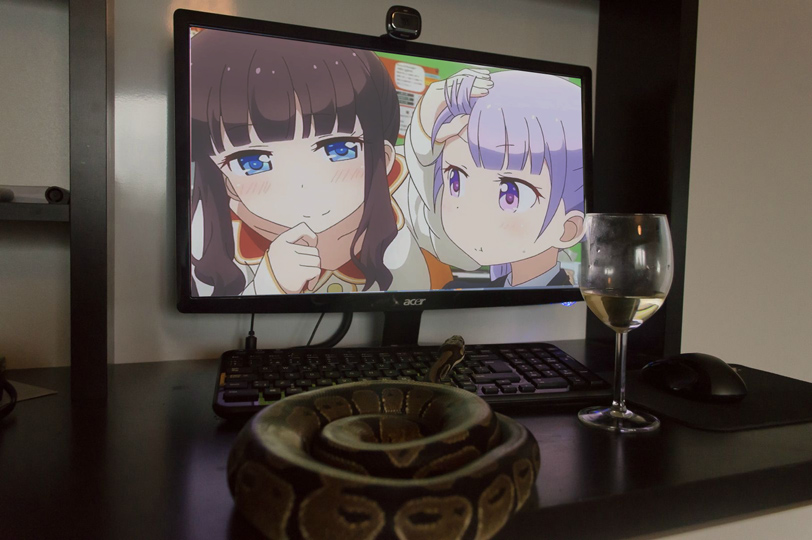

=====================
Introduction to osbpy
=====================

Don't Tread On Me
=================
:term:`osbpy` is a module developed by `Wafu <https://osu.ppy.sh/u/888955>`_ to create osu! storyboards in the Python language. It is `downloadable here <https://github.com/KawaiiWafu/osbpy/wiki>`_.

Why should you consider using osbpy for storyboarding?

- **Python is an incredibly lightweight and minimalistic programming language.** Its simplicity can allow the user to simply *focus* on the creation aspect and not need to worry about housekeeping variables and wordy syntax. A cluttered space really contributes to a chaotic mind. Python helps promote rapid development.
- **You have access to Python's vast libraries of powerful modules.** Because osbpy is essentially a module, the rest of Python is vastly available at your fingertips. It is still possible to enjoy the luxuries of popular and strong libraries such as PIL / Pillow, numpy, or even web-based ones such as requests.

While :term:`storybrew` is the current best medium to develop storyboarding, some computers may be unable to run the program. Furthermore, for those comfortable or interested in Python, osbpy is certainly a respectable choice for taking your storybaords to the next level.

The osbpy section in osb.moe covers installation, usage, and a few tips to working with osbpy successfully. Be sure to read each section to maximize your productivity in working with this module.

   Can a python only dream? Don't let your memes be dreams.

Overview
========
.. toctree::
  :maxdepth: 2
  :glob:
  :titlesonly:
  :caption: Storyboarding with Python - osbpy

  installation
