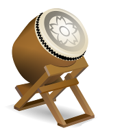
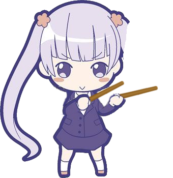
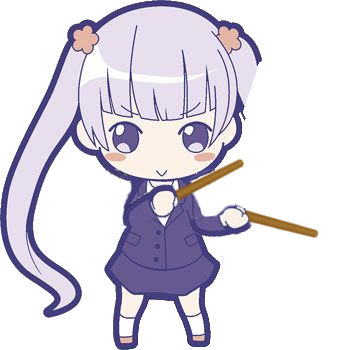
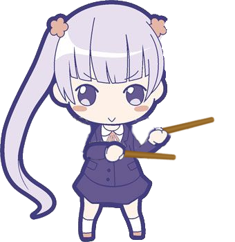
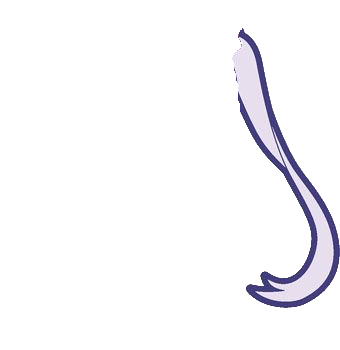
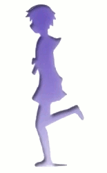
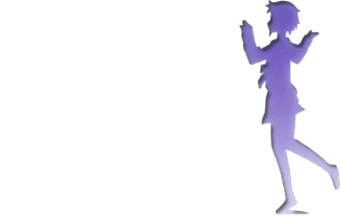

=================
Compound Commands
=================

Sequence Break
==============

.. _storyboarding_scripting_compound_commands_loop:

Loop
====
.. Storyboard loops
.. Remember that the numbers are based off 0!

Trigger
=======
.. Originally called trigger-loops lol

There is one mechanic within storyboarding that will allow you to create some sort of interactive effect with what is happening during gameplay: Triggers.
Triggers can catch certain events and execute basic commands on your sprite in response.

.. note:: Triggers are the most complex command currently provided by the storyboarding API and unfortunately they are accordingly buggy.
  There is a whole batch of weird behaviour attached to the use of triggers that will be covered in its most common oddities throughout this chapter and at the end of this chapter in its less common oddities.

Syntax
------
Like every other command, a trigger is always attached to a sprite or animation.

Triggers consist of merely 4 elements:
    - command-character
    - trigger condition
    - time window
    - trigger group (optional)

After the trigger command you have to list the commands that are to be executed when the trigger condition occurs.

.. code-block:: c
  :linenos:
  :caption: An example of using a simple trigger.
  :name: TriggerSyntax

  Sprite,Background,Centre,"sb\aoba.png",192.625,140
   F,0,23500,,0
   S,0,23500,,0.2
   T,HitSoundSoft,0,105330
    F,0,0,,1
    F,0,110,,0

*T* is they character marking the triggercommand.

*HitSoundSoft* is the trigger condition. You will learn about the different kinds of trigger conditions in the next chapter.

*0,105330* marks start- and endtime of the trigger. There is no limit to how often a trigger can be executed within the specified timeframe.

| The Fade commands after the trigger command are indented by one additional whitespace or underscore to mark them as belonging to the trigger.
| It is very important to notice that the time values specified for these commands are **relative** to the time when the trigger starts executing.

| Example: If the trigger condition is met at 23918 the sprite will change to 100% opacity at 23918 and fade out at 24028.
| This behaviour assures that there a trigger can be activated and executed multiple times.

Trigger Conditions
------------------
| Triggering a trigger is very similar to triggering a trap:
| It will snap once someone steps into it.

| It is not *that* simple though. Our traps have different tastes and they are picky to different degrees.
| Let's check how we can satisfy the taste of each of our traps.

Hitsounds
~~~~~~~~~
| The first big chunk of possible trigger conditions consists of hitsounds. Every time a note is hit, a hitsound will be played. But Hitsound does not equal Hitsound:
| There are as many possible different triggers for hitsounds in a map as hitsounds available.

| How do we specify the hitsound we want to have our trap snap on?
| This is easy. The naming for the according trigger follows a simple naming scheme as shown in the following table:

.. rst-class:: table table-sm table-hover table-striped
.. csv-table:: Hitsound Trigger Conditions
   :header: "Condition Type", "Name of Sampleset", "Additional", "Number of Sampleset", "Triggername"
   :widths: auto

   "Hitsound", "Soft", "Whistle", "1", "HitsoundSoftWhistle1"
   "Hitsound", "Drum", "", "", "HitsoundDrum"
   "Hitsound", "", "Clap", "", "HitsoundClap"
   "Hitsound", "", "", "4", "Hitsound4"
   "Hitsound", "Normal", "", "2", "HitsoundNormal2"
   "Hitsound", "", "Finish", "0", "HitsoundFinish0"

The columns are very easy to understand when you are familiar with hitsounding. Aside from the prefix "Hitsound" you can individually add or leave out a specification of your hitsound to get the exact hitsound or combination of hitsounds you want.

If you don't know what any of these mean, consider reading `a guide on hitsounding <https://osu.ppy.sh/s/224758>`_.

 .. warning:: While the naming of the triggers suggests that it checks which hitsound is played, this is actually not the case!
    Changing the sampleset of a note via the per-note quickaccess on the top left of the editor(Shift+Q/W/E/R) or via Sample Import will be ignored for the sake of evaluating triggers.
    You **always** have to change your samplesets via inherited timing sections if you want your Hitsound triggers to work correctly.

.. note:: You might have noticed that there is no option to catch a hitnormal alone. This is very annoying when you want to catch hitnormals along with other notes that actually have finishers.
  It can be worked around by changing the sampleset for these notes so you can use ``Hitsound5`` or something like that but it requires a lot of manual effort nonetheless.

  If you wonder why this is the case, the answer is that hitnormals work for everyone differently. Currently there is the option to configure the option ``LayeredHitSounds`` in your ``Skin.ini`` to 0 causing hitnormals no longer be played on notes that have additionals.
  As this is a setting determined by the user in most cases, there is no way to get a consistent experience for all players without the already mentioned workaround anyway.

Example: Hitsounds
..................
Aoba wants to play the Taiko drum! She is very inexperienced but maybe you can help her out?

If you aren't familiar with Taiko mapping, no problem, we got that covered in a few words.

There are 2 types of notes in Taiko, Don (red) and Kat (blue). If it has a whistle and/or clap hitsound attached it is a Kat, otherwise it is a Don note.

We can make Aoba hit the drum by catching the respective trigger conditions:

These would be ``HitsoundWhistle`` and ``HitsoundClap`` for Kat.

For Don we have to create a workaround and give each note a separate Hitsoundset because we can't react to the hitnormal without reacting to the additionals as well.

So let's say we put Hitsoundset 4 for each Don, meaning we have to specify the triggercondition as ``Hitsound4``.

To make this as simple as possible in terms of example, we'll introduce 2 more versions of Aoba in which she is using one or the other drumstick to hit the Taiko.

We will also put one of her pigtails into a differentsprite so that we can display the drumsticks in front of the drum but her hair behind it.
In total we got 5 sprites:

First of all we are moving our static sprites into place:

.. code-block:: c
  :linenos:
  :caption: Our static sprites
  :name: Static sprites

  Sprite,Background,Centre,"sb\aobaHair.png",192.625,140
   S,0,0,,0.2
   F,0,0,,1
  Sprite,Background,CentreLeft,"sb\drum.png",186,163
   S,0,0,,0.3
   F,0,0,,1

When nothing is happening the sprite of the idling Aoba should be shown. This will be the case at the start of the beatmap.
As soon as any hitsound is played she should get replaced by one of the other two sprites.

.. code-block:: c
  :linenos:
  :caption: Aoba preparing to hit the Taiko
  :name: IdleCode

  Sprite,Background,Centre,"sb\aobaTaikoIdle.png",192.625,140
   F,0,0,,1
   S,0,0,,0.2
   F,0,105330,,0
   T,HitSound,0,105330
    F,0,0,,0
    F,0,110,,1

Fairly simple, isn'it? Now let's do the same for the other two sprites except that they are invisible at the start and fade in on the according hitsound.

.. code-block:: c
  :linenos:
  :caption: Aoba hitting the drum with passion!
  :name: MovingCode

  Sprite,Background,Centre,"sb\aobaTaikoKat.png",192.625,140
   F,0,0,,0
   S,0,0,,0.2
   T,HitSoundWhistle,0,105330
    F,0,0,,1
    F,0,110,,0
   T,HitSoundClap,0,105330
    F,0,0,,1
    F,0,110,,0
  Sprite,Background,Centre,"sb\aobaTaikoDon.png",192.625,140
   F,0,0,,0
   S,0,0,,0.2
   T,HitSound4,0,105330
    F,0,0,,1
    F,0,110,,0

And that's it! Aoba will now play the drum in sync with the map!
You can see the application of this effect in the following map: https://osu.ppy.sh/s/597411

.. warning:: Yeah, the map, not with the player. Hitsound-triggers are only activated by Hitsounds from objects. Otherwise this would be amazing for Taiko-mode effects but you can still do some interesting things with it!
  The other sad thing is that spinners and drumrolls (except for the head) in Taiko don't trigger hitsounds but you could perfectly let Aoba drum to an osu!standard difficulty.
  This solution is far from universal as you will see in the Pitfalls-section but it works perfectly fine for Kantans and most Futsuu difficulties.

Change of Gamestate
~~~~~~~~~~~~~~~~~~~
.. it is safe to say that Passing/Failing triggers literally don't work in CtB and Mania
  attention:: If you are planning to use Passing and Failing triggers in a map for either Catch the Beat or mania, go no further because these are literally not implemented.
  There is full support for standard and partial support for Taiko (only Don/Kat, no drumrolls/spinners). Keep this in mind before making big plans with this type of trigger.

As you might know already from reading the chapter about layers and objects, osu! supports 4 layers of which 2 are `Pass` and `Fail` that are displayed in accordance to the current game state.
There are 2 trigger conditions corresponding with these layers called `Passing` and `Failing`:

  - Passing occurs when the game state is changing from Fail to Pass
  - Failing occurs when the game state is changing from Pass to Fail

Now there is one major hiccup in applying this to storyboards and that is that Pass and Fail-Layers work differently in every game mode.

In osu!standard the game state can only change at the end of a combo. If the last note of the combo gets you a Geki judgement the game state will be `Pass`, otherwise it will be `Fail`.

In osu!taiko the game state can change on each note. If the last note was missed, the game state is `Fail`, otherwise it is `Pass`. It should also be noted that drumrolls (except for the head? unconfirmed) and spinners don't count as notes.

In osu!mania and Catch the Beat the game state can only change on breaks and as we learned earlier, triggers always need to correspond to a gameobject. This means that `Passing` and `Failing` triggers basically don't exist for these gamemodes.

Example: Change of Gamestate
~~~~~~~~~~~~~~~~~~~~~~~~~~~~

This example is geared towards osu!standard as it is the only gamemode that has a consistent implementation for these trigger conditions.

It is rather advanced too but it would be boring otherwise, wouldn't it?

The narrative
.............

Aoba slept in and got the late train! Her only chance to get to work in time is running from the train station to the Eagle Jump office.

But...Aoba is clumsy. If she doesn't take care she will trip time and time again and not make it. It is up to the player to support Aoba in running.

The plan
........

On the Background layer we will put a picture of a street that is sidescrolling.

In Pass-state there will be an animation of Aoba running.

In Fail-state Aoba will lie on the ground after having tripped.

On triggering `Failing`, Aoba will be tripping.

On triggering `Passing`, Aoba will get up from the ground.

The implementation
..................

For the sidescrolling street we will take it easy as a start. After a quick google search a 2.5D animation of scrolling buildings turns up.

Splitting that into frames, renaming the individual pictures to use as an animation (I used a script for this because it has about 250 files) and we're ready to go.

.. image:: img/compound_commands/streetscroll.gif
  :scale: 100%
  :alt: Scrolling buildings
  :align: left

Now all we have to do is creating an animation with our existing knowledge:

.. code-block:: c
  :linenos:
  :caption: Buildings passing along...
  :name: StreetScrollCode

  Animation,Background,Centre,"sb\streetscroll\streetscroll.png",320,140,240,150,LoopForever
   F,0,0,,1
   S,0,0,,2
   F,0,90000,,0

And the street is running. Now to the more exciting stuff...

I prepared some animations to use for running, tripping and getting up (actually the hardest part).

.. image:: img/compound_commands/gettingUp.gif
  :scale: 100%
  :alt: Character getting up.
  :align: left

Let's start by putting the `Pass`-layer into place. While the gamestate is `Pass` the running-animation is displayed.

.. code-block:: c
  :linenos:
  :caption: Character running in Pass-state
  :name: RunningSimple

  Animation,Background,Centre,"sb\running\running.png",320,240,240,150,LoopForever
   F,0,0,,1

Simple as that. We have to make another addition for the case that the `Passing` event is triggered.

When this happens, Aoba is supposed to get up first before she starts running again. This means we have to fade the animation out for the process of getting up.

.. code-block:: c
  :linenos:
  :caption: Character running in Pass-state with transition
  :name: RunningComplete

  Animation,Pass,Centre,"sb\running\running.png",320,240,6,150,LoopForever
   F,0,0,,1
   T,Passing,0,90000
    F,0,0,,0
    F,0,1000,,1

The value of 1000 is arbitrary, it has to be set to the actual duration of getting up.

Now the same is done for the `Fail`-layer with the `Failing` trigger. This time it is a sprite, not an animation as Aoba is just lying down.

.. code-block:: c
  :linenos:
  :caption: Character lying on the ground
  :name: Tripped

  Sprite,Fail,Centre,"sb\falling\fallen.png",280,240
   F,0,0,,1
   T,Failing,0,90000
    F,0,0,,0
    F,0,2000,,1

All that is left is putting the actual animations for falling and getting up in.

.. code-block:: c
  :linenos:
  :caption: Character falling
  :name: Tripping

  Animation,Fail,Centre,"sb\falling\falling.png",280,240,9,150,LoopOnce
   T,Failing,0,90000
    F,0,0,,1
    F,0,1000,,0

.. code-block:: c
  :linenos:
  :caption: Character getting up
  :name: GettingUp

  Animation,Pass,Centre,"sb\gettingup\gettingup.png",320,240,8,150,LoopOnce
   T,Passing,0,90000
    F,0,0,,1
    F,0,2000,,0

Oh hey, that is easy, isn't it?

Yes, too easy to actually work. Otherwise this would be the coolest interactive storyboard in 29 lines ever.

The problem with using animations here is that they run independently from the trigger:

  - When using `LoopOnce` as the loop-option they will work fine on the first trigger but show only the last animation frame on consecutive triggers.
  - When using `LoopForever` the animation will work fine on the first trigger but start and end on the wrong frame.

The slightly annoying but in this case bearable workaround is animating by hand which means creating a Sprite for every frame of the animation and fade it in and out with the delay according to its position within the animation.
If you understood how an animation works, this should be trivial to do. Refer to the tutorial on :term:`animation` if you have trouble.

.. warning:: So we learned that you can't use triggers on animations if they are supposed to be displayed more than once.
  For recreating the animation with triggers on its individual sprites you have to explicitly fade them out at the start of the trigger as they will otherwise fade in as soon as the trigger starts executing.

.. note:: It should be noted that all combos in the map you're storyboarding for have to be at least as long as the longest transition effect (in this case 2 seconds of getting up).
  Otherwise the effects will overlap or not flow well into each other (assuming you counteracted the overlapping issue) and make it look very bad. 2 seconds for a combo in osu! standard is very reasonable though so this would work in most beatmaps.

.. You can check the result of this tutorial at <insert link here>.

Trigger Groups
--------------

.. defense shielding, spawning enemies one by one linearly through triggergroups

Pitfalls
--------

Interaction with commands outside of the trigger
~~~~~~~~~~~~~~~~~~~~~~~~~~~~~~~~~~~~~~~~~~~~~~~~

Interaction with other triggers
~~~~~~~~~~~~~~~~~~~~~~~~~~~~~~~

Supported hitobjects
~~~~~~~~~~~~~~~~~~~~
