======
Easing
======

..
    Man oh man, this page is going to be freakin' crazy lol.

.. _storyboarding_scripting_easing:

Introduction To Easings
=======================
So we've introduced sprites and a few basic commands that can be utilized with them. However, you may have noticed that all the tweening that occurs between sprite commands are in constant speed. An object moving rightwards is happily plodding along at a consistent speed, or a fade-in smoothly transitions in complete, constant form. However, objects in real life don't often conform to this, nor does animation. After all, open a door, and you realize that you could swing it wildly fast, or open it quickly at first and slow down as the door's fully ajar. When a ball drops on the floor, gravity's doing some hardcore acceleration, and there's a slight bounce when it hits the floor. In storyboarding, we can replicate this with :term:`easing`.

Easing is an effect that we can apply to a sprite's tweening that will change the rate of it moving from the start to end state. This means we can have our background climb in super quickly but slow down as it reaches its destination, or have dot particles fly around, bouncing wildly and with excitement. We're actually still using the set of commands! All we did was just change the easing from a constant speed to one that's far more exciting.

Another name for the default, "constant-speed" easing is *linear*. You may be wondering, why is it linear? Easings are actually mathematical functions composed of the incredibly useful `Bezier curve <https://en.wikipedia.org/wiki/B%C3%A9zier_curve>`_. You don't need to worry about the specific mathematics – much like our math books, the specific effects have already been found out, and as storyboarders we can take advantage of them.

Taking it Easy
--------------
This page will demonstrate all 35 supported easing behaviors on osu!. On the leftmost column, you'll see the **ID**, which can be used in direct scripting to call that particular easing. The **easing name** not only helps for referential purposes, but can be used in storybrew to call that Easing (refer to storybrew for more information). The column therafter is the **mathematical curve**, with the x-axis as *time* and the y-axis as the state of the command. So basically consider the bottom line as the starting state of a command (like a :term:`Fade` command starting at 0) and the upper line as the end state (to fully opaque at 0). You can see animated previews of the curve at `easings.net <http://easings.net/>`_. Finally, the final column is the **preview** column. This highlights how various commands are affected by the easing effect. Of course, the best strategy is for you to test yourself, but seeing what it's like in a simulated environment is pretty effective too.

Easings
=======
Many easing effects have similar relationships or functions between each other. Because of this, we've split the table into these various categories.

Basic Easing
------------
.. rst-class:: table-responsive
.. csv-table:: Basic Easing
   :header: "ID", "Name", "Curve", "Preview"
   :widths: auto

   0,"Linear",|linear_curve|,|linear_preview|
   1,"Out",|out_curve|,|out_preview|
   2,"In",|in_curve|,|in_preview|

These easing functions are the simplest kind of curving. In the old days of osu!, these were actually the only Easing options available! Let these effects help give you an impression of how the remaining easing effects behave, as the general concept is the same throughout these effects.

.. hint:: What's the difference between the Out and In easing effects? What situations do you think you find yourself using an Out Easing, and what situation do you find yourself using In?
    Pay attention to the later Easings' Ins and Outs and see what's so similar about them, and you'll be able to intuitively think of the right one to use for your sprite!

Polynomial Easing
------------------
.. rst-class:: table-responsive
.. csv-table:: Polynomial Easing
   :header: "ID", "Name", "Curve", "Preview"
   :widths: auto

   3,"InQuad",|quad_in_curve|,|quad_in_preview|
   4,"OutQuad",|quad_out_curve|,|quad_out_preview|
   5,"InOutQuad",|quad_in_out_curve|,|quad_in_out_preview|
   6,"InCubic",|cubic_in_curve|,|cubic_in_preview|
   7,"OutCubic",|cubic_out_curve|,|cubic_out_preview|
   8,"InOutCubic",|cubic_in_out_curve|,|cubic_in_out_preview|
   9,"InQuart",|quart_in_curve|,|quart_in_preview|
   10,"OutQuart",|quart_out_curve|,|quart_out_preview|
   11,"InOutQuart",|quart_in_out_curve|,|quart_in_out_preview|
   12,"InQuint",|quint_in_curve|,|quint_in_preview|
   13,"OutQuint",|quint_out_curve|,|quint_out_preview|
   14,"InOutQuint",|quint_in_out_curve|,|quint_in_out_preview|

Even though we call them *basic easing* functions, there's still mathematics behind those very functions. To no one's surprise, the default linear easing function is identical to a straight 1:1 slope you'd see in a basic algebra course – or ``x``. In calculus-based physics, we find out that the acceleration of an object affects the rate of the change of speed. This is very reminscent of how easings work – as we're changing the behavior of *constant* speed to something that's more variable. Due to the nature of exponents and calculus, an expression of ``x^2`` is the minimum to see this accelerating phenomenon. Thus we see that Out and In Easings are actually squared-based bezier curves. These additional variations you see then build on the expression through exponents – from the quadratic equation (``x^2 + x``) to cubed, the fourth power, and finally the fifth power. As an end user, what we pretty much see is more impact on the behavior.

Sinusoidal Easing
------------------
.. rst-class:: table-responsive
.. csv-table:: Sinusoidal Easing
   :header: "ID", "Name", "Curve", "Preview"
   :widths: auto

   15,"InSine",|sine_in_curve|,|sine_in_preview|
   16,"OutSine",|sine_out_curve|,|sine_out_preview|
   17,"InOutSine",|sine_in_out_curve|,|sine_in_out_preview|

As the polynomial easing functions are based off their respective exponential heavyweight, these set of easing functions are based off the sine wave.

.. tip:: These easing functions are actually really useful in creating curved motions in one command! Try instilling an OutSine Easing for an MX command, then an InSine Easing for MY. Compounding easings like this for a sprite can allow more precise and serendipitous discoveries. Try it out!

Exponential Easing
------------------
.. rst-class:: table-responsive
.. csv-table:: Exponential Easing
   :header: "ID", "Name", "Curve", "Preview"
   :widths: auto

   18,"InExpo",|expo_in_curve|,|expo_in_preview|
   19,"OutExpo",|expo_out_curve|,|expo_out_preview|
   20,"InOutExpo",|expo_in_out_curve|,|expo_in_out_preview|

If you thought that Quint wasn't enough, get a load of this!

Circular Easing
---------------
.. rst-class:: table-responsive
.. csv-table:: Circular Easing
   :header: "ID", "Name", "Curve", "Preview"
   :widths: auto

   21,"InCirc",|circ_in_curve|,|circ_in_preview|
   22,"OutCirc",|circ_out_curve|,|circ_out_preview|
   23,"InOutCirc",|circ_in_out_curve|,|circ_in_out_preview|

The circular series of easing functions are based on cooling a polynomial-based easing function through taking its square root.

Overshoot Easing
----------------
.. rst-class:: table-responsive
.. csv-table:: Overshoot Easing
   :header: "ID", "Name", "Curve", "Preview"
   :widths: auto

   24,"InElastic",|elastic_in_curve|,|elastic_in_preview|
   25,"OutElastic",|elastic_out_curve|,|elastic_out_preview|
   26,"OutElasticHalf",|elastic_half_out_curve|,|elastic_half_out_preview|
   27,"OutElasticQuarter",|elastic_quarter_out_curve|,|elastic_quarter_out_preview|
   28,"InOutElastic",|elastic_in_out_curve|,|elastic_in_out_preview|
   29,"InBack",|back_in_curve|,|back_in_preview|
   30,"OutBack",|back_out_curve|,|back_out_preview|
   31,"InOutBack",|back_in_out_curve|,|back_in_out_preview|

Some of the most exciting easing functions, the overshoot easings are named exactly because of their boundary breaking behavior. By multiplying the bezier-curve against a heavily modified sine or cosine wave, you can create a wildly oscillating kind of behavior for your sprite. The unique aspect is that it actually *overshoots* the end-state, then often backpedals in differing degrees. Observing the curves would prove really helpful here.

The main difference between the Elastic and Back easing functions are in stability. Elastic functions itself as something very erratic and dramatic, while Back's effects are more like someone running to their destination, slightly going too far, than reversing back in grace.

.. warning:: As you can see in the previews, Fade doesn't quite work properly with these functions. This is because the opacity of a sprite can never be negative, nor can they ever exceed 1 (or 100% opacity). A flickering effect occurs instead, which could be used to your advantage as a unique effect.

Bounce Easing
-------------
.. rst-class:: table-responsive
.. csv-table:: Bounce Easing
   :header: "ID", "Name", "Curve", "Preview"
   :widths: auto

   32,"InBounce",|bounce_in_curve|,|bounce_in_preview|
   33,"OutBounce",|bounce_out_curve|,|bounce_out_preview|
   34,"InOutBounce",|bounce_in_out_curve|,|bounce_in_out_preview|

In an attempt to simulate real physics, we end up having the bounce easing effects. Keep in mind that, unlike the overshoot easing functions, these never go past the end state's value. However, it certainly will flirt between that value and the slight bits before it.

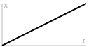

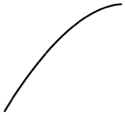

.. |in_curve| image:: img/easing/curves/2.png
  :alt: in curve.
  :width: 200px

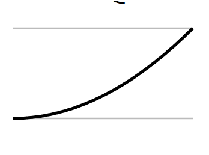

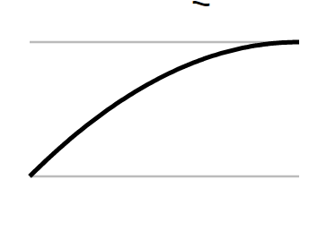

.. |quad_in_out_curve| image:: img/easing/curves/5.png
  :alt: quad_in_out curve.
  :width: 200px

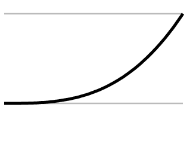

.. |cubic_in_preview| image:: img/easing/preview/easing6.gif
  :alt: cubic_in preview.
  :width: 400px

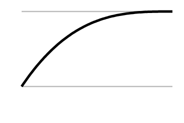

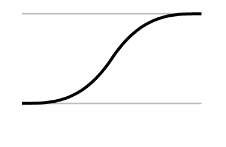

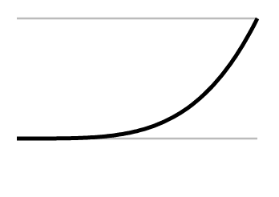

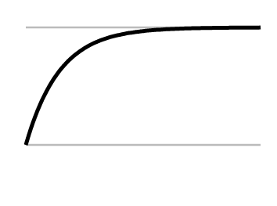

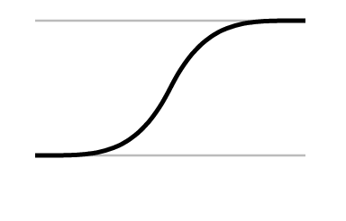

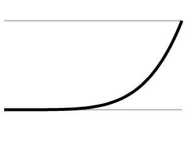

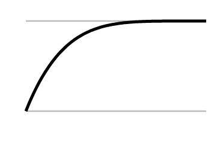

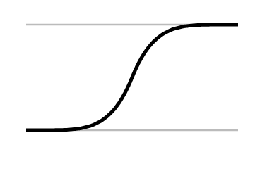

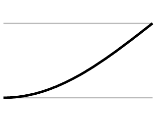

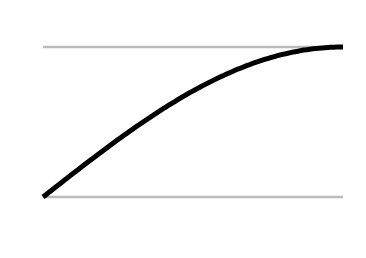

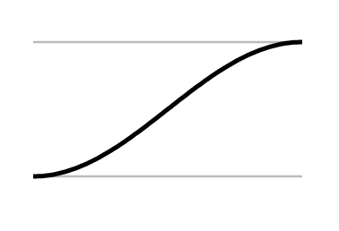

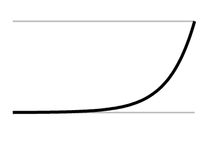

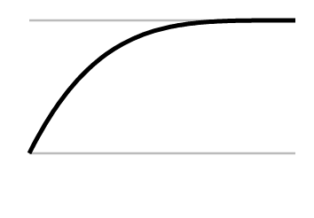

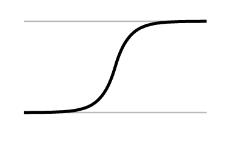

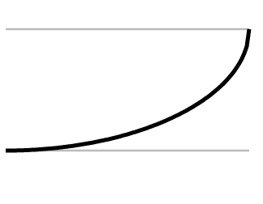

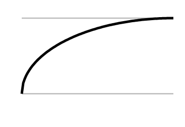

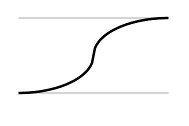

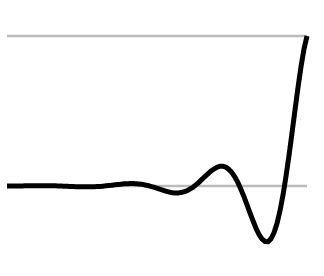

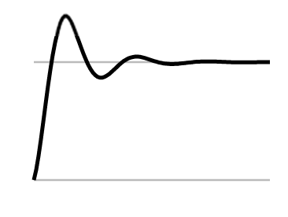

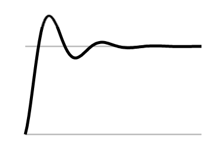

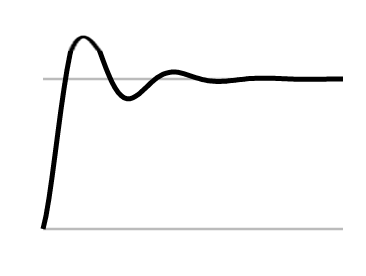

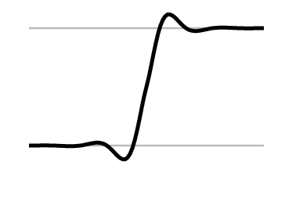

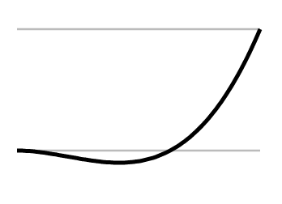

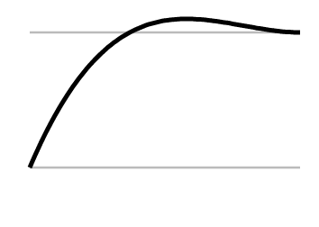

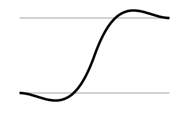

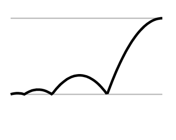

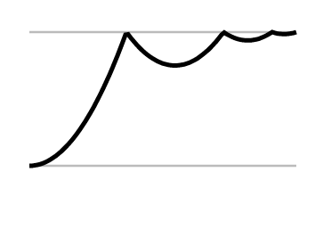

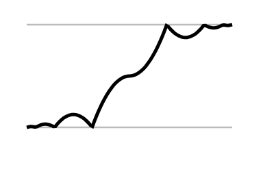

