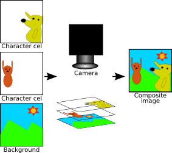

==================
Objects and Layers
==================

Introduction to Objects
=======================
Remember that a storyboard, in its simplest form, is a background animation that plays as the backdrop for a beatmap. You may have noticed storyboards with lyrics rushing in like it's karaoke, :term:`particle` fuego creating fireworks of fun, or even :term:`spectrum` bars that pulsate to the music like it's a media player visualization. All of these images, whether it's the lyric of a song or it's a small little sparkly dot, are graphical objects. **In storyboarding, we put graphic objects, often known as sprites, onto the background of the beatmap, then we tell these sprites what to do.** This chapter will show you the first half of that process, which is creating these graphic objects into existence.

Objection!
----------
.. Talk about the different type of objects you can put on your storyboard:
   i.e. sprites, animations, (and a footnote for samples too)

An :term:`object` is basically the graphic that we want to display on a storyboard. There are two kinds of graphics an object can be created from: a single image file, called a :term:`sprite`, or a series of image files, called an :term:`animation`. While animations do have their own uses (such as a character running from one side of the screen to the other), storyboarders overwhelmingly create sprites, as all they need is one single image to create magic.

.. hint:: In this day where game making has become more and more accessible, the term *sprite* has become a lot more commonplace. Consider a storyboard sprite the exact same thing as the one you may heard of in game design.

   Actually, do you happen to know the origin of the word *sprite*? It's not because of the soft drink, you know! Back in the early 1980s, for drawing efficiency, sprites were on a separate level than the background when being rendered. Their "floating" overlap was a lot like the mythical *sprite*, or a ghost. There you have it!

Let's Make An Object!
=====================
Let's start off by creating a sprite! To create a new sprite, you'd write the following line within your .osb file:

.. TODO: SCRIPTING NEEDS ITS OWN SYNTAX LMAO

.. code-block:: yaml

    Sprite, <layer>, <origin>, "<filepath>", <x>, <y>

Where...

    - **<layer>**: The :term:`layer` you want your sprite to appear on.
    - **<origin>**: The place on the image the (x,y) position will be based on.
    - **<filepath>**: The filename of the image you want.
    - **<x>**, **<y>**: The (x,y) coordinates of where you want to sprite to appear.

Let's break it down further. If you have a good idea about this stuff already, you can :ref:`skip to where we're going to put things together <applying>`. After each section, we're going to slowly replace each one of these items with an example, all totaling to a bona-fide, legit sprite that we can use and play around with!

Layers: Stack 'Em Up
--------------------
.. Layering, z-order, etc.
.. Get an image with the layers

In traditional animation, animators need to draw each frame by hand. However, drawing each Astro Boy frame in some empty void is far easier than drawing him in the sprawls of a bustling city. Imagine the work necessary to redraw both Astro Boy *AND* the cityscape! So then animators thought up of a clever trick. They painted the city background as one image, then had the moving objects such as Astro Boy or the cars in the city on their own transparent sheets known as *cels*, then stack them all together, so the camera thinks they're all one singular image. This is a prime example of layering.

.. This is a placeholder image lol

  Dragon Ball Z: Cel Saga

In osu!, a :term:`layer` works exactly the same way. We can assign sprites to certain layers, and then at the very end, they'll all stack up together.

There are four possible layers we can use:

    - **Background**
    - **Fail**
    - **Pass**
    - **Foreground**

The only things worth mentioning would be that the :term:`failing` and :term:`passing` layers have their own special conditions to appear visible. You can read more about them by clicking on their glossary terms, but at the end of the day, it's easier to just adopt the mentality of primarily sticking with the :term:`background` and :term:`foreground`.

When you have multiple sprites on the same layer, the one created later (i.e. appears later in the script file), will be on top of the previous sprite(s). This is a simple case of what's called :term:`z-order`.

Sounds good then! Now that we understand what layers are, let's fill that placeholder in with a layer of our choice. Let's go with *Foreground*.

.. code-block:: yaml

    Sprite,Foreground,<origin>,"<filepath>",<x>,<y>

Origin: It All Starts Here
--------------------------
Before deciding on an initial location you want your sprite to be, run by this thought: when we tell osu! to put a sprite at this numbered location, where exactly is it at? For context, the center of the :term:`playfield` is at (320,240). If we think a 1x1 image, or a single pixel, at (320,240), that's easy to imagine, as the pixel is exactly. But consider a 100x100 sprite. *What* part of the image is exactly at (320,240)? Is it the upper-left of the image? The center?

This is exactly what the :term:`origin` entails. For what area of the image do we consider to make as a point of reference?

.. TODO: PICTURE HERE

There are nine possible origin points of an image:

    - **TopLeft**
    - **TopCentre**
    - **TopRight**
    - **CentreLeft**
    - **Centre**
    - **CentreRight**
    - **BottomLeft**
    - **BottomCentre**
    - **BottomRight**

The most likely choice you'd find yourself using is *Centre*, as calculations such as movement and scale are handled far, far easier than the other settings. However, for special situations, the other origin points are very useful to have. For our example, let's stick with *Centre*, then.

.. code-block:: yaml

    Sprite,Foreground,Centre,"<filepath>",<x>,<y>

Filepath: Locate Me, Senpai!
----------------------------
What image do you want the sprite to display? This is relatively straightforward, but there are a few caveats to keep in mind:

    - The filepath is relative to the .OSB file. That means that the mapset's folder will be the starting location in looking for files. For instance, an image named ``"walrus.png"`` that's in the same folder as the storyboard script can simply be called as ``"walrus.png"``, with peace of mind.
    - When calling for images inside a subfolder of the mapset, it's preferred to use the forward-slash (``/``) than the backslash. If ``"walrus.png"`` is stored inside the ``SB`` folder, you can just call it through ``"SB/walrus.png"`` without any problems.

Those are the biggest concerns!

.. note:: Quotation marks surrounding the filepath are also optional! However, if your path location to your sprite requires spaces, the quotation marks become **required** to use. **Keep that in mind!**

In that case, we can just move on our example with grabbing a lovely sprite of :term:`Hifumi`.

.. code-block:: yaml

    Sprite,Foreground,Centre,"SB/hifumi.png",<x>,<y>

Coordinates: X Marks the Spot!
------------------------------
.. Talk about the playfield
.. Coordinate system 0,0 on topleft unlike center (320,240)
.. The numbers (widescreen support)
.. Hint admonition explaining the numbers

.. code-block:: yaml

    Sprite,Foreground,Centre,"SB/hifumi.png",320,240

.. _applying:

All Together Now...
===================
.. An example

Animations
==========
.. Explaining the frameCount/frameDelay/loopType
.. An example

To Summarize...
===============
.. Mention that you won't be able to see anything yet because there aren't any commands. Read next!
