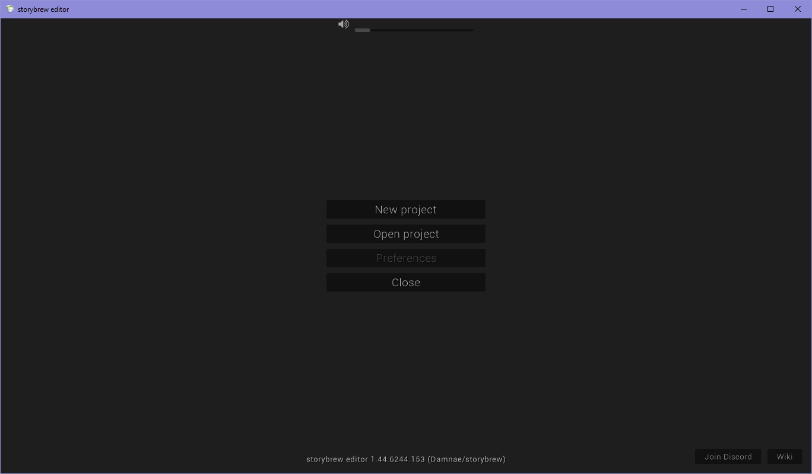
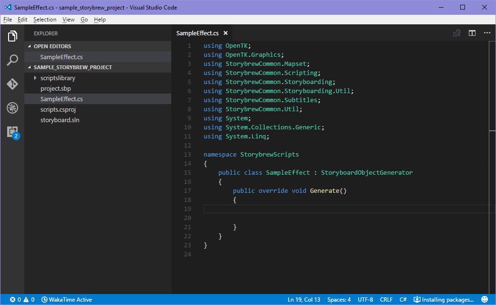
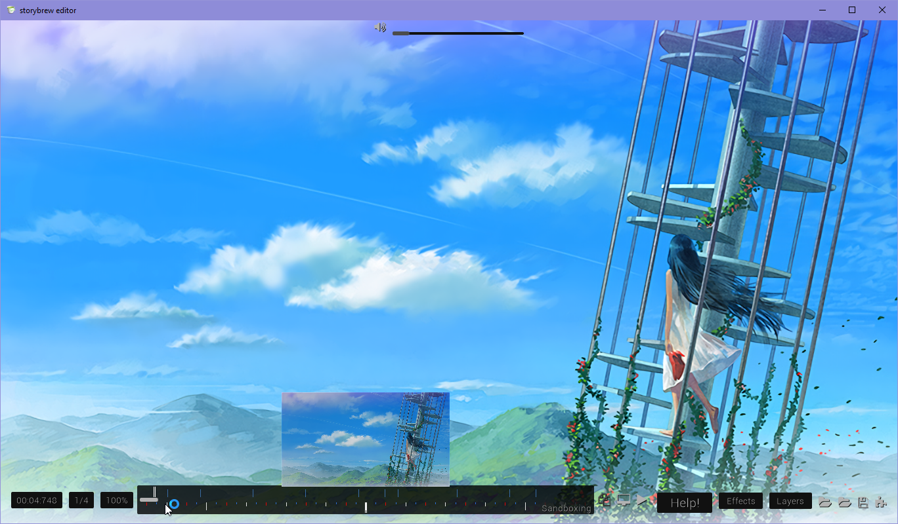
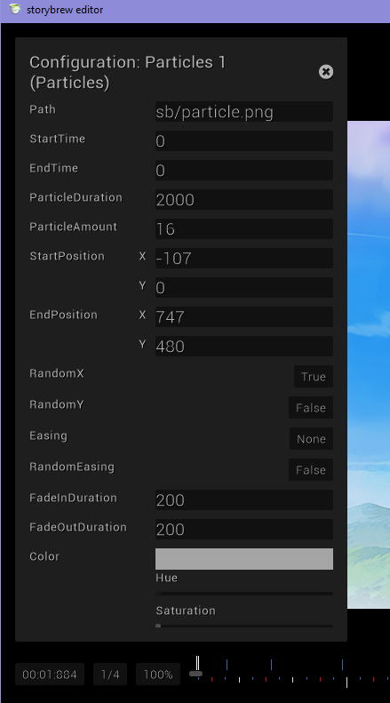

===============
Getting Started
===============

Let's get started with storybrew! This guide is a more beginners' friendly approach with getting started in storybrew. If you're already familiar with programming concepts and quickly navigating the interface, you can probably get started much faster by reading `the storybrew wiki <https://github.com/Damnae/storybrew/wiki/Getting-Started>`_ instead. Alternatively, you can pretty much skim through the ramblings here, right? ;)

Installation Mania
==================
Begin by downloading the `latest version of storybrew <https://github.com/Damnae/storybrew/releases/latest>`_. From there, you'd need a text editor that you can edit scripts with while deveoping in storybrew. storybrew primarily supports `Visual Studio Code <https://code.visualstudio.com/>`_, a lightweight text editor suited for editing small-scale projects and scripts such as this while offering tons of convenience features. More information about VS Code can be read `here <https://code.visualstudio.com/docs>`_.

When you're installing VS Code, be sure to either check "Add to PATH", or install it in the default location. This is so storybrew can find it.

.. attention:: storybrew relies completely on the OpenGL graphics library OpenTK. Because of this, it may have trouble running if your computer uses integrated graphics such as **Intel HD Graphics**.

    - If storybrew is unable to run or `displays garbage like this <_images/bad_gpu.png>`_, check to see if your graphics drivers can be updated, or supports at least OpenGL 2.0 without any hitches.
    - Otherwise, consider one of the :ref:`other options available <scripting_branching_paths_routes>`, or get a better computer or discrete graphics (i.e. an external graphics card).

Drawing an Owl
==============

   Hooray! Rejoice!

If everything goes well, you should be greeted with this minimalistic title screen. Select **New Project** and a beatmap difficulty to attach this towards. After selecting your map and project name, you'll be directed to the main interface, which currently only has a solid black screen and nothing much going for it.

That's fine. Because it's time for us to go for it. ;)

Creating a New Effect
---------------------
The first demo we'll do is to create an effect. In storybrew, storyboards are made up of multiple effects, all collected together to make something coherent and exciting. As such, click on the ``Effects`` button, then select ``New script``, as shown in the figure. Name your new script whatever you'd like (though best start with a letter and keep it one word). ``SampleEffect`` will do just fine, for instance.

.. figure:: img/getting_started/new_script.png
    :scale: 100%
    :alt: Visual of what was explained earlier.

    In case you were lost. ;)

If everything is working so far, VS Code should open with a pre-made ``SampleEffect`` script. If this is the first time opening VS Code, it will ask if you want to install the C# extension. This is a good idea. After installing, you should reload VS Code.

.. hint:: If it doesn't show up, you can press ``Ctrl+P``, type ``ext install csharp``, then install the "C# for Visual Studio Code" extension.

Your window should now look something like this. Pay attention to the fact there's now fancy colors, or syntax highlighting:

    In case you were lost. ;)

Generating
----------
The ``Generate`` :term:`method` is the main body of your script. storybrew looks for this ``Generate`` method and goes, "I'm going to execute whatever's in there". As an example, we're going to play with the beatmap's background real quickly just to see if everything works.

Add the following code for your ``Generate`` method:

.. code-block:: csharp
  :linenos:
  :caption: Sample method that fades a background in and out.
  :name: ``SampleEffect`` generation

  public override void Generate()
  {
      var layer = GetLayer("MySampleEffect");
      var bg = layer.CreateSprite("bg.png", OsbOrigin.Centre);
      bg.Scale(0, 480.0 / 1080);
      bg.Fade(0, 2000, 0, 1);
      bg.Fade(8000, 10000, 1, 0);
  }

Be sure to replace ``"bg.png"`` with whatever your background filename is for your beatmap, and then replace the ``1080`` in Line ``5`` with your background's height dimensions if it's not 1080. Also be sure to keep the decimal point in the ``480.0``, or else the calculations won't work properly. If these commands don't make any sense to you, consider reading :ref:`storyboarding by scripting <scripting_intro>` again.

    Congratulations! You've successfully created your first effect!

If everything works, then your effect should execute cleanly, with a fade in from 0ms to 2000ms, then a fade out from 8000ms to 10000ms. Now that we created our own custom script, let's check out one of the bundled ones to see what effects they can do.

The Rest of the Owl
===================

Sprites
-------
The first thing we'd need to do is to add a sprite into our mapset folder. If you don't want to spend a considerable amount of time looking for a sprite, here's a sample one for you to use:

.. figure:: img/getting_started/hifumi.png
    :scale: 100%
    :alt: It would REALLY suck if the image didn't load and you had to read this text instead.

    Isn't she adorable? ;)

Why not, right? In your storybrew main editor, select the second folder icon that says, "Open mapset folder", and save your image in there. We're going to call it ``hifumi.png``. You can save it inside a subfolder like ``SB``, but be sure to properly reflect that later.

Particles!
----------
One of the most enjoyable features with storybrew are the flexibility of the generators that have been ported into the program, such as the :term:`particle` generation effect. Let's check that out! Open the effects menu again, but this time select ``Add effect``. From the menu, select ``Particles``.

    This configuration window should pop up as you create the new effect.

We now have a brand-new particles effect applied on our storyboard, but the default configuration doesn't leave us with any visual splendor. What you want to do next is to edit these fields with whatever you'd like. Mainly what to pay attention to is the "Path" section. We want to replace that with ``hifumi.png``, or ``SB/hifumi.png`` if you saved that sprite inside a subfolder named ``SB`` inside your mapset folder. From there, change the ``EndTime`` to a value like 10000. Feel free to tinker around with any additional settings.

After messing around with settings, you could have a result that looks like this:

.. figure:: img/getting_started/particles.gif
    :scale: 80%
    :alt: Particles are bouncing!

    Boing boing!

If you want to change how the particles drop, you can change the values in ``Random seed`` to some other arbitrary value! At this point, you can just play around and have fun.

Congratulations! You've officially got started with storybrew! Was drawing the rest of the owl *that* tough? Your next step is to learn the storybrew interface, so let's go check that out.
