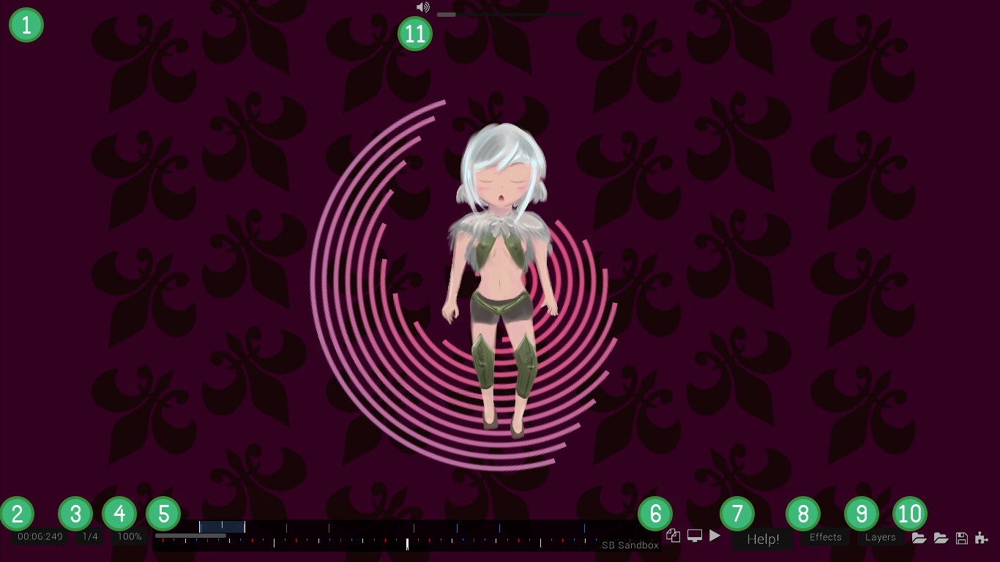
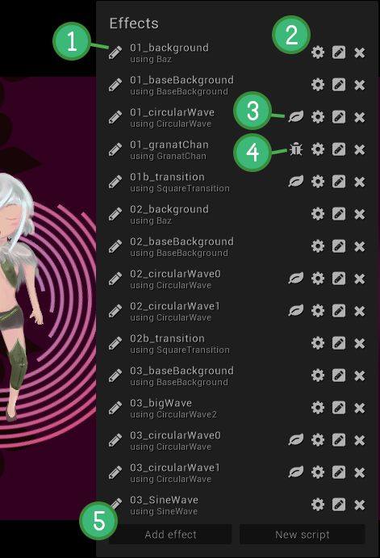
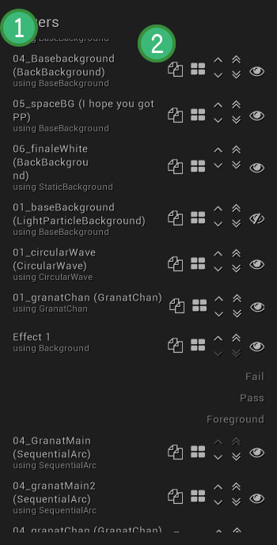
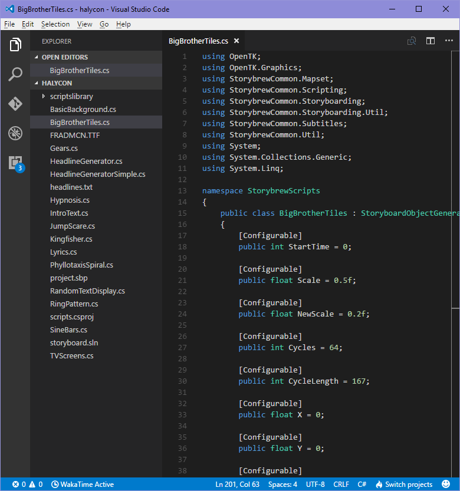

===================
storybrew Interface
===================

Welcome to my Secret Lair on Skullcrusher Mountain
==================================================
Sometimes, it's overwhelming to look at an interface. What, with so many gizmos, what exactly should you do?! Or perhaps you missed something that you didn't realize. This page aims to walk through the storybrew interface. We assume you already have familiarity with the basic concepts of storyboarding. If not, go read the basics now!

All of this information is as of **storybrew editor 1.44.6244.153**.

The Main Editor
===============

   The main storybrew interface.

Let's walk through the storybrew editor workspace!

1. The main workspace window. This is the primary visible playfield on storybrew as it would display on osu! with the Cinema mod activated.
2. The current time on the song. Pressing ``Ctrl+C`` copies this current time into your clipboard. Clicking on this button will let you shift to a different time, written in ms.
3. The beat snap divisor of the timeline. Operates similarly to osu!'s timeline.
4. The play speed of the map. Operates exactly like osu!'s play speed. 100% implies the song is playing at regular speed of 1.0x.
5. The timeline. Operates similarly to osu!'s timeline. Some convenience features from osu!'s editor are also supported in storybrew:

    - Use the left and right arrow keys to shift the timeline by the lowest divisor set.
    - Using ``Shift+←`` or ``Shift+→`` will shift the timeline 4x faster.
    - Using ``Ctrl+←`` or ``Ctrl+→`` will move you to the previous or next bookmark if they exist. It allows for extremely convenient shifting between different scenes.
    - Right-clicking and dragging on the timeline will create a repeating section in your map. Once the song passes the repeat point, it'll loop back to the start of the bounds defined. It's incredibly useful when configuring different effects and wanting to quickly check different configurations while not losing the place you're currently at.

6. Miscellaneous editor functions. In order from left-to-right:

    - Change the current beatmap difficulty that's open. Some effects, such as HitObjectHighlight, rely on the current difficulty that's open.
    - Change from Fit to Fill, or vice versa. Fit forces the 16:9 ratio no matter your resolution (or any other windows open, such as Effect Configuration), while Fill doesn't mind hiding the visuals beneath windows.
    - Play/Pause. Shortcut key is ``Space``.

7. Help!!!!! This opens the storybrew Wiki.
8. The effects menu. Read :ref:`here for more <effects>`.
9. The layers menu. Read :ref:`here for more <layers>`.
10. File menu. In order from left-to-right:

    - Opens the **storybrew project** folder. This contains your script files.
    - Opens the **mapset** folder. This is your actual beatmap's folder. Place assets such as your sprites in here. Right-click to change the mapset's folder to another beatmap.
    - Save Project. If you try exiting storybrew without saving, the editor will prompt you if you'd like to save as well. But don't be a doofus. Save often.
    - Export to .osb. The money maker. storybrew will also keep a backup of your previous .osb export safe, in case stuff hits the fan and you overwritten something you didn't want overwritten.

11. Volume. Hold ``Alt`` to display this. Adjusts volume of song playing, if only to keep your sanity at bay.

.. _effects:

Effects Menu
============

   The effects menu.

Time to talk about the effects menu!

1. Rename the effect. Since effects are sorted in alphabetical order by their name, consider having a naming convention system to make navigating between your effects much easier, such as having your effects prefixed with the scene name. The small caption below the name of the effect is what particular script the effect is using.
2. Effect functions. In order from left-to-right:

    - Configure the effect. A powerful feature in storybrew is that it allows the user to set customizable values to fine-tune and enhance their effect similar to that of :term:`particle` generators in the past.
    - Edit the script behind this effect. Note that any changes in the script will change *every* effect that also uses that script. You can effectively break your entire storyboard if numerous effects rely on one particular script module! **Requires having an installation of Visual Studio Code and its installation configured in the PATH environment variable.**
    - Remove the effect from the storyboard. Bye bye. :( There is no undo, so be careful!

3. Some scripts have logs that can give intermediary information or print general messages for the storyboarder to get a better understanding in things. This icon indicates that there is such a message and you can view its contents. Very useful for debugging.
4. Oh no! Your effect has a bug and it failed to execute. Clicking on this icon will open an error log to help diagnose where exactly the script failed. Keep wary of the line number and what the error specifically is than just blindly saying something's amiss and giving up.
5. Add effect, or add a new script. When you add a new effect, it checks against all existing scripts in the current project or in storybrew's general scripts folder.

.. _layers:

Layers Menu
===========

   The layers menu.

Home stretch!

1. The layers themselves. The naming first begins with the specific effect instantiated, then the string passed when the script inside calls ``GetLayer``. Remember that *inside* the script itself, one can declare different arbitrary layers.
2. Layer functions. In order from left-to-right:

    - Export to .osb or the specific difficulty opened. Note that difficulty-specific events have a forced ordering that can't intersect with the .osb file's events.
    - Change the .osb layer the effect's layer is on. This is the traditional layering system in osu! and not the specific layer called from ``GetLayer``.
    - Move layer up / down. Effects higher up are more towards the back, and vice versa.
    - Move layer to top / bottom. It's like the previous function, only fast-forwarded all the way to the boundaries!
    - Hide / display the layer. Sometimes there's too much going on and you need to hide some things, or sometimes you only want some difficulty-specific stuff to appear or not. Layers not visible will not be exported.

Visual Studio Code
==================

   A screenshot of VS Code. Look how lightweight it is!

Visual Studio Code, often shortened as VS Code, is a streamlined, lightweight code editor with many of the basic conveniences of full featured IDEs without all the bloat.  It's perfect to develop small-scale things such as the scripts in storybrew. There's not much to explain about VS Code, but it should be incredibly useful to take a look at the `official website's documentation <https://code.visualstudio.com/docs>`_ for getting started and extensions that can help you work smoothly in the editor.
